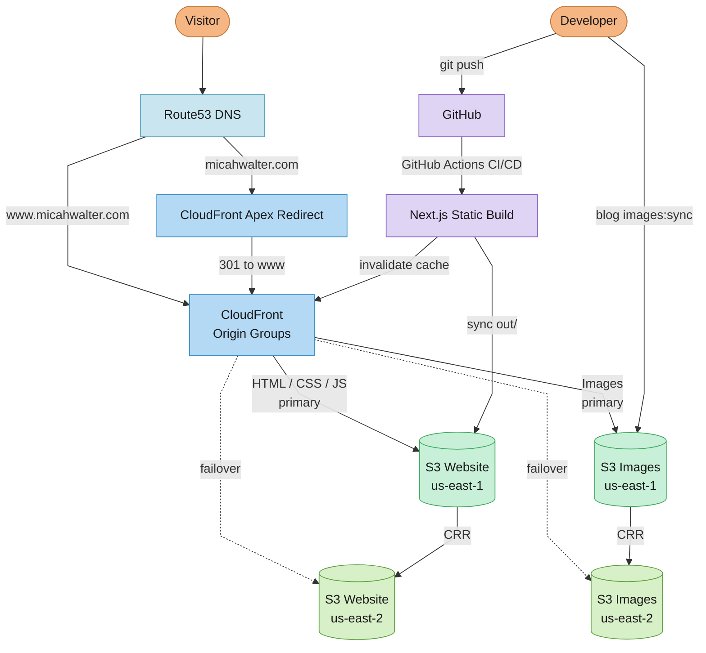
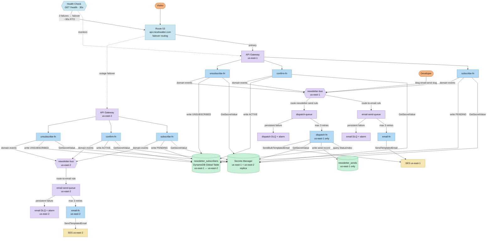

# Micah Walter's Website

A modern, statically-exported blog and photo archive built with Next.js 15 and hosted on AWS S3 + CloudFront with automated CI/CD deployment.

## Architecture



## Tech Stack

### Frontend
- **Next.js 15**: React framework with App Router and static export
- **TypeScript**: Type-safe development
- **Tailwind CSS**: Utility-first styling with custom design system
- **MDX**: Markdown content with React components via next-mdx-remote
- **EB Garamond & Beiruti**: Google Fonts for editorial typography
- **Rehype Highlight**: Syntax highlighting for code blocks

### Infrastructure
- **AWS S3**: Static file storage with versioning and encryption
- **CloudFront**: Global CDN with HTTP/2, HTTP/3, and edge caching
- **CloudFront Functions**: SPA routing/path rewriting + apex domain redirect
- **Route 53**: DNS management with A/AAAA alias records
- **ACM**: SSL/TLS certificates (DNS validated)
- **GitHub Actions**: CI/CD with OIDC authentication (no stored credentials)
- **Fathom Analytics**: Privacy-first analytics via `fathom-client`

### Image Processing
- **Sharp**: High-performance image optimization
- **WebP + JPEG**: Modern format with fallback support
- **Responsive Images**: Multiple sizes (400px, 800px, 1200px)
- **S3 Dual Storage**: Originals and optimized versions backed up

## Quick Start

### Prerequisites

- Node.js 20+
- AWS CLI configured with profile `www`
- Git and GitHub CLI (optional, for deployments)

### Local Development

```bash
# Clone the repository
git clone <repository-url>
cd micahwalter-www

# Install dependencies
npm install

# Link the blog CLI globally
npm link

# Download images from S3 (first time setup)
blog images:download --profile www

# Start development server
npm run dev

# Open http://localhost:3000
```

### Production Build

```bash
# Build static site (includes prebuild scripts)
npm run build

# Preview production build
npx serve out/
```

## Blog CLI Tool

The unified `blog` CLI manages all content and image operations. It must be linked globally once with `npm link`.

### Available Commands

| Command | Description |
|---------|-------------|
| `blog help` | Show all commands and usage |
| `blog help <command>` | Get help for specific command |
| `blog post:new` | Create new post with template |
| `blog post:new "Title"` | Create post with title (skip prompt) |
| `blog photos:import <dir>` | Import photos with EXIF extraction |
| `blog photos:tag <folder>` | AI-powered photo tagging via Amazon Bedrock |
| `blog photos:tag --all` | Tag all photos with AI suggestions |
| `blog images:optimize` | Process images (400/800/1200px WebP+JPEG) |
| `blog images:upload` | Upload originals + processed to S3 |
| `blog images:download` | Download from S3 to local |
| `blog images:sync` | Optimize + Upload (one command) |
| `blog images:copy-local` | Copy optimized images to public/ for dev |
| `blog build` | Optimize images + copy to public/ (local dev) |
| `blog build:static` | Generate RSS, sitemap, posts.json |
| `blog email:send <slug>` | Render email post and emit send event |

### Common Flags

- `--dry-run` - Preview operations without executing
- `--profile <name>` - Use specific AWS profile (e.g., `www`)
- `--originals-only` - Only work with original images
- `--processed-only` - Only work with optimized images

### Examples

```bash
# Create a new blog post
blog post:new "Building Modern Web Apps"

# Preview what would be uploaded
blog images:upload --dry-run --profile www

# Complete workflow: optimize + upload
blog images:sync --profile www

# Download only original images
blog images:download --originals-only --profile www
```

## Content Management

### Creating Blog Posts

Posts are MDX files stored in `content/posts/` with date-prefixed folder names.

#### Using the CLI (Recommended)

```bash
# Interactive mode (prompts for all fields)
blog post:new

# With title argument
blog post:new "My Awesome Blog Post"
```

This creates:
- `content/posts/YYYY-MM-DD-slug/index.mdx` with frontmatter template
- Post starts with `draft: true` by default
- Visible in dev mode, hidden in production builds

#### Manual Creation

Create a folder: `content/posts/2024-01-15-my-post-title/`

Create `index.mdx` with frontmatter:

```yaml
---
id: 42
title: "My Post Title"
publishedAt: "2024-01-15"
excerpt: "A brief description that appears in listings and SEO."
category: "AI"  # or "AWS", "Writing"
tags: ["tag1", "tag2", "tag3"]
coverImage: "./cover.jpg"  # optional
draft: false
---

Your post content here in markdown/MDX format.

## Heading 2

Regular markdown features work:
- Lists
- **Bold** and *italic*
- [Links](https://example.com)
- Code blocks with syntax highlighting

```javascript
const example = "code";
```

You can also use JSX components if needed.

### Frontmatter Fields

| Field | Required | Description |
|-------|----------|-------------|
| `id` | ✅ | Auto-assigned global sequential ID (set by `blog post:new` or `blog photos:import`) |
| `title` | ✅ | Post title for display and SEO |
| `publishedAt` | ✅ | Publication date (YYYY-MM-DD) |
| `excerpt` | ✅ | Brief summary for listings and SEO |
| `category` | ✅ | One of "AI", "AWS", or "Writing" |
| `tags` | ❌ | Array of tag strings |
| `coverImage` | ❌ | Relative path to cover image |
| `draft` | ❌ | Set `true` to hide in production |

### Email Posts

Newsletter issues are a first-class content type stored alongside blog and photo posts. They get a permanent "view in browser" URL at `/emails/<slug>` and are listed in the public email archive at `/emails`.

```yaml
---
type: email
id: 142                                   # Required; unique across all posts
title: "What I've been thinking about — March 2026"
publishedAt: "2026-03-15"                 # Must not be in the future to send
excerpt: "A short summary for the archive listing"
draft: false                              # Must be false to send
---

Email body in standard markdown/MDX...
```

The `id` field is the primary key for the `newsletter_sends` DynamoDB table and is required for send tracking and idempotency.

### Content Structure

```
content/
└── posts/
    ├── 2024-01-15-building-ai-agents/
    │   ├── index.mdx
    │   └── cover.jpg
    ├── 2024-02-03-serverless-architecture/
    │   ├── index.mdx
    │   ├── cover.jpg
    │   └── diagram.png
    └── ...
```

### Draft Posts

Posts with `draft: true` behave differently in dev vs production:

- **Development** (`npm run dev`): Drafts visible with "DRAFT" badge
- **Production** (`npm run build`): Drafts completely excluded

Set `draft: false` when ready to publish.

## Photo Archive System

The site includes a complete photo archive system with automatic EXIF extraction and AI-powered tagging using Claude via Amazon Bedrock.

### Photo Import with EXIF Extraction

Import photos with automatic metadata extraction from EXIF data:

```bash
# Import photos from a directory
blog photos:import ~/Desktop/photos

# Preview without creating files
blog photos:import ~/Photos/trip --dry-run

# Set custom category
blog photos:import ~/vacation-photos --category Travel
```

**What it does:**
1. Scans directory for image files (JPG, PNG, HEIC)
2. Extracts EXIF metadata using ExifReader:
   - Camera make and model
   - Lens information
   - Camera settings (aperture, shutter speed, ISO, focal length)
   - Date and time photo was taken
3. Creates post folder: `content/posts/YYYY-MM-DD-slug/`
4. Copies original photo to folder
5. Generates `index.mdx` with frontmatter populated from EXIF

**Date handling:**
- Folder date = Today (upload/post date)
- `dateTaken` field = EXIF capture date (preserved in metadata)

This separation lets you post old photos while preserving when they were actually taken.

### AI-Powered Photo Tagging

Use Claude via Amazon Bedrock to analyze photos and suggest relevant tags. Authentication reuses the existing `www` AWS profile — no separate API key is needed.

```bash
# Tag a specific photo
blog photos:tag 2026-02-16-sunset-park --profile www

# Tag all photos interactively
blog photos:tag --all --profile www

# Auto-approve all suggestions
blog photos:tag --all --auto-approve --profile www

# Preview suggestions without updating
blog photos:tag --all --dry-run
```

**AI analysis includes:**
- Subject matter (people, objects, nature, architecture)
- Location type (urban, beach, indoor, outdoor)
- Mood and atmosphere (serene, dramatic, vibrant)
- Visual style (minimalist, colorful, vintage)
- Notable features (sunset, reflection, bokeh)

**Example AI-generated tags:**
- `seascape, ocean, sunset, coastal, water-reflection`
- `skateboarding, urban, dramatic-sky, action-sports`
- `bridge, autumn, reflection, park, colorful-foliage`

Tags are merged with existing ones (no duplicates) and appear on photo cards and filter pages.

### Photo Content Structure

Photos are stored alongside blog posts with `type: photo`:

```
content/posts/
├── 2026-02-16-sunset-park/
│   ├── index.mdx        # Photo post with EXIF metadata
│   └── photo.jpg        # Original photo
├── 2026-02-15-beach-walk/
│   ├── index.mdx
│   └── photo.jpg
└── ...
```

### Photo Frontmatter

Photo posts include all standard fields plus EXIF metadata:

```yaml
---
type: photo                    # Content type (required)
title: "Sunset in Brooklyn"
publishedAt: "2026-02-16"     # Post date (today)
excerpt: "Golden hour over the park"
category: "Photography"
tags: ["sunset", "urban", "golden-hour", "cityscape"]
coverImage: "./photo.jpg"

# EXIF metadata (automatically extracted)
camera: "Canon EOS R5"
lens: "RF 24-105mm f/4L IS USM"
aperture: "f/2.8"
shutterSpeed: "1/500"
iso: "400"
focalLength: "50mm"
dateTaken: "2024-08-15T18:30:00"  # Actual capture date
location: "Brooklyn, NY"

draft: false
---

Optional narrative or description of the photo...
```

### Photo Display Features

**Photo Cards (Homepage/Grid):**
- 4:3 aspect ratio (classic photo format)
- Photo badge overlay
- EXIF summary on hover
- Up to 4 tags displayed
- Camera info shown

**Individual Photo Pages:**
- Large responsive image display
- Organized EXIF panel with sections:
  - Equipment (camera, lens)
  - Settings (aperture, shutter, ISO, focal length)
  - Details (capture date, location)
- Full description/narrative
- Same SEO and sharing features as blog posts

**Photo-Only Feed:**
- Access at `/photos`
- Filters to show only photo posts
- Photo-optimized grid layout
- Pagination support

### Photo Workflow Example

Complete workflow from import to publish:

```bash
# 1. Import photos with EXIF extraction
blog photos:import ~/Desktop/vacation-photos

# 2. AI-tag the photos (uses existing AWS profile — no separate API key needed)
blog photos:tag --all --profile www

# 3. Review and edit generated posts
# Edit content/posts/2026-02-16-*/index.mdx

# 4. Optimize images
blog images:optimize

# 5. Upload to S3
blog images:sync --profile www

# 6. Commit and deploy
git add content/posts/
git commit -m "Add vacation photos"
git push
```

### AI Tagging Requirements

To use AI photo tagging, you need:

1. **AWS Profile**: The existing `www` profile is used — no separate API key required.
2. **Bedrock model access**: Enable `us.anthropic.claude-sonnet-4-6` in the AWS Bedrock console under **Model access** in `us-east-1`.
3. **IAM permissions**: The `www` IAM user/role needs `bedrock:InvokeModel` permission for the model ARN.
4. **Cost**: ~$0.01-0.02 per photo analyzed (Bedrock on-demand pricing).

## Image Workflow

This project uses a dual-storage system for images to support multi-machine workflows without bloating the Git repository.

### Storage Architecture

**Local:**
- Originals: `content/posts/{slug}/*.{jpg,png}`
- Processed: `.optimized-images/posts/{slug}/*-{size}.{webp,jpg}`

**S3:**
- Originals: `s3://bucket/images/originals/posts/{slug}/`
- Processed: `s3://bucket/images/posts/{slug}/`

### Image Processing

Each image is optimized into 6 files:
- `image-400.webp` (small, modern format)
- `image-400.jpg` (small, fallback)
- `image-800.webp` (medium, modern)
- `image-800.jpg` (medium, fallback)
- `image-1200.webp` (large, modern)
- `image-1200.jpg` (large, fallback)

**File Size Comparison:**

| Size | Format | Typical Size | Savings |
|------|--------|--------------|---------|
| Original | JPEG | 800 KB | - |
| 1200px | WebP | 160 KB | 80% |
| 800px | WebP | 80 KB | 90% |
| 400px | WebP | 20 KB | 97% |

Mobile users downloading 400px WebP save **97%** bandwidth!

### Daily Workflow

#### Adding Images to a Post

```bash
# 1. Add image to post directory
cp ~/photo.jpg content/posts/2024-01-15-my-post/cover.jpg

# 2. Reference in frontmatter
# coverImage: "./cover.jpg"

# 3. Optimize and upload everything
blog images:sync --profile www

# 4. Commit (only MDX, images are gitignored)
git add content/posts/2024-01-15-my-post/index.mdx
git commit -m "Add new blog post"
git push
```

#### Setting Up on a New Machine

```bash
# Clone repository
git clone <repo-url>
cd micahwalter-www

# Install dependencies
npm install

# Link CLI globally
npm link

# Download all images from S3
blog images:download --profile www

# Now you have originals + processed images!
```

### Image Recommendations

**Cover Images:**
- Dimensions: 1200px wide (or tall for portraits)
- Format: JPEG or PNG (will be converted)
- Quality: High quality (optimization is automatic)
- Max file size: 2MB before optimization
- Aspect ratio: 16:9 or 4:3 recommended

**File naming:**
- Use descriptive names: `cover.jpg`, `diagram.png`, `screenshot.jpg`
- Avoid generic: `img1.jpg`, `photo.png`

### How Images Are Served

Browser receives responsive `<picture>` elements:

```html
<picture>
  <source
    srcset="
      https://cdn.example.com/images/posts/slug/cover-400.webp 400w,
      https://cdn.example.com/images/posts/slug/cover-800.webp 800w,
      https://cdn.example.com/images/posts/slug/cover-1200.webp 1200w
    "
    type="image/webp"
  />
  <source
    srcset="
      https://cdn.example.com/images/posts/slug/cover-400.jpg 400w,
      https://cdn.example.com/images/posts/slug/cover-800.jpg 800w,
      https://cdn.example.com/images/posts/slug/cover-1200.jpg 1200w
    "
    type="image/jpeg"
  />
  
</picture>
```

**Browser intelligently chooses:**
- Format: WebP if supported (97%+ browsers), otherwise JPEG
- Size: Based on viewport width (mobile: 400px, tablet: 800px, desktop: 1200px)

## Development

### NPM Scripts

```bash
npm run dev              # Start dev server with Turbopack
npm run build            # Production build (runs prebuild automatically)
npm run start            # Start production server
npm run lint             # ESLint check

# Image scripts (prefer blog CLI)
npm run optimize-images  # Legacy: use blog images:optimize
npm run upload-images:www # Legacy: use blog images:upload --profile www
npm run images:dev       # Optimize + copy to public/ for dev
```

### Environment Variables

**Production (GitHub Actions secrets):**

| Secret | Description |
|--------|-------------|
| `AWS_ROLE_ARN` | IAM role ARN for OIDC deployment |
| `S3_BUCKET` | S3 bucket name for website content (CloudFormation output: WebsiteBucketName) |
| `IMAGES_BUCKET` | S3 bucket name for images (CloudFormation output: ImagesBucketName) |
| `CLOUDFRONT_DISTRIBUTION_ID` | CloudFront distribution ID (CloudFormation output: CloudFrontDistributionId) |
| `ROUTE53_HOSTED_ZONE_ID` | Route53 hosted zone ID for micahwalter.com |
| `NEXT_PUBLIC_FATHOM_SITE_ID` | Fathom Analytics site ID (baked in at build time) |
| `NEXT_PUBLIC_NEWSLETTER_API_URL` | Newsletter API Gateway base URL (baked in at build time) |

**Local Development:**
Create `.env.local`:

```bash
NEXT_PUBLIC_FATHOM_SITE_ID=your-fathom-site-id
NEXT_PUBLIC_NEWSLETTER_API_URL=https://api.micahwalter.com/newsletter
```

## Build Process

The build runs in this order:

### 1. Prebuild Scripts (Automatic)

Triggered by `prebuild` in package.json before `next build`:

- `generate-posts-json.js` → `/public/posts.json` (search index)
- `generate-rss.js` → `/public/feed.xml`
- `generate-sitemap.js` → `/public/sitemap.xml`

### 2. Next.js Build

- Generates static HTML for all routes
- Uses `generateStaticParams()` for dynamic routes
- Outputs to `/out` directory
- No API routes (static export mode)

### 3. Deployment (GitHub Actions)

- Syncs `/out` to S3 with optimized cache headers
- Invalidates CloudFront cache
- Takes ~3-4 minutes total

## Deployment

### Automated Deployment (Recommended)

Push to `main` branch triggers automatic deployment:

```bash
# Make changes
git add .
git commit -m "Update website"
git push

# GitHub Actions will:
# 1. Install dependencies
# 2. Build Next.js static export
# 3. Sync to S3 with cache headers
# 4. Invalidate CloudFront cache
# 5. Deploy globally in ~3-4 minutes
```

### Manual Deployment Trigger

```bash
# Via GitHub CLI
gh workflow run deploy.yml

# Or via GitHub web interface
# https://github.com/micahwalter/micahwalter-www/actions/workflows/deploy.yml
```

### Monitor Deployments

```bash
# View recent deployments
gh run list --workflow=deploy.yml

# Watch current deployment
gh run watch

# View detailed logs
gh run view --log
```

## Newsletter

The newsletter system is a serverless backend deployed alongside the main website. It covers two distinct workflows: **subscription management** (opt-in, confirmation, unsubscribe) and **campaign sending** (authoring an email post and dispatching it to all active subscribers).

Both workflows follow an event-driven architecture — command handlers validate input, write state, and emit domain events. All downstream behaviour is handled by independent consumers without coupling to the command side.

### Architecture



### Subscriber Journey

| Step | Page | What happens |
|---|---|---|
| 1 | `/newsletter` | Visitor submits email + name |
| 2 | `/newsletter/check-inbox` | `subscribe-fn` writes `PENDING`, emits `SignupRequested`; `email-fn` sends confirmation email with signed 24h token |
| 3 | `/newsletter/confirm?token=…` | Page auto-POSTs token; `confirm-fn` verifies HMAC, writes `ACTIVE`, emits `SubscriberConfirmed` |
| 4 | `/newsletter/thank-you` | `email-fn` sends welcome email with signed 90-day unsubscribe token |
| 5 | `/newsletter/unsubscribe` | Token in URL → auto-submits; no token → email form. `unsubscribe-fn` writes `UNSUBSCRIBED`, emits `UnsubscribeRequested` |
| 6 | `/newsletter/goodbye` | `email-fn` sends goodbye email |

### Sending a Campaign

Email posts are authored in `content/posts/` with `type: email` frontmatter. A single CLI command renders the MDX and triggers delivery to all active subscribers.

```bash
# 1. Create a new email post
# content/posts/2026-03-08-march-2026/index.mdx
# frontmatter: type: email, id: 142, draft: false

# 2. Send a test email to yourself first
blog email:send march-2026 --test you@example.com --profile www

# 3. Preview the full event payload without sending
blog email:send march-2026 --dry-run --profile www

# 4. Send to all active subscribers
blog email:send march-2026 --profile www
```

**What happens after `blog email:send`:**

1. Script validates frontmatter (type, draft, publishedAt, id)
2. Renders MDX → HTML + plain text
3. Emits `NewsletterSendRequested` to `newsletter-bus` (source: `newsletter.campaigns`)
4. `route-newsletter-send` EventBridge rule routes to `newsletter-dispatch-queue`
5. `dispatch-fn` Lambda:
   - Creates/updates an SES template (`newsletter-campaign-<id>`) with the rendered HTML, appending a footer with `{{unsubscribe_link}}` and `{{view_in_browser_url}}` placeholders
   - Queries all `ACTIVE` subscribers from `newsletter_subscribers` (paginated)
   - Checks `newsletter_sends` — skips any subscriber already marked `SENT` (idempotent)
   - Generates a signed 90-day unsubscribe token per subscriber
   - Sends via `SES:SendBulkTemplatedEmail` in batches of 50, substituting per-recipient template variables
   - Writes `SENT`/`FAILED` records to `newsletter_sends`

**Test sends** (`--test <email>`) deliver to a single address via the full pipeline without querying subscribers or writing any `newsletter_sends` records. Safe to run as many times as needed before the real send.

**Re-sending is safe.** If a send is interrupted and retried, only subscribers without a `SENT` record receive the email.

**Email archive.** Every sent email gets a permanent public URL at `/emails/<slug>` and is listed at `/emails` (linked from the site footer).

### Domain Events

All events are emitted onto the `newsletter-bus` EventBridge bus. The event archive retains 90 days of history for replay and audit.

| Event (`detail-type`) | Source | Emitted by | Trigger |
|---|---|---|---|
| `SignupRequested` | `newsletter.subscribers` | `subscribe-fn` | New or re-subscribing email |
| `ConfirmationResent` | `newsletter.subscribers` | `subscribe-fn` | Already-`PENDING` email re-submits |
| `SubscriberConfirmed` | `newsletter.subscribers` | `confirm-fn` | Token verified; record updated to `ACTIVE` |
| `UnsubscribeRequested` | `newsletter.subscribers` | `unsubscribe-fn` | Unsubscribe via signed link or form |
| `NewsletterSendRequested` | `newsletter.campaigns` | `blog email:send` | Campaign send triggered by developer |

### Token Security

Confirmation and unsubscribe links use HMAC-SHA256 signed tokens — no raw email addresses are ever in URLs.

```
payload   = base64url( email + "|" + expires_unix_ts )
signature = HMAC-SHA256( payload, secret )
token     = payload + "." + signature
```

- Verification uses `crypto/subtle.ConstantTimeCompare` to prevent timing attacks
- Dual-key rotation: Secrets Manager stores `{"current":"…","previous":"…"}` so keys can be rotated without invalidating in-flight tokens
- Confirmation tokens expire after 24 hours; unsubscribe tokens after 90 days

### Newsletter Deploy

**One-time bootstrap** (creates the S3 artifacts bucket):

```bash
cd infra/newsletter-lambdas
make deploy-bootstrap
```

**Build, upload, and deploy:**

```bash
make build            # compile all Go binaries for linux/arm64
make upload           # zip + upload to S3
make deploy           # create/update CloudFormation stack (prints API URL)
```

**Update Lambda code only** (faster than a full stack deploy):

```bash
make update-functions
```

**CloudFormation stacks:**
- `micahwalter-newsletter-bootstrap` — S3 artifacts bucket (us-east-1)
- `micahwalter-newsletter` — all newsletter resources (DynamoDB tables, EventBridge bus + rules, SQS queues, API Gateway, Lambdas, SES identity, CloudWatch alarms)

### Newsletter Multi-Region Resilience

Subscribe, confirm, and unsubscribe survive a complete us-east-1 outage via an active-passive failover to us-east-2. Newsletter dispatch (`blog email:send`) stays in primary only and degrades gracefully.

**Architecture:**
- **Primary (us-east-1):** Full stack — subscribe / confirm / unsubscribe / email / formtoken / health / dispatch
- **Secondary (us-east-2):** Subscription management only — subscribe / confirm / unsubscribe / email / formtoken / health (no dispatch)
- **DynamoDB `newsletter_subscribers`:** Global Table replicated to us-east-2; writes in either region sync automatically
- **HMAC secret:** Replicated to us-east-2 via Secrets Manager `ReplicaRegions`; tokens signed in primary are verifiable in secondary
- **Route 53:** Failover routing on `api.micahwalter.com` — health check on primary `/health` endpoint; ~90 seconds to fail over on outage
- **SES:** Domain verified in both regions; transactional emails send from the region handling the request

**First-time setup** (run once after merging this feature):

```bash
# 1. Deploy updated primary stack (adds streams + health route + HMAC replication)
cd infra/newsletter-lambdas
make deploy  # or: AWS_PROFILE=www aws cloudformation deploy ...

# 2. Add us-east-2 replica to the newsletter_subscribers DynamoDB table (one-time)
AWS_PROFILE=www aws dynamodb update-table \
  --table-name newsletter_subscribers \
  --replica-updates 'Create={RegionName=us-east-2}' \
  --region us-east-1

# 3. Create the secondary S3 artifacts bucket
make deploy-bootstrap-secondary

# 4. Build and upload Lambda zips to secondary bucket
make build
make upload-secondary

# 5. Deploy the secondary API Gateway domain (us-east-2) — Route 53 records OFF for now
#    (SECONDARY failover records can't coexist with simple records; add them in step 7b)
AWS_PROFILE=www aws cloudformation deploy \
  --stack-name micahwalter-api-domain-secondary \
  --template-file infra/api-domain-secondary.yml \
  --region us-east-2 \
  --parameter-overrides HostedZoneId=<your-hosted-zone-id>

# 6. Deploy the secondary newsletter stack
make deploy-secondary

# 7a. Manually delete the existing simple Route 53 A and AAAA records for api.micahwalter.com
#     (PRIMARY failover records can't coexist with simple records; CloudFormation can't do
#      this atomically — you must delete them out-of-band first)
AWS_PROFILE=www aws route53 change-resource-record-sets \
  --hosted-zone-id <your-hosted-zone-id> \
  --change-batch '{
    "Changes": [
      {"Action":"DELETE","ResourceRecordSet":{"Name":"api.micahwalter.com.","Type":"A",
        "AliasTarget":{"HostedZoneId":"<apigw-hz-id>","DNSName":"<apigw-regional-domain>.","EvaluateTargetHealth":false}}},
      {"Action":"DELETE","ResourceRecordSet":{"Name":"api.micahwalter.com.","Type":"AAAA",
        "AliasTarget":{"HostedZoneId":"<apigw-hz-id>","DNSName":"<apigw-regional-domain>.","EvaluateTargetHealth":false}}}
    ]
  }'

# 7b. Activate Route 53 PRIMARY failover routing on the api-domain stack
PRIMARY_API_DOMAIN=$(AWS_PROFILE=www aws cloudformation describe-stacks \
  --stack-name micahwalter-newsletter \
  --region us-east-1 \
  --query "Stacks[0].Outputs[?OutputKey=='ApiRegionalDomainName'].OutputValue" \
  --output text)

AWS_PROFILE=www aws cloudformation deploy \
  --stack-name micahwalter-api-domain \
  --template-file infra/api-domain.yml \
  --region us-east-1 \
  --parameter-overrides \
    HostedZoneId=<your-hosted-zone-id> \
    PrimaryApiRegionalDomain=$PRIMARY_API_DOMAIN

# 7c. Now add the SECONDARY Route 53 failover records (safe now that PRIMARY exists)
AWS_PROFILE=www aws cloudformation deploy \
  --stack-name micahwalter-api-domain-secondary \
  --template-file infra/api-domain-secondary.yml \
  --region us-east-2 \
  --parameter-overrides \
    HostedZoneId=<your-hosted-zone-id> \
    CreateRoute53Records=true

# 8. Update GitHub Actions IAM role (adds us-east-2 permissions)
AWS_PROFILE=www aws cloudformation deploy \
  --stack-name micahwalter-www-github-actions \
  --template-file infra/github-actions-role.yml \
  --region us-east-1 \
  --capabilities CAPABILITY_NAMED_IAM
```

After first-time setup, all subsequent deployments are fully automated via GitHub Actions.

**Ongoing deploys:**

```bash
# Update secondary Lambda code manually (primary is also updated)
make update-functions-secondary

# Full secondary stack update
make deploy-secondary
```

**CloudFormation stacks (multi-region):**

| Stack | Region | Template |
|-------|--------|----------|
| `micahwalter-newsletter-bootstrap` | us-east-1 | `newsletter-bootstrap.yml` |
| `micahwalter-newsletter` | us-east-1 | `newsletter.yml` |
| `micahwalter-api-domain` | us-east-1 | `api-domain.yml` |
| `micahwalter-newsletter-bootstrap-secondary` | us-east-2 | `newsletter-bootstrap-secondary.yml` |
| `micahwalter-newsletter-secondary` | us-east-2 | `newsletter-secondary.yml` |
| `micahwalter-api-domain-secondary` | us-east-2 | `api-domain-secondary.yml` |

**What happens during a us-east-1 outage:**
1. Route 53 health check fails 3 consecutive times (~90 seconds)
2. `api.micahwalter.com` DNS switches to us-east-2 endpoint
3. Subscribe / confirm / unsubscribe served from us-east-2 Lambdas
4. DynamoDB writes go to the us-east-2 replica and sync to us-east-1 once it recovers
5. Transactional emails (confirmation, welcome, goodbye) send from SES in us-east-2
6. `blog email:send` (dispatch) fails with AWS error — acceptable; retry once us-east-1 recovers
7. When us-east-1 recovers, Route 53 automatically routes traffic back (health check recovers)

### Spam Protection

The subscribe endpoint is protected by a signed form token mechanism. Before the subscribe form is shown, the frontend fetches a short-lived HMAC-signed token from `GET /newsletter/form-token` (handled by the `formtoken` Lambda). The token is included in the `POST /subscribe` body and validated server-side by `subscribe-fn`. Submissions without a valid token are rejected silently, blocking bots that POST directly to the endpoint without first loading the page.

---

## Infrastructure

### AWS Resources

**Main Stack (CloudFormation — `infra/infra.yml`, us-east-1):**
- S3 Website Bucket — static HTML/JS/CSS (versioned, AES256, OAC)
- S3 Images Bucket — optimized images (versioned, AES256, OAC)
- S3 Logs Bucket — CloudFront + S3 access logs (90-day lifecycle)
- ACM Certificate — `www.micahwalter.com` + `micahwalter.com` (DNS validated)
- CloudFront Distribution — origin groups with automatic failover to us-east-2
- CloudFront Apex Redirect Distribution — `micahwalter.com` → 301 → `www.micahwalter.com`
- CloudFront Functions — SPA routing + apex redirect
- Route53 A/AAAA alias records for both domains
- Origin Access Control (OAC) — primary + secondary origins
- IAM Replication Role — S3 Cross-Region Replication to us-east-2

**Secondary Stack (CloudFormation — `infra/infra-secondary.yml`, us-east-2):**
- S3 Secondary Website Bucket — CRR destination, versioned
- S3 Secondary Images Bucket — CRR destination, versioned
- Bucket policies allowing the primary CloudFront distribution via OAC

**GitHub Actions Stack (`infra/github-actions-role.yml`):**
- IAM Role with OIDC provider
- Least-privilege permissions for S3 and CloudFront

### Initial Infrastructure Setup

```bash
# 1. Deploy secondary stack first (CRR destination must exist before source)
AWS_PROFILE=www aws cloudformation deploy \
  --stack-name micahwalter-www-secondary \
  --template-file infra/infra-secondary.yml \
  --region us-east-2 \
  --parameter-overrides CloudFrontDistributionId=<dist-id>

# 2. Deploy main infrastructure (requires HostedZoneId from Route53)
#    CAPABILITY_NAMED_IAM required for the S3 replication IAM role
AWS_PROFILE=www aws cloudformation deploy \
  --stack-name micahwalter-www \
  --template-file infra/infra.yml \
  --region us-east-1 \
  --capabilities CAPABILITY_NAMED_IAM \
  --parameter-overrides \
    HostedZoneId=<your-hosted-zone-id> \
    DomainName=micahwalter.com \
    WWWDomainName=www.micahwalter.com

# 3. Backfill existing objects into secondary buckets
#    (CRR only replicates objects created after the rule is enabled)
./scripts/backfill-secondary.sh

# 4. Deploy GitHub Actions OIDC role
AWS_PROFILE=www aws cloudformation deploy \
  --stack-name micahwalter-www-github-actions \
  --template-file infra/github-actions-role.yml \
  --region us-east-1 \
  --capabilities CAPABILITY_NAMED_IAM

# 5. Add GitHub Actions secrets
aws cloudformation describe-stacks \
  --stack-name micahwalter-www-github-actions \
  --profile www \
  --region us-east-1 \
  --query 'Stacks[0].Outputs[?OutputKey==`RoleArn`].OutputValue' \
  --output text

gh secret set AWS_ROLE_ARN --body "<role-arn>"
```

### Get Deployment Info

```bash
# Get all stack outputs
aws cloudformation describe-stacks \
  --stack-name micahwalter-www \
  --profile www \
  --region us-east-1 \
  --query 'Stacks[0].Outputs' \
  --output table

# Shows:
# - CloudFront URL
# - Distribution ID
# - Website Bucket Name
# - Images Bucket Name
# - Logs Bucket Name
```

### Update Infrastructure

```bash
# Update secondary stack (us-east-2)
AWS_PROFILE=www aws cloudformation deploy \
  --stack-name micahwalter-www-secondary \
  --template-file infra/infra-secondary.yml \
  --region us-east-2

# Update main stack (us-east-1)
AWS_PROFILE=www aws cloudformation deploy \
  --stack-name micahwalter-www \
  --template-file infra/infra.yml \
  --region us-east-1 \
  --capabilities CAPABILITY_NAMED_IAM \
  --parameter-overrides \
    HostedZoneId=<your-hosted-zone-id> \
    DomainName=micahwalter.com \
    WWWDomainName=www.micahwalter.com

# Update GitHub Actions role
AWS_PROFILE=www aws cloudformation deploy \
  --stack-name micahwalter-www-github-actions \
  --template-file infra/github-actions-role.yml \
  --region us-east-1 \
  --capabilities CAPABILITY_NAMED_IAM
```

### Manual Deployment (Advanced)

If you need to deploy without GitHub Actions:

```bash
STACK_NAME=micahwalter-www

# Get bucket and distribution ID
S3_BUCKET=$(aws cloudformation describe-stacks \
  --stack-name $STACK_NAME \
  --query 'Stacks[0].Outputs[?OutputKey==`WebsiteBucketName`].OutputValue' \
  --output text \
  --profile www)

DISTRIBUTION_ID=$(aws cloudformation describe-stacks \
  --stack-name $STACK_NAME \
  --query 'Stacks[0].Outputs[?OutputKey==`CloudFrontDistributionId`].OutputValue' \
  --output text \
  --profile www)

# Upload files
aws s3 sync out/ s3://$S3_BUCKET/ \
  --delete \
  --profile www

# Invalidate cache
aws cloudfront create-invalidation \
  --distribution-id $DISTRIBUTION_ID \
  --paths "/*" \
  --profile www
```

## Design System

Defined in `tailwind.config.ts`:

**Colors:**
- Cream: `#fafaf2` (background)
- Charcoal: `#191919` (text)
- Gray: `#5F5F5F` (metadata)
- Accent: `#F5B684` (links, highlights)

**Typography:**
- EB Garamond: Serif for body text and headings
- System fonts: Sans-serif for UI elements

**Layout:**
- Max width (reading): 645px
- Max width (wide): 1340px
- Mobile-first responsive breakpoints

## Features

### Blog Features
- ✅ MDX-based content management
- ✅ Blog post grid with featured layout
- ✅ Category filtering (AI, AWS, Writing, Photography)
- ✅ Tag system for content organization
- ✅ Client-side search functionality
- ✅ RSS feed generation
- ✅ Dynamic sitemap
- ✅ SEO-optimized metadata
- ✅ Syntax-highlighted code blocks
- ✅ Responsive images with lazy loading
- ✅ Mobile-friendly navigation
- ✅ Draft post support (dev vs production)
- ✅ Themed 404 page (`app/not-found.tsx`)
- ✅ Fathom Analytics (privacy-first, page-view tracking)

### Photo Archive Features
- ✅ Unified content system (photos as posts with `type: photo`)
- ✅ Bulk photo import with EXIF extraction
- ✅ AI-powered tagging via Amazon Bedrock (no separate API key — reuses `www` AWS profile)
- ✅ EXIF metadata display (camera, lens, settings, capture date)
- ✅ Photo-optimized layouts (4:3 aspect ratio cards)
- ✅ Photo-only filtering route (`/photos`)
- ✅ Interactive tagging approval workflow
- ✅ Tag merging (preserves existing tags)
- ✅ Separation of post date vs capture date
- ✅ Same image optimization as blog posts

### Newsletter Features
- ✅ Double opt-in subscription (confirmation email required)
- ✅ Spam protection via HMAC-signed form tokens (`formtoken` Lambda + `GET /newsletter/form-token`)
- ✅ HMAC-SHA256 signed tokens (no raw emails in URLs)
- ✅ Dual-key rotation support for zero-downtime key changes
- ✅ Idempotent, non-revealing unsubscribe endpoint
- ✅ Event-driven architecture via EventBridge (extensible without touching existing code)
- ✅ 90-day event archive for replay and audit
- ✅ SQS dead-letter queues with CloudWatch alarms on failures
- ✅ SES transactional emails (confirmation, welcome, goodbye)
- ✅ DKIM-signed sending domain via Route53
- ✅ Campaign sending via `blog email:send <slug>` CLI command
- ✅ `type: email` content type — email posts are first-class MDX content
- ✅ Public email archive at `/emails` with permanent per-issue URLs
- ✅ Per-subscriber unsubscribe tokens embedded in every campaign email
- ✅ Idempotent bulk dispatch — safe to retry; skips already-sent subscribers
- ✅ SES `SendBulkTemplatedEmail` (batches of 50) for efficient large-list delivery
- ✅ Send history tracked in `newsletter_sends` DynamoDB table
- ✅ Multi-region active-passive failover — subscribe/confirm/unsubscribe survive a us-east-1 outage
- ✅ DynamoDB Global Table replication to us-east-2 (~zero RPO for subscriber data)
- ✅ Route 53 health-check failover with ~90 second RTO

### Infrastructure Features
- ✅ HTTPS enabled (TLS 1.2+)
- ✅ HTTP/2 and HTTP/3 support
- ✅ Custom domain (`www.micahwalter.com`) with ACM SSL certificate
- ✅ Apex redirect (`micahwalter.com` → 301 → `https://www.micahwalter.com`)
- ✅ Global edge locations
- ✅ SPA routing (CloudFront Function)
- ✅ Gzip/Brotli compression
- ✅ S3 versioning (365-day retention)
- ✅ AES256 encryption at rest
- ✅ Access logging for S3 and CloudFront
- ✅ Origin Access Control (OAC)
- ✅ Smart caching (1 year static, revalidate HTML)
- ✅ Multi-region resilience — secondary buckets in us-east-2 with S3 Cross-Region Replication
- ✅ Automatic per-request failover via CloudFront origin groups (no DNS changes, no manual intervention)
- ✅ Delete marker replication — secondary stays in sync when content is removed

### CI/CD Features
- ✅ Automated build and deployment
- ✅ OIDC authentication (no stored credentials)
- ✅ Automatic CloudFront invalidation
- ✅ Manual deployment trigger option
- ✅ Build-time image optimization
- ✅ Separate image and content buckets
- ✅ Path triggers cover `app/`, `components/`, `lib/`, `content/`, `public/`, `scripts/`

## Security

- Origin Access Control (OAC) for secure S3 access
- Public access blocked on all buckets
- CloudFront serves all content over HTTPS
- HTTP to HTTPS redirect enforced
- GitHub Actions uses OIDC (no stored AWS credentials)
- IAM roles with least-privilege permissions
- S3 versioning for content recovery
- AES256 encryption at rest

## Cost Optimization

**Storage:**
- Standard S3 (no replication)
- Log lifecycle: 90-day retention
- Version lifecycle: 365-day retention
- AES256 encryption (no KMS costs)

**Estimated Monthly Costs:**

For a blog with 100 posts, 1 cover image each, 10K pageviews/month:

| Service | Usage | Cost |
|---------|-------|------|
| S3 Storage (primary) | 60 MB images + 10 MB site | $0.002 |
| S3 Storage (secondary, us-east-2) | Same data replicated | $0.002 |
| S3 CRR transfer | ~70 MB/month inter-region | $0.001 |
| S3 Requests | Minimal (CI uploads only) | $0.001 |
| CloudFront | 1 GB transfer (optimized images) | $0.085 |
| **Total** | | **~$0.09/month** |

Multi-region resilience adds ~$0.003/month for this site size. CloudFront origin groups are free.

## Troubleshooting

### Images not loading after deploy

1. **Check S3**: Verify images uploaded
   ```bash
   aws s3 ls s3://<your-images-bucket>/images/posts/{slug}/ --profile www
   ```

2. **Check CloudFront**: May take a few minutes. Try invalidating:
   ```bash
   aws cloudfront create-invalidation \
     --distribution-id <DISTRIBUTION_ID> \
     --paths "/images/*" \
     --profile www
   ```

3. **Check browser console**: Look for 404 errors

### Build fails during image optimization

1. **Rebuild sharp** (platform-specific binaries):
   ```bash
   npm rebuild sharp
   ```

2. **Check image format**: Ensure JPEG, PNG, or WebP

3. **Check file size**: Very large images (>10MB) may cause issues

### Images not uploading to S3

```bash
# Check AWS credentials
aws s3 ls --profile www

# Try dry-run first
blog images:upload --dry-run --profile www

# Check bucket name in environment
echo $IMAGES_BUCKET
```

### Need to re-optimize all images

```bash
rm -rf .optimized-images
blog images:optimize
```

### GitHub Actions deployment failing

1. **Check Actions logs**: View detailed error messages
2. **Verify IAM permissions**: Ensure role has S3 and CloudFront access
3. **Check secrets**: Verify `AWS_ROLE_ARN` is set correctly
4. **Review CloudFormation**: Ensure stacks are in good state

### CloudFront returns 403 errors

1. **Check bucket policy**: Verify OAC has access
2. **Check origin configuration**: Ensure CloudFront is using OAC
3. **Wait**: OAC changes take 5-10 minutes to propagate

## Performance Metrics

### Expected Improvements

**Before optimization:**
- Cover image: ~800 KB
- Mobile load time: 1-2s on 3G
- Lighthouse Performance: 70-80

**After optimization:**
- Cover image: 20-160 KB (depending on device)
- Mobile load time: 0.3-0.6s on 3G
- Lighthouse Performance: 90-100

### WebP Browser Support

WebP is supported by 97%+ of browsers:
- ✅ Chrome 32+
- ✅ Firefox 65+
- ✅ Safari 14+
- ✅ Edge 18+
- ❌ IE 11 (falls back to JPEG)

## Static Export Limitations

`output: "export"` is enabled in **production only** (`NODE_ENV === "production"`). Dev mode uses standard Next.js routing. In production builds:

- **No API routes**: Cannot use `/app/api/*` routes
- **No server-side rendering**: Everything is pre-rendered at build time
- **No server actions**: No runtime server code
- **Dynamic routes**: Must use `generateStaticParams()`
- **Generated files**: Must be created at build time via prebuild scripts

## Important Patterns

### Next.js 15 Async Params

Dynamic route params are Promises and must be awaited:

```typescript
export default async function Page({ params }: Props) {
  const { slug } = await params; // Must await!
  // ...
}
```

### Content Filtering

- `getAllPosts()` - Returns all posts (blog + photos + emails), filtering drafts in production
- `getSortedPosts()` - Posts sorted by publishedAt (newest first)
- `getBlogPosts()` - Filter to only blog posts (`type: 'blog'`)
- `getPhotos()` - Filter to only photo posts (`type: 'photo'`)
- `getEmailPosts()` - Filter to only email posts (`type: 'email'`)
- `getPostsByCategory(category)` - Filter by category
- `getPostsByTag(tag)` - Filter by tag

### Code Syntax Highlighting

Uses `rehype-highlight` with custom theme:
- Import `highlight.js/styles/atom-one-dark.min.css` first in `globals.css`
- Custom CSS overrides ensure readable contrast
- All code blocks use cream text on charcoal background

## License

Private

---

**For detailed developer guidance, see [CLAUDE.md](./CLAUDE.md)**
