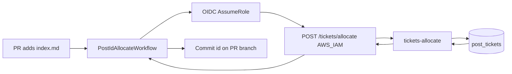

# Component Dependencies — Issue #121

## Dependency matrix

| Component | Depends on | Dependency type |
|-----------|------------|-----------------|
| TicketsAllocateFn | `post_tickets` DynamoDB | Runtime write |
| TicketsAllocateFn | API Gateway route `POST /allocate` | Invoke |
| TicketsApi (allocate route) | IAM principal (GHA role) | Authz |
| PostIdAllocateWorkflow | TicketsAllocateFn (via HTTPS) | Runtime call |
| PostIdAllocateWorkflow | FrontmatterPostIdPatcher | Library/script |
| PostIdAllocateWorkflow | `GITHUB_TOKEN` | Push to PR head |
| GitHubActions role | `execute-api:Invoke` on allocate | IAM |
| Secondary TicketsAllocateFn | Primary-region DynamoDB table | Cross-region write |

Does **not** depend on: `ticket-server-secrets`, photo-upload stack, Next.js build.

## Communication patterns

- **Sync request/response** for allocate (CI waits for id before commit)
- **No EventBridge** for this feature
- **Git push** as the side effect that makes the id durable in the repo

## Data flow



### Text alternative
```
PR adds post → Actions workflow → OIDC role → SigV4 POST /tickets/allocate
→ tickets-allocate → DynamoDB counter → {id} → patch frontmatter → one git push
```
