# Execution Plan — Photo UX Polish

## Detailed Analysis Summary

### Transformation Scope (Brownfield)
- **Transformation Type**: Single-area polish across existing UI + one API Gateway route
- **Primary Changes**: Map component, photo detail tags, homepage skeleton, gallery layout, bare `GET /photos` route
- **Related Components**: `components/*`, `lib/photos-api.ts`, `app/photos/*`, `infra/photo-upload.yml` (+ secondary if mirrored)

### Change Impact Assessment
- **User-facing changes**: Yes — home, photo detail, photos index filter, galleries detail
- **Structural changes**: No — no new services or data models
- **Data model changes**: No
- **API changes**: Yes (minor) — bare `/photos` list route; optional client-side `?tag=` only (no required new query param if client filters)
- **NFR impact**: Low — perceived load (skeleton), privacy unchanged (public coords only)

### Component Relationships
- **Primary**: Next.js App Router UI (`ApiPhotoDetail`, `PhotoStaticMap`, `HomePhotos`, `GalleryViewer` / `ApiGalleryDetail`, photos index)
- **Infrastructure**: `micahwalter-photo-upload` HTTP API routes (and secondary mirror)
- **Shared**: `lib/photos-api.ts`
- **Dependent**: Static site clients calling `/photos` and `/photos/`
- **Change Type**: Minor UI + configuration-only API route
- **Priority**: Important (live UX bugs/gaps)

### Risk Assessment
- **Risk Level**: Low
- **Rollback Complexity**: Easy (revert UI commit; remove added API route if needed)
- **Testing Complexity**: Simple (visual + curl CORS/list + tag filter smoke)

### Module Update Strategy
- **Update Approach**: Sequential single package (site repo)
- **Critical Path**: UI can ship independently; bare `/photos` route needs CFN deploy of photo-upload stack(s)
- **Coordination**: Deploy API route before or with any client that depends on bare path; site already uses trailing slash for list
- **Testing Checkpoints**: `npm run build`; curl OPTIONS/GET; browser smoke on `/photos/171`, `/photos?tag=`, `/`, gallery detail

---

## Workflow Visualization

### Mermaid

```mermaid
flowchart TD
    Start(["User Request"])

    subgraph INCEPTION["INCEPTION PHASE"]
        WD["Workspace Detection<br/>COMPLETED"]
        RE["Reverse Engineering<br/>SKIP"]
        RA["Requirements Analysis<br/>COMPLETED"]
        US["User Stories<br/>COMPLETED"]
        WP["Workflow Planning<br/>EXECUTE"]
        AD["Application Design<br/>SKIP"]
        UG["Units Generation<br/>SKIP"]
    end

    subgraph CONSTRUCTION["CONSTRUCTION PHASE"]
        FD["Functional Design<br/>SKIP"]
        NFRA["NFR Requirements<br/>SKIP"]
        NFRD["NFR Design<br/>SKIP"]
        ID["Infrastructure Design<br/>SKIP"]
        CG["Code Generation<br/>EXECUTE"]
        BT["Build and Test<br/>EXECUTE"]
    end

    subgraph OPERATIONS["OPERATIONS PHASE"]
        OPS["Operations<br/>PLACEHOLDER"]
    end

    Start --> WD
    WD --> RE
    RE --> RA
    RA --> US
    US --> WP
    WP --> AD
    AD --> UG
    UG --> FD
    FD --> NFRA
    NFRA --> NFRD
    NFRD --> ID
    ID --> CG
    CG --> BT
    BT --> OPS
    OPS --> EndNode(["Complete"])

    style WD fill:#4CAF50,stroke:#1B5E20,stroke-width:3px,color:#fff
    style RA fill:#4CAF50,stroke:#1B5E20,stroke-width:3px,color:#fff
    style US fill:#4CAF50,stroke:#1B5E20,stroke-width:3px,color:#fff
    style WP fill:#4CAF50,stroke:#1B5E20,stroke-width:3px,color:#fff
    style CG fill:#4CAF50,stroke:#1B5E20,stroke-width:3px,color:#fff
    style BT fill:#4CAF50,stroke:#1B5E20,stroke-width:3px,color:#fff
    style RE fill:#BDBDBD,stroke:#424242,stroke-width:2px,stroke-dasharray: 5 5,color:#000
    style AD fill:#BDBDBD,stroke:#424242,stroke-width:2px,stroke-dasharray: 5 5,color:#000
    style UG fill:#BDBDBD,stroke:#424242,stroke-width:2px,stroke-dasharray: 5 5,color:#000
    style FD fill:#BDBDBD,stroke:#424242,stroke-width:2px,stroke-dasharray: 5 5,color:#000
    style NFRA fill:#BDBDBD,stroke:#424242,stroke-width:2px,stroke-dasharray: 5 5,color:#000
    style NFRD fill:#BDBDBD,stroke:#424242,stroke-width:2px,stroke-dasharray: 5 5,color:#000
    style ID fill:#BDBDBD,stroke:#424242,stroke-width:2px,stroke-dasharray: 5 5,color:#000
    style OPS fill:#BDBDBD,stroke:#424242,stroke-width:2px,stroke-dasharray: 5 5,color:#000
    style Start fill:#CE93D8,stroke:#6A1B9A,stroke-width:3px,color:#000
    style EndNode fill:#CE93D8,stroke:#6A1B9A,stroke-width:3px,color:#000
```



### Text alternative
```
INCEPTION
  Workspace Detection     COMPLETED
  Reverse Engineering     SKIP (existing artifacts)
  Requirements Analysis   COMPLETED
  User Stories            COMPLETED
  Workflow Planning       EXECUTE (this stage)
  Application Design      SKIP
  Units Generation        SKIP (single code-gen unit)

CONSTRUCTION
  Functional Design       SKIP
  NFR Requirements        SKIP
  NFR Design              SKIP
  Infrastructure Design   SKIP (route change in Code Generation)
  Code Generation         EXECUTE
  Build and Test          EXECUTE

OPERATIONS
  Operations              PLACEHOLDER
```

---

## Phases to Execute

### INCEPTION
- [x] Workspace Detection (COMPLETED)
- [x] Reverse Engineering (SKIPPED — artifacts sufficient)
- [x] Requirements Analysis (COMPLETED)
- [x] User Stories (COMPLETED)
- [x] Workflow Planning (IN PROGRESS)
- [ ] Application Design — **SKIP**
  - **Rationale**: Work stays inside existing components; no new services or service-layer design needed
- [ ] Units Generation — **SKIP**
  - **Rationale**: One cohesive polish pass; treat as a single Code Generation unit rather than multi-unit decomposition. IaC delta is one explicit API route (documented in the code-gen plan)

### CONSTRUCTION
- [ ] Functional Design — **SKIP**
  - **Rationale**: No new data models or complex business rules
- [ ] NFR Requirements — **SKIP**
  - **Rationale**: NFRs already captured in requirements.md; no new stack selection
- [ ] NFR Design — **SKIP**
  - **Rationale**: NFR Requirements skipped
- [ ] Infrastructure Design — **SKIP**
  - **Rationale**: Single HTTP API route addition handled in Code Generation (must not reintroduce `$default`)
- [ ] Code Generation — **EXECUTE** (ALWAYS)
  - **Rationale**: Implement US-1…US-5 / FR-1…FR-5
- [ ] Build and Test — **EXECUTE** (ALWAYS)
  - **Rationale**: `npm run build` + API curl + UI smoke checks

### OPERATIONS
- [ ] Operations — PLACEHOLDER
  - **Rationale**: Deploy via existing GHA / CFN after merge; no new ops stage content required beyond handoff notes in Build and Test

## Package Change Sequence
1. Site UI + `lib/photos-api.ts` (map, tags, skeleton, galleries, `?tag=` client filter)
2. `infra/photo-upload.yml` (+ secondary) — explicit bare list route if needed
3. Deploy photo-upload stack(s) when API change merges; site deploy for UI

## Effort characterization (not calendar time)
- **Touch surfaces**: ~6–8 front-end files + 1–2 CFN templates
- **Risk**: Low; map provider swap is the main behavioral change
- **Dependencies**: OSM tiles/embed must work in browser; no new AWS secrets

## Success Criteria
- **Primary Goal**: Ship the four UX fixes + bare `/photos` reliability
- **Key Deliverables**: Working UI on home/photo/gallery; `/photos?tag=`; map+place on detail; API bare path 200 without `$default`
- **Quality Gates**: Build green; OPTIONS 204; photo 171 map visible; gallery margins correct
