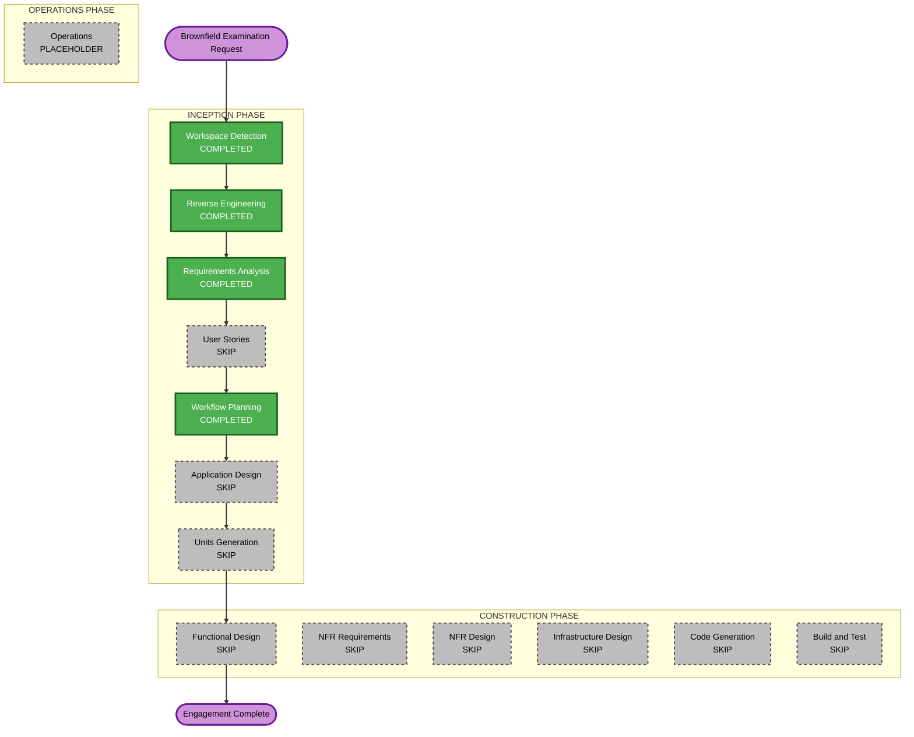

# Execution Plan

## Engagement Summary

| Field | Value |
|-------|--------|
| **Engagement Type** | Brownfield examination and living documentation foundation |
| **Implementation Scope** | None — documentation only |
| **Backlog Source** | GitHub Issues (see `aidlc-docs/workflow-conventions.md`) |
| **Risk Level** | Low |
| **Rollback Complexity** | N/A (no code changes) |
| **Testing Complexity** | N/A (no code changes) |

## Detailed Analysis Summary

### Transformation Scope
- **Transformation Type**: None — baseline documentation only
- **Primary Changes**: AI-DLC artifacts created in `aidlc-docs/`; no application or infrastructure changes
- **Related Components**: None affected

### Change Impact Assessment
- **User-facing changes**: No
- **Structural changes**: No
- **Data model changes**: No
- **API changes**: No
- **NFR impact**: No

### Component Relationships
No components are being modified in this engagement. The brownfield system remains unchanged. Reverse engineering artifacts in `aidlc-docs/inception/reverse-engineering/` document existing relationships for future reference.

### Risk Assessment
- **Risk Level**: Low — documentation-only, no production impact
- **Rollback Complexity**: Easy — aidlc-docs changes are additive and reversible via git
- **Testing Complexity**: Simple — verify artifact completeness and accuracy

## Workflow Visualization

### Text Alternative

```
Phase 1: INCEPTION (this engagement)
- Workspace Detection     COMPLETED
- Reverse Engineering   COMPLETED
- Requirements Analysis COMPLETED
- User Stories          SKIPPED (deferred)
- Workflow Planning     COMPLETED
- Application Design    SKIPPED (no implementation)
- Units Generation      SKIPPED (no implementation)

Phase 2: CONSTRUCTION (this engagement)
- All stages            SKIPPED (no implementation scope)

Phase 3: OPERATIONS
- Operations            PLACEHOLDER

Result: ENGAGEMENT COMPLETE — ready for issue-driven future work
```



## Phases — This Engagement

### INCEPTION PHASE
- [x] Workspace Detection — **COMPLETED**
- [x] Reverse Engineering — **COMPLETED**
- [x] Requirements Analysis — **COMPLETED**
- [x] User Stories — **SKIP** — Deferred; revisit when implementation scope emerges (per Q5)
- [x] Workflow Planning — **COMPLETED**
- [ ] Application Design — **SKIP** — No new components or services; documentation-only engagement
- [ ] Units Generation — **SKIP** — No decomposition needed; no implementation scope

### CONSTRUCTION PHASE
- [ ] Functional Design — **SKIP** — No business logic changes
- [ ] NFR Requirements — **SKIP** — No new NFR requirements
- [ ] NFR Design — **SKIP** — No NFR requirements stage
- [ ] Infrastructure Design — **SKIP** — No infrastructure changes
- [ ] Code Generation — **SKIP** — No code changes in this engagement
- [ ] Build and Test — **SKIP** — No build or test work in this engagement

### OPERATIONS PHASE
- [ ] Operations — **PLACEHOLDER**

## Future Engagement Template (Issue-Driven)

When starting work on a GitHub issue (e.g., "Let's work on #68"), AI-DLC shall adapt as follows:

### Entry Point
1. Read issue from GitHub: `gh issue view <number>`
2. Load existing reverse engineering artifacts (no re-run unless stale)
3. Load `aidlc-docs/workflow-conventions.md`

### Recommended Phase Selection (varies by issue)

| Issue Type | Typical Stages |
|------------|----------------|
| Static site feature (e.g., #10 featured post) | Requirements (standard) → Workflow Planning → Code Generation → Build and Test |
| CI/CD / infra (e.g., #68 branch preview) | Requirements → Workflow Planning → Infrastructure Design → Code Generation → Build and Test |
| CLI improvement | Requirements → Workflow Planning → Code Generation → Build and Test |
| Cross-system feature (e.g., #71 photo upload) | Requirements → User Stories → Application Design → Units Generation → Full Construction |

### Phase Decision Rules
- **User Stories**: Execute when user-facing workflows or multiple personas involved
- **Application Design**: Execute when new components, services, or API contracts needed
- **Units Generation**: Execute when changes span multiple subsystems (site + infra + CLI)
- **Infrastructure Design**: Execute when CloudFormation, CI/CD, or AWS resources change
- **Code Generation + Build and Test**: Always execute for implementation engagements

### Package Update Sequence (Brownfield)
When an issue touches multiple packages, typical order:
1. Shared models / lib utilities
2. Infrastructure (CloudFormation) if new resources needed
3. Application code (Next.js, Lambdas, CLI)
4. CI/CD workflows
5. Documentation updates in aidlc-docs (engagement-specific only)

### Completion
- PR references issue: `Closes #<number>`
- Update `aidlc-docs/audit.md` with engagement log
- Close or update GitHub issue — do not duplicate in aidlc-docs

## Success Criteria — This Engagement

- [x] Reverse engineering artifacts complete
- [x] Requirements documented with GitHub backlog convention
- [x] Workflow conventions established
- [x] Execution plan created
- [x] Living documentation foundation in `aidlc-docs/` ready for future sessions

## Quality Gates — This Engagement

- Reverse engineering artifacts reviewed and approved
- Requirements approved
- Workflow conventions align with user preference (GitHub as backlog)
- No application code modified

## Next Action After Approval

**This engagement is complete.** To begin implementation work, start a new AI-DLC session with a GitHub issue:

```
"Let's work on #<issue-number>"
```

The agent will read the issue, run Requirements Analysis at standard depth for that scope, and produce an issue-specific execution plan.
