# Execution Plan — Photo Map Privacy (Neighborhood-Scale)

## Detailed Analysis Summary

### Transformation Scope (Brownfield)
- **Transformation Type**: Single-feature enhancement across enricher + photo detail UI
- **Primary Changes**: Coarser public GPS fuzz (2 decimals); area-style OSM embed without marker; backfill existing photos
- **Related Components**:
  - `infra/photo-upload-lambdas/src/lib/geo.js` (fuzz)
  - `infra/photo-upload-lambdas/src/enrich.js` (uses fuzz; force re-enrich path for backfill)
  - `lib/photos-api.ts` (`buildOsmEmbedUrl` / browse URL)
  - `components/PhotoStaticMap.tsx` (embed presentation)
  - Optional small script or documented EventBridge force-enrich for backfill

### Change Impact Assessment
- **User-facing changes**: Yes — map reads as neighborhood area, not street pin
- **Structural changes**: No
- **Data model changes**: No schema change; `publicLatitude`/`publicLongitude` values become coarser
- **API changes**: Same fields; lower precision values only
- **NFR impact**: Privacy strengthened; no performance/infra changes

### Component Relationships
- **Primary**: Photo enricher geo helpers → DynamoDB public coords → PublicPhoto DTO → PhotoStaticMap
- **Infrastructure**: No CFN changes expected (algorithm + UI only)
- **Dependent**: Detail page already gated on public coords

### Risk Assessment
- **Risk Level**: Low
- **Rollback Complexity**: Easy (revert fuzz decimals + map URL; re-backfill if needed)
- **Testing Complexity**: Simple (unit tests for rounding; visual check of map embed; smoke API coords)

### Module Update Strategy
- **Update Approach**: Sequential within one unit
- **Critical Path**: (1) fuzz helper + tests → (2) map URL/UI → (3) deploy enricher → (4) backfill
- **Coordination**: Site UI can ship before/with Lambda; backfill needs deployed enricher (or local admin script writing DynamoDB)

## Workflow Visualization

```mermaid
flowchart TD
    Start(["User Request"])

    subgraph INCEPTION["INCEPTION PHASE"]
        WD["Workspace Detection<br/>COMPLETED"]
        RE["Reverse Engineering<br/>SKIP"]
        RA["Requirements Analysis<br/>COMPLETED"]
        US["User Stories<br/>SKIP"]
        WP["Workflow Planning<br/>IN PROGRESS"]
        AD["Application Design<br/>SKIP"]
        UG["Units Generation<br/>SKIP"]
    end

    subgraph CONSTRUCTION["CONSTRUCTION PHASE"]
        FD["Functional Design<br/>SKIP"]
        NFRA["NFR Requirements<br/>SKIP"]
        NFRD["NFR Design<br/>SKIP"]
        ID["Infrastructure Design<br/>SKIP"]
        CG["Code Generation<br/>EXECUTE"]
        BT["Build and Test<br/>EXECUTE"]
    end

    subgraph OPERATIONS["OPERATIONS PHASE"]
        OPS["Backfill public coords<br/>AFTER DEPLOY"]
    end

    Start --> WD
    WD --> RE
    RE --> RA
    RA --> US
    US --> WP
    WP --> AD
    AD --> UG
    UG --> FD
    FD --> NFRA
    NFRA --> NFRD
    NFRD --> ID
    ID --> CG
    CG --> BT
    BT --> OPS
    OPS --> EndNode(["Complete"])

    style WD fill:#4CAF50,stroke:#1B5E20,stroke-width:3px,color:#fff
    style RA fill:#4CAF50,stroke:#1B5E20,stroke-width:3px,color:#fff
    style WP fill:#FFA726,stroke:#E65100,stroke-width:3px,color:#000
    style CG fill:#4CAF50,stroke:#1B5E20,stroke-width:3px,color:#fff
    style BT fill:#4CAF50,stroke:#1B5E20,stroke-width:3px,color:#fff
    style RE fill:#BDBDBD,stroke:#424242,stroke-width:2px,stroke-dasharray: 5 5,color:#000
    style US fill:#BDBDBD,stroke:#424242,stroke-width:2px,stroke-dasharray: 5 5,color:#000
    style AD fill:#BDBDBD,stroke:#424242,stroke-width:2px,stroke-dasharray: 5 5,color:#000
    style UG fill:#BDBDBD,stroke:#424242,stroke-width:2px,stroke-dasharray: 5 5,color:#000
    style FD fill:#BDBDBD,stroke:#424242,stroke-width:2px,stroke-dasharray: 5 5,color:#000
    style NFRA fill:#BDBDBD,stroke:#424242,stroke-width:2px,stroke-dasharray: 5 5,color:#000
    style NFRD fill:#BDBDBD,stroke:#424242,stroke-width:2px,stroke-dasharray: 5 5,color:#000
    style ID fill:#BDBDBD,stroke:#424242,stroke-width:2px,stroke-dasharray: 5 5,color:#000
    style OPS fill:#FFF59D,stroke:#F57F17,stroke-width:2px,color:#000
    style Start fill:#CE93D8,stroke:#6A1B9A,stroke-width:3px,color:#000
    style EndNode fill:#CE93D8,stroke:#6A1B9A,stroke-width:3px,color:#000
```

### Text alternative
1. INCEPTION: WD done → RE skip → RA done → US skip → WP (this plan) → AD skip → UG skip  
2. CONSTRUCTION: design stages skip → Code Generation → Build and Test  
3. OPERATIONS: backfill public coords after enricher deploy  

## Phases to Execute

### INCEPTION
- [x] Workspace Detection — COMPLETED
- [x] Reverse Engineering — SKIP (artifacts exist)
- [x] Requirements Analysis — COMPLETED
- [x] User Stories — **SKIP**
  - **Rationale**: Single locked privacy tweak; acceptance criteria already in requirements.md; no multi-persona or ambiguous UX journeys. Override if you want formal visitor stories.
- [ ] Workflow Planning — IN PROGRESS (this document)
- [ ] Application Design — **SKIP**
  - **Rationale**: No new components/services; change existing `fuzzPublicCoords` + map URL helpers
- [ ] Units Generation — **SKIP**
  - **Rationale**: One vertical slice (geo + UI + backfill); treat as single unit in Code Generation

### CONSTRUCTION
- [ ] Functional Design — **SKIP** (simple rounding + embed URL change)
- [ ] NFR Requirements — **SKIP** (privacy NFR already stated; no new stack)
- [ ] NFR Design — **SKIP**
- [ ] Infrastructure Design — **SKIP** (no CFN/API changes expected)
- [ ] Code Generation — **EXECUTE**
  - Part 1: short implementation plan with checkboxes
  - Part 2: code + unit tests + backfill notes
- [ ] Build and Test — **EXECUTE**
  - Enricher unit tests; `npm run build`; manual map check on a photo with GPS

### OPERATIONS
- [ ] Backfill — run force re-enrich / coords rewrite for existing GPS photos after Lambda deploy (document in build-and-test / ops handoff)

## Package Change Sequence
1. `infra/photo-upload-lambdas` — fuzz to 2 decimals + tests  
2. Site `lib/photos-api.ts` + `components/PhotoStaticMap.tsx` — larger bbox, no marker  
3. Deploy enricher (existing photo-upload workflow on merge)  
4. Backfill existing photo public coords  

## Success Criteria
- **Primary Goal**: Photo maps show neighborhood-scale area without implying exact capture point
- **Key Deliverables**: Updated fuzz; area map UI; backfill path; tests green
- **Quality Gates**: Unit tests for 2-decimal fuzz; build passes; sample photo API shows 2-decimal public coords after backfill

## Extension Compliance
| Extension | Status |
|-----------|--------|
| Security Baseline | N/A (disabled) |
| Resiliency Baseline | N/A (disabled) |
| Property-Based Testing | N/A (disabled) |
