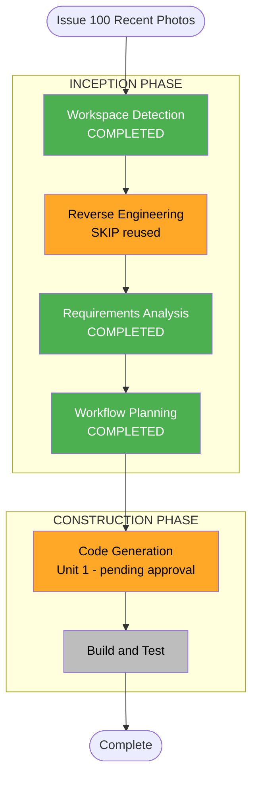

# Execution Plan — Issue #100: Recent Photos Section on Homepage

**GitHub Issue**: [#100](https://github.com/micahwalter/micahwalter-www/issues/100)
**Branch**: `claude/ai-dlc-implementation-plan-2ltytn`
**Date**: 2026-07-13
**Requirements**: `aidlc-docs/inception/requirements/issue-100-requirements.md`

## Phase Decisions

| AI-DLC Stage | Decision | Rationale |
|--------------|----------|-----------|
| Workspace Detection | COMPLETED | Brownfield; prior AI-DLC artifacts present |
| Reverse Engineering | SKIP (reused) | Homepage/content/grid patterns already documented in requirements doc |
| Requirements Analysis | COMPLETED | Standard depth — one design decision (card density) flagged for approval |
| User Stories | SKIP | Simple homepage teaser addition; no new personas or workflows |
| Workflow Planning | COMPLETED | This document |
| Application Design | SKIP | No new components/services beyond one presentational section |
| Units Generation | SKIP | Single unit |
| Functional Design | SKIP | No business logic; pure presentation + existing data helper |
| NFR Requirements | SKIP | Covered in requirements (static export, responsive, build) |
| NFR Design | SKIP | No new patterns needed |
| Infrastructure Design | SKIP | No infrastructure changes |
| Code Generation | APPROVED — EXECUTE | Unit 1 — compact thumbnail grid, 6 photos |
| Build and Test | EXECUTE | `npm run build` |

## Workflow Visualization

## Unit 1: Recent Photos Section

| Step | Task | Files |
|------|------|-------|
| 1 | Add "Recent Photos" section to homepage below "Recent Posts": pull `getPhotos()`, exclude the hero photo id, cap to agreed count, render as a responsive grid of image tiles linking to `/posts/[slug]`, with a "View all photos →" link to `/photos` | `app/page.tsx` |
| 2 | Skip rendering the section when zero eligible photos remain | `app/page.tsx` |
| 3 | Run production build | — |
| 4 | Write construction summary | `aidlc-docs/construction/issue-100-construction-summary.md` |

## Verification Checklist

- [ ] Homepage renders Recent Photos grid below Recent Posts
- [ ] Hero photo excluded from the grid (no duplicate)
- [ ] Grid collapses to single column on mobile
- [ ] "View all photos →" links to `/photos`
- [ ] `npm run build` succeeds
- [ ] Manual visual check via dev server

## Extension Compliance Summary

All extensions disabled/N/A — no auth, data, infra, or test-runner surface touched.

## Approval Gate

**APPROVED (2026-07-13)** — user selected compact thumbnail grid, 6 photos. Proceeding to Code Generation.
