# Execution Plan — Issues #103 / #104: Photo Metadata DynamoDB + Dynamic Serving

**GitHub Issues**: [#103](https://github.com/micahwalter/micahwalter-www/issues/103), [#104](https://github.com/micahwalter/micahwalter-www/issues/104)  
**Branch**: `cursor/photo-metadata-dynamodb-be02`  
**Date**: 2026-07-16  
**Requirements**: `aidlc-docs/inception/requirements/issue-103-requirements.md`  
**Stories**: `aidlc-docs/inception/user-stories/issue-103-stories.md`  
**RE**: `aidlc-docs/inception/reverse-engineering/photo-subsystem.md`

---

## Detailed Analysis Summary

### Transformation Scope (Brownfield)
- **Transformation Type**: Architectural + infrastructure — photo metadata moves from git markdown to DynamoDB; photo UI becomes API-backed; upload process stops GitHub commits
- **Primary Changes**: New photo/gallery data plane; process Lambda enrichment; hybrid frontend fetch; CloudFront redirects; scheduled feed job; content-tree cleanup
- **Related Components**: `infra/photo-upload-*`, `infra/tickets.yml`, `infra/api-domain.yml`, `infra/infra.yml` (CF redirects), `app/upload`, `app/photos`, `app/posts`, `app/page`, `lib/content.ts`, `lib/galleries.ts`, `scripts/tag-photos.js`, `cli/`, `.github/workflows/*`

### Change Impact Assessment
| Area | Impact |
|------|--------|
| User-facing | Yes — multi-upload, captions, `/photos/<id>`, maps, edit UI, gallery admin, live listings |
| Structural | Yes — new DB + APIs; hybrid static/dynamic photo surfaces |
| Data model | Yes — DynamoDB photos + galleries; migrate ~43 photos + gallery markdown |
| API | Yes — extend `/photos`; public read + authenticated write; gallery admin APIs |
| NFR | Yes — publish latency, GPS privacy, multi-region parity, enrichment resilience |

### Component Relationships
```text
tickets API (id alloc)
    ^
photo-upload process --> DynamoDB photos (+ enrichment: EXIF/GPS, Bedrock, reverse geocode)
    |                         |
    |                         +--> public read API --> homepage /photos /photos/[id] search
    |                         +--> auth write API --> edit UI / upload metadata
    +--> images CDN (unchanged)
DynamoDB galleries <--> gallery admin UI / public gallery pages
Scheduled job --> RSS/sitemap photo URLs
CloudFront --> /posts/<id> photo redirects --> /photos/<id>
```

| Component | Change Type | Priority |
|-----------|-------------|----------|
| Photo DynamoDB + APIs | Major (new) | Critical |
| photo-upload process Lambda | Major | Critical |
| Next.js photo UI + upload/edit | Major | Critical |
| Galleries store + admin/public | Major | Important |
| CloudFront / redirects | Minor–Major | Critical |
| Feed scheduled job | Major (new) | Important |
| CLI photo tools | Minor–Major | Important |
| Blog markdown / static export core | None / config only | — |

### Risk Assessment
- **Risk Level**: High
- **Rollback Complexity**: Moderate–Difficult (dual-write window recommended before deleting markdown; redirects reversible)
- **Testing Complexity**: Complex (API, UI, enrichment, migration, redirects, feeds)
- **Mitigations**: Dual-write then cutover; idempotent migration; enrichment failures non-blocking; keep image CDN unchanged

---

## Phase Decisions

| AI-DLC Stage | Decision | Rationale |
|--------------|----------|-----------|
| Workspace Detection | COMPLETED | Brownfield; new engagement on existing repo |
| Reverse Engineering | COMPLETED | Focused photo-subsystem refresh |
| Requirements Analysis | COMPLETED | Comprehensive; approved |
| User Stories | COMPLETED | 16 stories / 2 personas; approved |
| Workflow Planning | IN PROGRESS | This document |
| Application Design | **EXECUTE** | New services, APIs, components, dependencies |
| Units Generation | **EXECUTE** | Multiple packages/units; schemas + APIs + infra |
| Functional Design | **EXECUTE** (per unit as needed) | Data models, enrichment rules, gallery membership |
| NFR Requirements | **EXECUTE** (per unit as needed) | Latency, GPS privacy, multi-region, caching |
| NFR Design | **EXECUTE** (per unit as needed) | Fuzzing, async enrichment, failover patterns |
| Infrastructure Design | **EXECUTE** (per unit as needed) | DynamoDB, Lambdas, CF behaviors, scheduler |
| Code Generation | **EXECUTE** (always, per unit) | Implementation |
| Build and Test | **EXECUTE** (always) | Build, migration dry-run, manual/API verification |
| Operations | PLACEHOLDER | Deploy handoff notes at end if needed |

### Depth
- Application Design / Units / per-unit design: **comprehensive** (matches migration complexity)
- Code Generation: full planning + generation per unit

---

## Workflow Visualization

```mermaid
flowchart TD
    Start(["Issues 103 104 Photo DB"])

    subgraph INCEPTION["INCEPTION PHASE"]
        WD["Workspace Detection<br/>COMPLETED"]
        RE["Reverse Engineering<br/>COMPLETED"]
        RA["Requirements Analysis<br/>COMPLETED"]
        US["User Stories<br/>COMPLETED"]
        WP["Workflow Planning<br/>IN PROGRESS"]
        AD["Application Design<br/>EXECUTE"]
        UG["Units Generation<br/>EXECUTE"]
    end

    subgraph CONSTRUCTION["CONSTRUCTION PHASE"]
        FD["Functional Design<br/>EXECUTE per unit"]
        NFRA["NFR Requirements<br/>EXECUTE per unit"]
        NFRD["NFR Design<br/>EXECUTE per unit"]
        ID["Infrastructure Design<br/>EXECUTE per unit"]
        CG["Code Generation<br/>EXECUTE per unit"]
        BT["Build and Test<br/>EXECUTE"]
    end

    subgraph OPERATIONS["OPERATIONS PHASE"]
        OPS["Operations<br/>PLACEHOLDER"]
    end

    Start --> WD --> RE --> RA --> US --> WP --> AD --> UG
    UG --> FD --> NFRA --> NFRD --> ID --> CG
    CG -->|"next unit"| FD
    CG --> BT --> EndNode(["Complete"])
    BT -.-> OPS

    style WD fill:#4CAF50,stroke:#1B5E20,stroke-width:3px,color:#fff
    style RE fill:#4CAF50,stroke:#1B5E20,stroke-width:3px,color:#fff
    style RA fill:#4CAF50,stroke:#1B5E20,stroke-width:3px,color:#fff
    style US fill:#4CAF50,stroke:#1B5E20,stroke-width:3px,color:#fff
    style WP fill:#FFA726,stroke:#E65100,stroke-width:3px,color:#000
    style AD fill:#FFA726,stroke:#E65100,stroke-width:3px,stroke-dasharray: 5 5,color:#000
    style UG fill:#FFA726,stroke:#E65100,stroke-width:3px,stroke-dasharray: 5 5,color:#000
    style FD fill:#FFA726,stroke:#E65100,stroke-width:3px,stroke-dasharray: 5 5,color:#000
    style NFRA fill:#FFA726,stroke:#E65100,stroke-width:3px,stroke-dasharray: 5 5,color:#000
    style NFRD fill:#FFA726,stroke:#E65100,stroke-width:3px,stroke-dasharray: 5 5,color:#000
    style ID fill:#FFA726,stroke:#E65100,stroke-width:3px,stroke-dasharray: 5 5,color:#000
    style CG fill:#4CAF50,stroke:#1B5E20,stroke-width:3px,color:#fff
    style BT fill:#4CAF50,stroke:#1B5E20,stroke-width:3px,color:#fff
    style OPS fill:#BDBDBD,stroke:#424242,stroke-width:2px,stroke-dasharray: 5 5,color:#000
    style Start fill:#CE93D8,stroke:#6A1B9A,stroke-width:3px,color:#000
    style EndNode fill:#CE93D8,stroke:#6A1B9A,stroke-width:3px,color:#000
```



### Text alternative

```text
INCEPTION (done): Workspace Detection -> Reverse Engineering -> Requirements -> User Stories
INCEPTION (next): Workflow Planning (this) -> Application Design -> Units Generation
CONSTRUCTION (per unit): Functional Design -> NFR Requirements -> NFR Design -> Infrastructure Design -> Code Generation
AFTER ALL UNITS: Build and Test -> Complete
Operations: placeholder
```

---

## Phases to Execute

### INCEPTION
- [x] Workspace Detection
- [x] Reverse Engineering
- [x] Requirements Analysis
- [x] User Stories
- [x] Workflow Planning (this document — awaiting approval)
- [ ] Application Design — **EXECUTE**
  - Rationale: New photo/gallery services, APIs, UI components, dependency map
- [ ] Units Generation — **EXECUTE**
  - Rationale: Multi-unit decomposition across data plane, enrichment, UI, galleries, cutover

### CONSTRUCTION (per unit, then once)
- [ ] Functional Design — **EXECUTE** when unit has data/business rules
- [ ] NFR Requirements — **EXECUTE** when unit has latency/security/region concerns
- [ ] NFR Design — **EXECUTE** when NFR Requirements ran
- [ ] Infrastructure Design — **EXECUTE** when unit touches AWS resources
- [ ] Code Generation — **EXECUTE** (always)
- [ ] Build and Test — **EXECUTE** (after all units)

### OPERATIONS
- [ ] Operations — PLACEHOLDER (optional deploy handoff notes)

### Skipped
- None remaining in INCEPTION/CONSTRUCTION beyond adaptive per-unit skips (e.g. a pure UI unit may skip Infrastructure Design)

---

## Tentative Unit Sequence (finalize in Units Generation)

Suggested critical path (subject to Units Generation approval):

1. **Photo data plane** — DynamoDB photos, public read + auth write APIs, process Lambda writes DB (no GitHub commit), dual-write optional window
2. **Enrichment** — GPS extract, fuzz, reverse-geocode → city/country tags, Bedrock auto-tags
3. **Upload UI** — multi-file + per-file title/caption/featured + progress
4. **Browse & detail** — homepage/`/photos`/`/photos/[id]` API fetch; static map; internal links
5. **Edit UI** — authenticated metadata edit
6. **Galleries** — DynamoDB + admin UI + public pages + migrate gallery markdown
7. **Cutover** — migrate 43 photos, redirects `/posts/<id>`→`/photos/<id>`, feed scheduler, content cleanup, CLI parity, multi-region wiring

**Update approach**: Sequential along critical path (1→2→3/4 can partially overlap after APIs exist); galleries after photos readable; cutover last.

**Story mapping (indicative)**  
- Unit 1: US-002 foundation  
- Unit 2: US-003, US-004  
- Unit 3: US-001  
- Unit 4: US-007, US-008, US-009, US-010  
- Unit 5: US-005  
- Unit 6: US-011, US-012  
- Unit 7: US-006, US-013–US-016  

---

## Package / Stack Change Sequence

1. DynamoDB + photo API Lambdas (extend `micahwalter-photo-upload` or sibling stack) + IAM/Bedrock/geo permissions  
2. Process Lambda behavior change (DB write, drop GitHub commit)  
3. Frontend Next.js photo surfaces + upload/edit/gallery admin  
4. CloudFront redirect rules for legacy photo URLs  
5. Scheduled feed/sitemap job  
6. Migration scripts + cutover + content cleanup  
7. CLI updates  

---

## Scope Characterization (not calendar estimates)

- **Stages remaining (INCEPTION)**: Application Design, Units Generation  
- **Construction**: Up to ~7 units, each with design+code as applicable  
- **Highest coupling**: Data plane must land before UI and cutover  
- **Highest risk slice**: Cutover (migration + stop markdown + redirects)

---

## Success Criteria

- **Primary goal**: Photos publish and render from DynamoDB/API without full site rebuild; markdown photo tree removed after cutover  
- **Key deliverables**: Working APIs/UI per US-001–016 acceptance criteria; migration complete; redirects live; feed job running  
- **Quality gates**: `npm run build` for site; API smoke tests; migration dry-run then apply; manual upload/edit/gallery/map checks  
- **Integration**: Homepage, `/photos`, detail, search, galleries, legacy redirects consistent  
- **Operational readiness**: Multi-region posture documented/implemented per NFR-3; secrets/IAM in place  

---

## Extension Compliance Summary

| Extension | Status | Notes |
|-----------|--------|-------|
| Security Baseline | N/A (disabled) | Auth, secrets, GPS privacy still required by NFRs |
| Resiliency Baseline | N/A (disabled) | Multi-region parity still required by NFR-3 |
| Property-Based Testing | N/A (disabled) | Lightweight validation in Build and Test |

---

## Approval Gate

Awaiting approval of this execution plan before **Application Design**.
