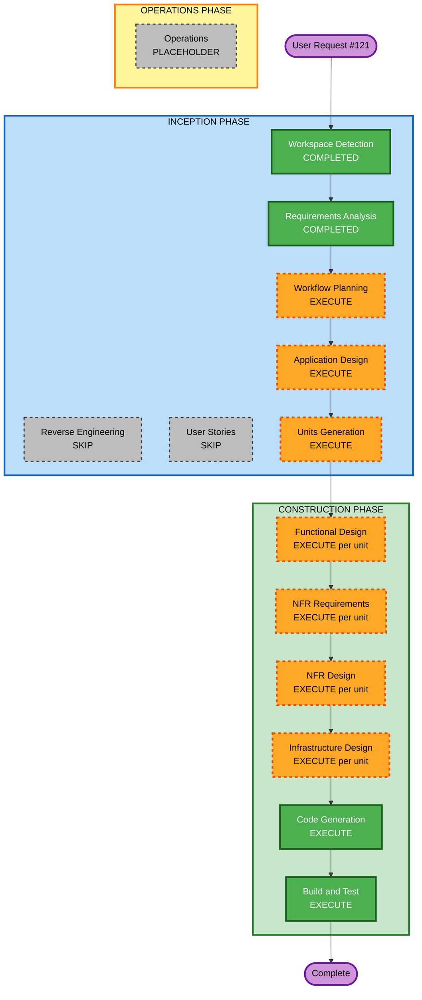

# Execution Plan — Issue #121 Blog post ID allocation

## Detailed Analysis Summary

### Transformation Scope (Brownfield)
- **Transformation Type**: Multi-component (tickets API + CI + IAM); not a full architectural rewrite
- **Primary Changes**: New machine-authenticated allocate route on tickets API; PR workflow that allocates and commits `id`; IAM for GitHub Actions OIDC; docs; backfill live post
- **Related Components**: `infra/ticket-lambdas`, `infra/tickets.yml`, `infra/tickets-secondary.yml` (if route must exist in failover region), `infra/github-actions-role.yml`, `.github/workflows/`, `content/posts/2026-07-20-photos-without-the-deploy/`, `aidlc-docs/workflow-conventions.md` / AGENTS.md / CLAUDE.md

### Change Impact Assessment
- **User-facing changes**: No (site readers unchanged). Author/agent publish path improved
- **Structural changes**: Yes — new tickets API route + CI automation
- **Data model changes**: No — same `post_tickets` counter
- **API changes**: Yes — new machine allocate endpoint (IAM auth)
- **NFR impact**: Yes — authz for machine callers; least privilege for Actions role

### Component Relationships
- **Primary**: tickets-next / new allocate function → DynamoDB `post_tickets`
- **Infrastructure**: `micahwalter-tickets` (+ secondary), `micahwalter-www-github-actions`
- **CI**: New (or extended) GitHub Actions workflow using OIDC
- **Dependent**: Blog/email frontmatter under `content/posts/`
- **Supporting**: Existing `/tickets/auth` + `/tickets/next` (unchanged for humans)

### Risk Assessment
- **Risk Level**: Medium (touches production tickets counter and CI push-to-PR-branch)
- **Rollback Complexity**: Moderate (remove workflow / disable route; counter values already issued stay used)
- **Testing Complexity**: Moderate (unit tests for frontmatter detect/patch; deploy + dry-run against tickets API; PR workflow needs careful permissions)

### Module Update Strategy
- **Update Approach**: Sequential
- **Critical Path**: (1) Tickets machine route + stack deploy → (2) IAM for Actions → (3) PR workflow → (4) Docs + backfill
- **Coordination Points**: Same DynamoDB counter as `/tickets/next`; Actions must not log passcode
- **Testing Checkpoints**: After tickets deploy (IAM-signed allocate works); after workflow (PR bot commit); after backfill (live post has id)

## Workflow Visualization



### Text alternative
```
INCEPTION: WD done → RE skip → RA done → US skip → WP execute → AD execute → UG execute
CONSTRUCTION (per unit): FD → NFR req → NFR design → Infra design → Code Gen → then Build and Test
OPERATIONS: placeholder
```

## Phases to Execute

### INCEPTION PHASE
- [x] Workspace Detection — COMPLETED
- [x] Reverse Engineering — SKIPPED (artifacts exist)
- [x] Requirements Analysis — COMPLETED
- [x] User Stories — SKIPPED (CI/publishing tooling; user approved without adding stories)
- [ ] Workflow Planning — EXECUTE (this document)
- [ ] Application Design — EXECUTE
  - **Rationale**: New allocate route, auth model, and PR bot behavior need component/service definition
- [ ] Units Generation — EXECUTE
  - **Rationale**: At least two units (tickets API vs CI/IAM/docs/backfill) with a clear dependency order

### CONSTRUCTION PHASE (per unit)
- [ ] Functional Design — EXECUTE (standard for API unit; lighter for CI unit)
  - **Rationale**: Allocate rules, idempotency, content-type filters
- [ ] NFR Requirements — EXECUTE
  - **Rationale**: IAM authz, least privilege, no secret leakage
- [ ] NFR Design — EXECUTE
  - **Rationale**: Map NFRs to API Gateway IAM auth and role policies
- [ ] Infrastructure Design — EXECUTE
  - **Rationale**: CloudFormation for tickets (+ secondary), GitHub Actions role, workflow
- [ ] Code Generation — EXECUTE (ALWAYS)
- [ ] Build and Test — EXECUTE (ALWAYS)

### OPERATIONS PHASE
- [ ] Operations — PLACEHOLDER (deploy notes in handoff / PR)

## Proposed Units (preview for Units Generation)
1. **U1 — Tickets machine allocate** — Go Lambda + `tickets.yml` (+ secondary parity) IAM-auth route
2. **U2 — PR allocate bot + IAM** — workflow, contents write permission pattern, OIDC invoke policy
3. **U3 — Docs + live post backfill** — conventions docs; allocate id for Photos without the deploy

## Estimated Effort Shape
- **Total stages executing after this plan**: Application Design, Units Generation, then per-unit design loop × ~3 units, Code Generation, Build and Test
- **Not a calendar estimate**: work is bounded by tickets stack + CI permissions + one backfill commit

## Success Criteria
- PR adding a blog/email post without `id` gets a bot commit with `id: N`
- Re-run does not double-allocate
- Machine route rejects unauthenticated callers
- Local passcode path unchanged
- Live post backfilled
- Closes #121 when merged and verified
