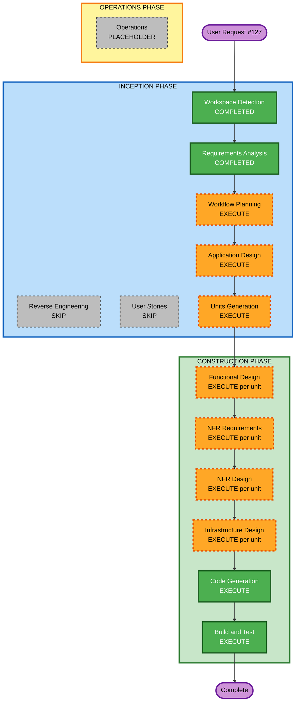

# Execution Plan — Issue #127 Exposure (periodic photo newsletter)

## Detailed Analysis Summary

### Transformation Scope (Brownfield)
- **Transformation Type**: Multi-component architectural addition (photo domain + newsletter automation + new Exposure public API/UI)
- **Primary Changes**: Photo eligibility/sent fields; edit UI + test send; Exposure DynamoDB/API + `/exposures` routes; EventBridge Sunday schedule; random select → SES via existing newsletter dispatch path; `AdminEmail` notify on empty pool; dedicated Exposure issue counter
- **Related Components**: `infra/photo-upload-lambdas` + `infra/photo-upload.yml`, `infra/newsletter-lambdas` + `infra/newsletter.yml` (or sibling Exposure stack), `app/upload/*`, `app/exposures/*` (new), `lib/photos-api.ts` (+ new exposures client), SES / EventBridge / DynamoDB

### Change Impact Assessment
- **User-facing changes**: Yes — subscribers get weekly Exposure emails; public `/exposures` archive; owner edit UI gains eligibility + test send
- **Structural changes**: Yes — new Exposure service surface + scheduled campaign path
- **Data model changes**: Yes — photo fields; exposures table; Exposure counter
- **API changes**: Yes — photo patch fields; exposures list/get; authenticated test-send; schedule-triggered internal send
- **NFR impact**: Yes — auth for owner actions; send idempotency; schedule reliability; admin notify

### Component Relationships
- **Primary**: Exposure send orchestrator (EventBridge → Lambda) → photos DB + exposures DB + newsletter dispatch/SES
- **Infrastructure**: Photo-upload stack (schema/API/UI auth); newsletter stack (`AdminEmail`, subscribers, dispatch bus); new or extended CFN for schedule + Exposure table/API
- **Site**: Next.js edit panel + `/exposures` pages
- **Dependent**: Existing `newsletter_subscribers` / `newsletter_sends` / SES templates
- **Supporting**: CloudWatch logs; existing photo session auth

### Risk Assessment
- **Risk Level**: Medium–High (touches production subscriber sends and photo metadata)
- **Rollback Complexity**: Moderate (disable EventBridge rule; leave eligibility fields harmless; archive data retained)
- **Testing Complexity**: Moderate (dry-run/test send to AdminEmail; schedule invoke; empty-pool path; no accidental blast)

### Module Update Strategy
- **Update Approach**: Sequential (data/API before schedule; site can parallel after read APIs exist)
- **Critical Path**: (1) Photo fields + eligibility UI + test send → (2) Exposure store/API + site routes → (3) EventBridge send loop + counter + empty-pool notify
- **Coordination Points**: Shared SES/`AdminEmail`; campaign id ↔ Exposure issue number; photo stamp only after successful subscriber dispatch
- **Testing Checkpoints**: Test button → AdminEmail only; manual EventBridge invoke with inventory; empty-pool notify; `/exposures` renders

## Workflow Visualization



### Text alternative
```
INCEPTION: WD done → RE skip → RA done → US skip → WP execute → AD execute → UG execute
CONSTRUCTION: per-unit FD → NFRA → NFRD → ID → CG → BT
OPERATIONS: placeholder
```

## Phases to Execute

### INCEPTION PHASE
- [x] Workspace Detection — COMPLETED
- [x] Reverse Engineering — SKIP (existing artifacts)
- [x] Requirements Analysis — COMPLETED
- [x] User Stories — SKIP (owner request; requirements + acceptance criteria sufficient)
- [x] Workflow Planning — IN PROGRESS (this document)
- [ ] Application Design — **EXECUTE**
  - **Rationale**: New Exposure components, photo field semantics, send orchestration, API boundaries
- [ ] Units Generation — **EXECUTE**
  - **Rationale**: Multi-package split (photos UI/API, Exposure archive, scheduled send)

### CONSTRUCTION PHASE
- [ ] Functional Design — **EXECUTE** (per unit)
  - **Rationale**: Eligibility/sent rules, random selection, archive entities, counter
- [ ] NFR Requirements — **EXECUTE** (per unit, standard/light)
  - **Rationale**: Auth, idempotent dispatch, schedule/ops
- [ ] NFR Design — **EXECUTE** (per unit)
  - **Rationale**: Patterns for auth, retries, logging
- [ ] Infrastructure Design — **EXECUTE** (per unit)
  - **Rationale**: EventBridge cron, DynamoDB, API Gateway, SES/`AdminEmail` wiring
- [ ] Code Generation — **EXECUTE** (ALWAYS)
- [ ] Build and Test — **EXECUTE** (ALWAYS)

### OPERATIONS PHASE
- [ ] Operations — PLACEHOLDER

## Proposed unit split (preview; finalized in Units Generation)

| Unit | Focus |
|------|--------|
| **U1** | Photo `exposureEligible` / sent fields; edit UI; authenticated test-send API → `AdminEmail` |
| **U2** | Exposure DynamoDB + public API; `/exposures` and `/exposures/[n]` site routes |
| **U3** | EventBridge Sunday schedule; random select; build email; dispatch to subscribers; stamp photo; empty-pool notify; Exposure counter |

## Package Change Sequence
1. Photo-upload stack / photos API + edit UI (U1)
2. Exposure table/API + site pages (U2)
3. Schedule + send orchestration + newsletter integration (U3)
4. Build/test instructions and deploy notes

## Success Criteria
- **Primary Goal**: Automated weekly Exposure email to newsletter subscribers with eligibility, sent tracking, archive, and owner test/empty-pool notify
- **Key Deliverables**: Working schedule, edit UX, `/exposures` archive, docs for AdminEmail/schedule
- **Quality Gates**: Test send never blasts; production send stamps once; empty pool notifies; acceptance checklist in requirements.md

## Overrides you can request
- Skip Application Design or Units Generation (code-first)
- Collapse per-unit NFR/infra design into a single lightweight pass
- Re-include User Stories

## Amendment (Units Generation)

- Construction design depth set to **lightweight combined design note per unit**, then Code Generation (not full FD/NFR/Infra gates per unit).
- Counter ownership: **U3** create + allocate.
- AdminEmail: CFN parameter on photo-upload stack.
