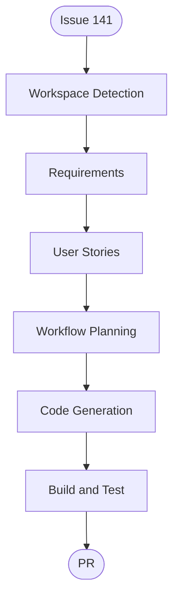

# Execution Plan — Issue #141 Exposure queue in admin

## Detailed Analysis Summary

### Transformation Scope (Brownfield)

- **Transformation Type**: Single-feature enhancement across existing photo admin UI and photos HTTP API
- **Primary Changes**: Authenticated `GET /exposure-queue`; Exposures tab on `/upload`
- **Related Components**: `photos-api` Lambda, `listExposureCandidates`, public exposures list client, `UploadHub`

### Change Impact Assessment

- **User-facing changes**: Yes — owner admin only
- **Structural changes**: No new stacks or tables
- **Data model changes**: None
- **API changes**: New authenticated GET on photos API (primary + secondary)
- **NFR impact**: Same auth/CORS as other admin routes

### Risk Assessment

- **Risk Level**: Low
- **Rollback Complexity**: Low (remove route + tab)
- **Testing Complexity**: Low (route matcher unit tests, `tsc` / `npm run build`; live tab needs passcode + deployed API)

## Stage decisions

| Stage | Decision | Why |
|-------|----------|-----|
| Reverse Engineering | Skip | #127 artifacts + current Exposure code are sufficient |
| Requirements Analysis | Execute (standard) | Issue is clear; document FR |
| User Stories | Execute (minimal) | Owner-facing admin UX |
| Workflow Planning | Execute | This plan |
| Application Design | Skip | Within existing photos-api + `/upload` boundaries |
| Units Generation | Skip | Single unit of work |
| Functional / NFR / Infra Design | Skip | No new business rules, stack, or NFR surface |
| Code Generation | Execute | API + UI |
| Build and Test | Execute | Unit tests + production Next build |

## Workflow Visualization

### Text alternative

1. Workspace Detection (complete)
2. Requirements Analysis (complete)
3. User Stories (minimal, complete)
4. Workflow Planning (this document)
5. Code Generation (API route + admin tab)
6. Build and Test (unit tests + `npm run build`)
7. Draft PR referencing Closes #141

## Unit of work

**U1 — Exposure queue admin**: `GET /exposure-queue` (auth) on photos-api; CloudFormation routes on primary and secondary; `getExposureQueue` client; Exposures tab listing upcoming pool + sent archive.
