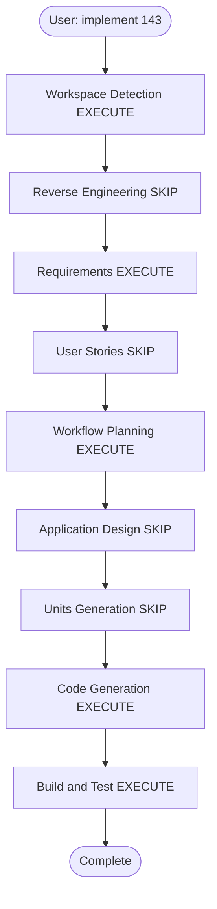

# Execution Plan — Issue #143 Social preview images

## Analysis summary

### Transformation scope
- **Type**: Application + existing infrastructure (CloudFront Function, feed-publisher Lambda, website bucket)
- **Primary changes**: Next.js `generateMetadata` / layout; OG HTML artifacts; crawler URI rewrite
- **Related**: `deploy.yml` S3 sync excludes; photo-upload IAM/env

### Change impact
- **User-facing**: Yes — social unfurls only (on-site UI unchanged)
- **Structural**: No new services; extra S3 keys under `og/`
- **Data model**: No
- **API**: No public API contract change
- **NFR**: Crawler HTML must stay cacheable and public

### Component relationships

```
LinkedInBot
    |
    v
CloudFront Function (viewer-request)
    | crawler + /photos/178
    v
S3 website /og/photos/178.html
    |
    +-- og:image --> /images/posts/{folder}/photo-1200.jpg (images origin)

Browser
    |
    v
CloudFront Function
    | human + /photos/178
    v
S3 website /photos/0.html (existing SPA shell)
```

### Risk
- **Level**: Medium (CloudFront Function is on every HTML request; must not break SPA shells or legacy redirects)
- **Rollback**: Revert Function + Next.js metadata; leftover `og/` keys are harmless
- **Testing**: Unit tests for OG HTML; `npm run build`; function size check

## Workflow visualization



Text alternative: Workspace Detection -> skip RE -> Requirements -> skip Stories -> Workflow Planning -> skip App Design and Units -> Code Generation -> Build and Test.

## Stage decisions

| Stage | Decision | Why |
|-------|----------|-----|
| Reverse Engineering | SKIP | Architecture known; #143 includes live tag dump |
| User Stories | SKIP | Single owner; AC already in the issue |
| Application Design | SKIP | No new components; CF Function + feed-publisher + metadata |
| Units Generation | SKIP | One unit of work |
| Per-unit design | SKIP | Implementation notes below |
| Code Generation | EXECUTE | |
| Build and Test | EXECUTE | |

## Implementation notes

1. Site share card `public/share-card.jpg` (1200x630) as universal fallback.
2. `lib/seo.ts` helper: canonical URL, `summary_large_image`, default image.
3. Static pages and MDX posts set metadata at build time (covers when present).
4. Feed-publisher writes `og/home.html`, `og/photos.html`, `og/exposures.html`, `og/galleries.html`, plus per-id/per-issue/per-slug HTML.
5. CloudFront Function: known share-crawler User-Agents on API-backed paths rewrite to those objects **before** SPA shell rewrite. Cache keys differ (rewritten URI), so bots and humans do not collide.
6. `deploy.yml` HTML sync excludes `og/photos/*`, `og/exposures/*`, `og/galleries/*` so `--delete` does not wipe generated files.
7. Best-effort OG write from photo process and Exposure orchestrator so new items are shareable before the hourly publisher.

## Module update strategy
- **Approach**: Sequential in one PR (Next.js + photo-upload + infra.yml + deploy.yml)
- **Deploy order after merge**: photo-upload stack (publisher + IAM) and infra stack (CloudFront Function) before or with site deploy; publisher backfill within an hour
