# Execution Plan — Issue #153 (Sparse AI Photo Tags)

## Detailed Analysis Summary

### Transformation Scope (Brownfield)
- **Transformation Type**: Single-component fix (photo enrich / Bedrock tagging)
- **Primary Changes**: Diagnose why `photo-upload-enrich` soft-fails Bedrock; fix invoke/parse/IAM as needed; improve observability logs; backfill sparse photo ids
- **Related Components**: `infra/photo-upload-lambdas` (enrich, bedrock-tags, tag-merge, image-keys), `infra/photo-upload.yml` (EnrichFn IAM / env), optional CLI `scripts/tag-photos.js` for backfill parity

### Change Impact Assessment
- **User-facing changes**: Yes — photo detail/grid tags regain subject/mood/style AI tags
- **Structural changes**: No — existing enrich pipeline retained
- **Data model changes**: No — `tags` / `enrichmentStatus` semantics unchanged (`complete` soft-fail kept)
- **API changes**: No public API contract change
- **NFR impact**: Yes (observability) — richer Bedrock failure logs/metrics; no status enum change

### Component Relationships
- **Primary Component**: `photo-upload-enrich` Lambda (`src/enrich.js`, `lib/bedrock-tags.js`)
- **Infrastructure Components**: `infra/photo-upload.yml` EnrichFnRole / BEDROCK_MODEL_ID
- **Shared Components**: `lib/tag-merge.js`, `lib/image-keys.js`, CLI `scripts/tag-photos.js`
- **Dependent Components**: Public photos API DTO (`tags`), site UI (read-only consumers)
- **Supporting Components**: CloudWatch Logs, EventBridge `PhotoPendingEnrichment`, S3 images bucket

### Risk Assessment
- **Risk Level**: Medium — production enrich path; root cause may be ops (model access) vs code
- **Rollback Complexity**: Easy — Lambda code rollback via prior zip; IAM revert if changed
- **Testing Complexity**: Moderate — needs live Bedrock + force re-enrich / upload smoke; unit tests for parse/logging where possible

## Workflow Visualization

### Mermaid Diagram

```mermaid
flowchart TD
    Start(["User Request"])

    subgraph INCEPTION["INCEPTION PHASE"]
        WD["Workspace Detection<br/>COMPLETED"]
        RE["Reverse Engineering<br/>SKIP"]
        RA["Requirements Analysis<br/>COMPLETED"]
        US["User Stories<br/>SKIP"]
        WP["Workflow Planning<br/>EXECUTE"]
        AD["Application Design<br/>SKIP"]
        UG["Units Generation<br/>SKIP"]
    end

    subgraph CONSTRUCTION["CONSTRUCTION PHASE"]
        FD["Functional Design<br/>SKIP"]
        NFRA["NFR Requirements<br/>SKIP"]
        NFRD["NFR Design<br/>SKIP"]
        ID["Infrastructure Design<br/>SKIP"]
        CG["Code Generation<br/>EXECUTE"]
        BT["Build and Test<br/>EXECUTE"]
    end

    subgraph OPERATIONS["OPERATIONS PHASE"]
        OPS["Operations<br/>PLACEHOLDER"]
    end

    Start --> WD
    WD --> RE
    RE --> RA
    RA --> US
    US --> WP
    WP --> AD
    AD --> UG
    UG --> FD
    FD --> NFRA
    NFRA --> NFRD
    NFRD --> ID
    ID --> CG
    CG --> BT
    BT --> OPS
    OPS --> EndNode(["Complete"])

    style WD fill:#4CAF50,stroke:#1B5E20,stroke-width:3px,color:#fff
    style RA fill:#4CAF50,stroke:#1B5E20,stroke-width:3px,color:#fff
    style WP fill:#FFA726,stroke:#E65100,stroke-width:3px,stroke-dasharray: 5 5,color:#000
    style CG fill:#4CAF50,stroke:#1B5E20,stroke-width:3px,color:#fff
    style BT fill:#4CAF50,stroke:#1B5E20,stroke-width:3px,color:#fff
    style RE fill:#BDBDBD,stroke:#424242,stroke-width:2px,stroke-dasharray: 5 5,color:#000
    style US fill:#BDBDBD,stroke:#424242,stroke-width:2px,stroke-dasharray: 5 5,color:#000
    style AD fill:#BDBDBD,stroke:#424242,stroke-width:2px,stroke-dasharray: 5 5,color:#000
    style UG fill:#BDBDBD,stroke:#424242,stroke-width:2px,stroke-dasharray: 5 5,color:#000
    style FD fill:#BDBDBD,stroke:#424242,stroke-width:2px,stroke-dasharray: 5 5,color:#000
    style NFRA fill:#BDBDBD,stroke:#424242,stroke-width:2px,stroke-dasharray: 5 5,color:#000
    style NFRD fill:#BDBDBD,stroke:#424242,stroke-width:2px,stroke-dasharray: 5 5,color:#000
    style ID fill:#BDBDBD,stroke:#424242,stroke-width:2px,stroke-dasharray: 5 5,color:#000
    style OPS fill:#BDBDBD,stroke:#424242,stroke-width:2px,stroke-dasharray: 5 5,color:#000
    style Start fill:#CE93D8,stroke:#6A1B9A,stroke-width:3px,color:#000
    style EndNode fill:#CE93D8,stroke:#6A1B9A,stroke-width:3px,color:#000
```



### Text Alternative

```
INCEPTION
- Workspace Detection: COMPLETED
- Reverse Engineering: SKIP
- Requirements Analysis: COMPLETED
- User Stories: SKIP
- Workflow Planning: EXECUTE (this stage)
- Application Design: SKIP
- Units Generation: SKIP

CONSTRUCTION
- Functional / NFR / Infra Design: SKIP
- Code Generation: EXECUTE (diagnose + fix + backfill tooling)
- Build and Test: EXECUTE (unit tests + live smoke + backfill verify)

OPERATIONS: PLACEHOLDER
```

## Phases to Execute

### INCEPTION PHASE
- [x] Workspace Detection (COMPLETED)
- [x] Reverse Engineering (SKIPPED — artifacts current)
- [x] Requirements Analysis (COMPLETED)
- [x] User Stories (SKIPPED — bug fix; AC in requirements)
- [x] Workflow Planning (IN PROGRESS)
- [ ] Application Design — SKIP
  - **Rationale**: Changes stay inside existing enrich / Bedrock tagger boundaries; no new services
- [ ] Units Generation — SKIP
  - **Rationale**: Single unit of work; no multi-package decomposition needed

### CONSTRUCTION PHASE
- [ ] Functional Design — SKIP
  - **Rationale**: Existing U2 business rules retained; fix invoke/parse/observability only
- [ ] NFR Requirements — SKIP
  - **Rationale**: Observability improvement is scoped in Code Generation plan (FR-2 / FR-5); no new NFR assessment stage
- [ ] NFR Design — SKIP
  - **Rationale**: Soft-fail pattern already designed; deepen logging only
- [ ] Infrastructure Design — SKIP
  - **Rationale**: No new resources planned; if CloudWatch shows IAM gaps, fold minimal `photo-upload.yml` IAM edits into Code Generation
- [ ] Code Generation — EXECUTE
  - **Rationale**: Diagnosis (CloudWatch), code/IAM fix, logging, backfill of sparse ids
- [ ] Build and Test — EXECUTE
  - **Rationale**: Unit tests for tag parsing/logging; live API verification; backfill confirmation

### OPERATIONS PHASE
- [ ] Operations — PLACEHOLDER

## Construction work sequence (single unit)

1. **Unblock AWS** — user completes `aws sso login --profile www` + Bedrock model access check
2. **Diagnose** — CloudWatch for `photo-upload-enrich` on sparse ids (`bedrockOk`, errors, cover load)
3. **Fix** — root cause (IAM / model id / response parse / other) + richer failure logs (keep `complete`)
4. **Verify** — new upload or force re-enrich shows AI tags
5. **Backfill** — ids 171, 174–181
6. **Build and Test docs** — instructions + evidence

## Package Change Sequence
1. `infra/photo-upload-lambdas` (code) — required
2. `infra/photo-upload.yml` — only if IAM/env fix needed
3. Deploy via existing `photo-upload-deploy.yml` after merge
4. Ops backfill against live DynamoDB / EventBridge (post-deploy)

## Effort characterization (not calendar estimates)
- Touch surface: small (enrich path + optional IAM policy statements)
- Highest uncertainty: runtime root cause (needs CloudWatch / Bedrock console)
- Backfill: finite known id list; mechanical once Bedrock works

## Success Criteria
- **Primary Goal**: New uploads get 3–8 non-geo AI tags; sparse ids backfilled
- **Key Deliverables**: Fixed enrich/Bedrock path, improved logs, #153 closable with root cause
- **Quality Gates**: Unit tests where applicable; live `GET /photos/{id}` shows AI tags; CloudWatch shows `bedrockOk: true` on success path
- **Integration Testing**: Enrich + public API + site tag display
- **Operational Readiness**: Logging sufficient to spot future silent AI loss without status enum change

## Extension compliance
| Extension | Status |
|-----------|--------|
| Security Baseline | N/A (disabled) |
| Resiliency Baseline | N/A (disabled) |
| Property-Based Testing | N/A (disabled) |

## Prerequisites / blockers
- [ ] AWS SSO profile `www` available in this environment (user)
- [ ] Bedrock model access for `us.anthropic.claude-sonnet-4-6` in us-east-1 (user)
- [ ] Confirm enrich role can invoke the model (user)
