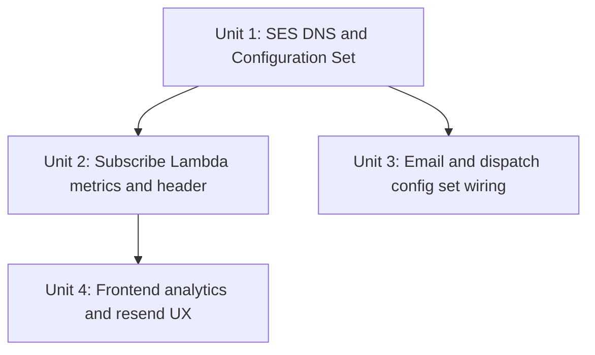

# Execution Plan — Issue #80

**GitHub Issue**: [#80](https://github.com/micahwalter/micahwalter-www/issues/80)  
**Branch**: `feature/issue-80-newsletter-confirm-rate`  
**Date**: 2026-07-06

## Scope Summary

Five work items addressing email authentication, delivery observability, analytics accuracy, and resend UX for the newsletter double opt-in flow.

## Phase Decisions

| AI-DLC Stage | Decision | Rationale |
|--------------|----------|-----------|
| Reverse Engineering | Skip | Artifacts current from prior engagement |
| Requirements Analysis | Standard | Completed — `issue-80-requirements.md` |
| User Stories | Skip | Issue acceptance criteria sufficient |
| Workflow Planning | Execute | This document |
| Application Design | Skip | Changes within existing components |
| Units Generation | Skip | Single cohesive change set |
| Functional Design | Minimal | Documented in construction summary |
| NFR Requirements/Design | Skip | Covered in requirements |
| Infrastructure Design | Execute | SES/DNS changes documented below |
| Code Generation | Execute | All units |
| Build and Test | Execute | Go build + manual deploy checklist |

## Units of Work

### Unit 1 — Infrastructure (SES + DNS)

- [x] Add `MailFromSubdomain`, `DmarcReportEmail` parameters
- [x] `NewsletterConfigurationSet` + CloudWatch event destination
- [x] Custom MAIL FROM on `SESEmailIdentity`
- [x] Route 53: MAIL FROM MX, MAIL FROM SPF, DMARC records
- [x] Mirror configuration set + MAIL FROM in `newsletter-secondary.yml`
- [x] GitHub Actions IAM: configuration set permissions
- [x] API Gateway CORS: expose `X-Newsletter-Queued`
- [x] Subscribe IAM: `cloudwatch:PutMetricData` for `Newsletter/Subscribe`

### Unit 2 — Subscribe Lambda

- [x] `internal/metrics` package for CloudWatch counts
- [x] `BotDropped` metric on honeypot / form-token rejection
- [x] `SignupQueued` metric + `X-Newsletter-Queued` header on new signup
- [x] Resend path unchanged (no header, no signup metric)

### Unit 3 — Email + Dispatch Lambdas

- [x] `CONFIGURATION_SET_NAME` env var on email and dispatch functions
- [x] Pass configuration set + message tags on all SES sends

### Unit 4 — Frontend

- [x] `SubscribeForm`: Fathom goal only when `X-Newsletter-Queued` header present
- [x] Store pending email/name in sessionStorage for resend
- [x] `ResendConfirmation` component
- [x] Check-inbox page: embedded resend
- [x] Confirm expired state: resend with email input

## Deploy Sequence

1. Merge and push — newsletter GitHub Actions builds Lambdas
2. If `infra/newsletter.yml` changed → full CloudFormation deploy (~3–4 min)
3. If Lambdas only → fast path code update (~1 min)
4. Site redeploy not required for backend-only changes; frontend resend/analytics changes need static site deploy via push to `main`

## Post-Deploy Verification

- [ ] `dig TXT _dmarc.micahwalter.com` — DMARC present
- [ ] `dig MX bounce.micahwalter.com` — SES feedback MX
- [ ] `aws sesv2 get-email-identity --email-identity micahwalter.com` — MAIL FROM configured
- [ ] Test signup → Fathom goal fires; bot submit (honeypot) → goal does not fire
- [ ] CloudWatch: `Newsletter/Subscribe` metrics appear
- [ ] CloudWatch: SES configuration set metrics under `AWS/SES` after a test send

## Risk

**Medium** — DNS and SES identity changes affect production mail deliverability. DMARC starts at `p=none` (monitor only). MAIL FROM uses subdomain isolated from personal mail SPF.
