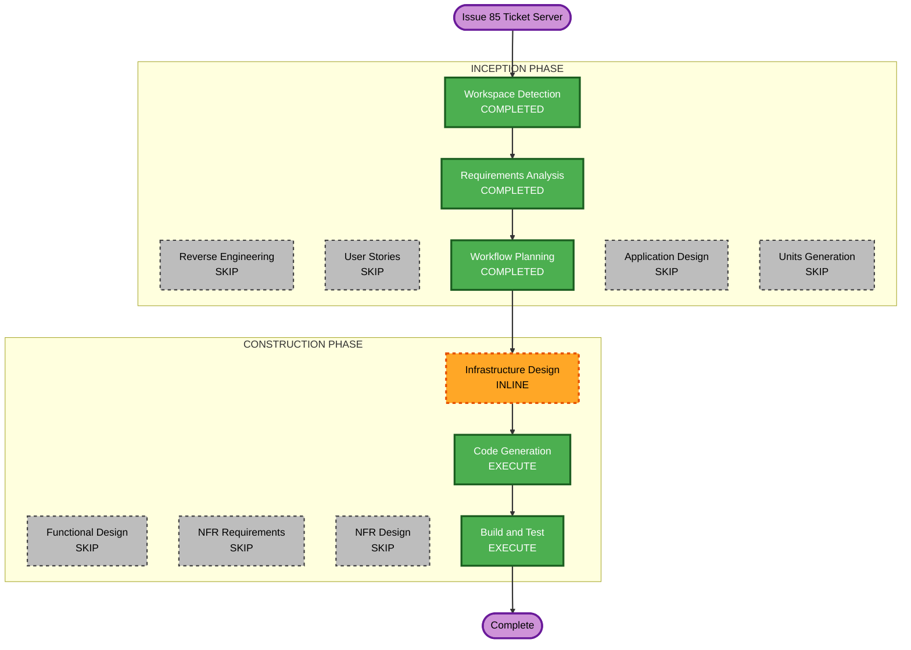
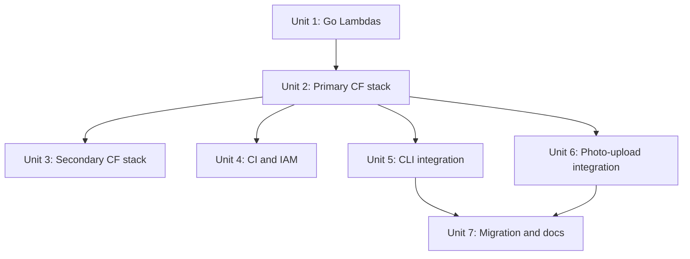

# Execution Plan — Issue #85: Ticket Server (Go)

**GitHub Issue**: [#85](https://github.com/micahwalter/micahwalter-www/issues/85)  
**Branch**: `cursor/ticket-server-go-065a`  
**Date**: 2026-07-07  
**Requirements**: `aidlc-docs/inception/requirements/issue-85-requirements.md`

## Detailed Analysis Summary

### Transformation Scope

| Aspect | Assessment |
|--------|------------|
| **Transformation type** | Architectural — new serverless subsystem + migration off git counter |
| **Primary changes** | Go ticket API, DynamoDB counter, CLI/photo-upload consumers |
| **Related components** | `api-domain*.yml`, `github-actions-role.yml`, photo-upload Lambdas, blog CLI scripts |

### Change Impact Assessment

| Area | Impact |
|------|--------|
| User-facing | Low — no public UI; authoring workflows gain network dependency |
| Structural | **Yes** — new API on `api.micahwalter.com/tickets`, new DynamoDB table |
| Data model | **Yes** — counter moves from git file to DynamoDB |
| API | **Yes** — new `/tickets/auth` and `/tickets/next` endpoints |
| NFR | **Yes** — multi-region failover, cross-region DynamoDB writes, auth |

### Component Relationships

| Component | Change | Priority |
|-----------|--------|----------|
| `infra/ticket-lambdas/` (new) | Major — Go auth + next handlers | Critical |
| `infra/tickets.yml` (new) | Major — primary stack | Critical |
| `infra/tickets-secondary.yml` (new) | Major — secondary API stack | Critical |
| `infra/github-actions-role.yml` | Minor — deploy permissions | Important |
| `.github/workflows/tickets-deploy.yml` (new) | Major — CI pipeline | Important |
| `scripts/lib/allocate-post-id.js` (new) | Major — CLI HTTP client | Critical |
| `scripts/create-post.js`, `import-photos.js` | Minor — use allocate helper | Critical |
| `infra/photo-upload-lambdas/src/process.js` | Minor — HTTP ticket client, drop counter commit | Critical |
| `infra/photo-upload.yml` | Minor — env var for ticket API URL | Important |
| `scripts/seed-post-counter.js` (new) | Major — migration with manual gate | Critical |
| `content/post-counter` | Remove | Critical (after seed) |
| Docs (`CLAUDE.md`, etc.) | Minor | Important |

### Risk Assessment

| Factor | Level |
|--------|-------|
| **Overall risk** | Medium |
| **Rollback** | Moderate — revert code; re-seed git counter from DynamoDB value |
| **Testing** | Moderate — local Go build, CloudFormation validate, integration via CLI curl |
| **Production cutover** | Medium — seed script requires manual review before first live allocation |

---

## Phase Decisions

| AI-DLC Stage | Decision | Rationale |
|--------------|----------|-----------|
| Workspace Detection | COMPLETED | Brownfield detected |
| Reverse Engineering | SKIP (reused) | Artifacts current |
| Requirements Analysis | COMPLETED | `issue-85-requirements.md` approved |
| User Stories | SKIP | Single-author internal tooling; requirements sufficient |
| Workflow Planning | COMPLETED | This document |
| Application Design | SKIP | API routes, auth flow, and multi-region architecture captured in requirements |
| Units Generation | SKIP | Units defined below in execution plan (7 units, clear sequence) |
| Functional Design | SKIP | Atomic increment; no complex business rules |
| NFR Requirements | SKIP | Covered in requirements NFR section |
| NFR Design | SKIP | Patterns established (newsletter-secondary, photo-upload auth) |
| Infrastructure Design | EXECUTE (inline) | CloudFormation + multi-region documented in Unit 2–3; no separate artifact |
| Code Generation | EXECUTE | All units |
| Build and Test | EXECUTE | Go build, `npm run build`, deploy checklist |

---

## Workflow Visualization



### Text alternative

```
INCEPTION:  Workspace Detection [done] -> Requirements [done] -> Workflow Planning [done]
             Reverse Engineering, User Stories, Application Design, Units Generation [skipped]

CONSTRUCTION: Infrastructure Design [inline] -> Code Generation [execute] -> Build and Test [execute]
              Functional Design, NFR stages [skipped]
```

---

## Units of Work



### Unit 1 — Go ticket Lambdas (`infra/ticket-lambdas/`)

- [ ] `go.mod` / module layout mirroring newsletter-lambdas
- [ ] `internal/sessiontoken` — HMAC passcode session tokens (TTL, constant-time verify)
- [ ] `internal/secrets` — Secrets Manager loader + cache
- [ ] `internal/tickets` — DynamoDB atomic increment (cross-region client config)
- [ ] `cmd/auth` — `POST /auth` handler
- [ ] `cmd/next` — `POST /next` handler (Bearer token + increment)
- [ ] `Makefile` — build, upload, deploy, update-functions (primary + secondary)

### Unit 2 — Primary stack (`infra/tickets.yml`)

- [ ] DynamoDB table `post_tickets` (us-east-1, on-demand, pk `partition`)
- [ ] Secrets Manager `ticket-server-secrets` with `ReplicaRegions: us-east-2`
- [ ] HTTP API + CORS + throttling (`/auth` stricter than `/next`)
- [ ] ApiMapping `tickets` on `api.micahwalter.com`
- [ ] IAM roles for auth + next Lambdas
- [ ] CloudWatch error alarms
- [ ] Outputs: API URL, table name, secret ARN

### Unit 3 — Secondary stack (`infra/tickets-secondary.yml`)

- [ ] Mirror auth + next Lambdas in us-east-2
- [ ] ApiMapping on api-domain-secondary
- [ ] Lambdas configured with `DYNAMODB_REGION=us-east-1` for cross-region writes
- [ ] Secrets resolved via local replica name
- [ ] CloudWatch alarms (secondary suffix)

### Unit 4 — CI/CD and IAM

- [ ] `.github/workflows/tickets-deploy.yml` — build Go, upload zips, CF deploy / fast-path update
- [ ] `infra/github-actions-role.yml` — ticket stack permissions (both regions)
- [ ] Artifact prefix under newsletter artifacts bucket (or dedicated bootstrap if needed)

### Unit 5 — CLI integration

- [ ] `scripts/lib/allocate-post-id.js` — auth + next HTTP client, token cache, credentials file
- [ ] `scripts/lib/tickets-credentials.js` — read/write `~/.config/blog/credentials`
- [ ] Update `scripts/create-post.js` — async allocate (remove file counter)
- [ ] Update `scripts/import-photos.js` — async allocate
- [ ] Update `scripts/backfill-ids.js` — note to run seed after backfill

### Unit 6 — Photo-upload integration

- [ ] Add `ticketsPasscode` to `photo-upload-secrets` schema (document in README)
- [ ] `infra/photo-upload-lambdas/src/lib/tickets.js` — HTTP client (auth + next)
- [ ] Update `process.js` — allocate via HTTP; commit only `index.md`
- [ ] `infra/photo-upload.yml` — `TICKETS_API_URL` env var

### Unit 7 — Migration and docs

- [ ] `scripts/seed-post-counter.js` — dry-run default, `--apply` flag, manual confirmation prompt
- [ ] Remove `content/post-counter` from repo
- [ ] Update `CLAUDE.md`, `README.md`, `AGENTS.md`
- [ ] Construction summary in `aidlc-docs/construction/issue-85-ticket-server-summary.md`

---

## Package Change Sequence

| Order | Package | Depends on | Notes |
|-------|---------|------------|-------|
| 1 | Go lambdas (Unit 1) | — | Can develop locally without deploy |
| 2 | Primary CF stack (Unit 2) | Unit 1 zips | Deploy + populate secret |
| 3 | CI/IAM (Unit 4) | — | Can parallel with Unit 2 |
| 4 | Secondary CF stack (Unit 3) | Unit 2, api-domain-secondary | Cross-region writes to primary table |
| 5 | CLI (Unit 5) | Unit 2 live | Test against production API |
| 6 | Photo-upload (Unit 6) | Unit 2 live | Add passcode to secrets |
| 7 | Migration (Unit 7) | Units 5–6 tested | Seed → cutover → remove git counter |

---

## Deploy and Cutover Sequence

1. Deploy primary `micahwalter-tickets` stack (us-east-1)
2. Populate `ticket-server-secrets`: `{ "passcode", "hmac" }`
3. Run seed script **dry-run** → review → `--apply` with confirmation
4. Deploy secondary `micahwalter-tickets-secondary` (us-east-2)
5. Smoke test: `curl` auth + next from local; verify both regional API endpoints
6. Merge branch → CI deploys Lambdas on push to `main`
7. Update `photo-upload-secrets` with `ticketsPasscode`
8. Deploy photo-upload stack update
9. Remove `content/post-counter`; verify CLI + web upload allocate correctly

---

## Success Criteria

- [ ] Go `make build` succeeds for auth + next
- [ ] Primary + secondary stacks deploy without error
- [ ] `POST /tickets/auth` and `POST /tickets/next` work via `api.micahwalter.com/tickets`
- [ ] Concurrent `/next` calls return unique IDs
- [ ] `blog post:new` and `blog photos:import` allocate via API
- [ ] Photo upload commits exclude `content/post-counter`
- [ ] `npm run build` passes
- [ ] Seed script dry-run + apply documented and executed before cutover

---

## Extension Compliance

| Extension | Status | Notes |
|-----------|--------|-------|
| Security Baseline | N/A | Disabled per requirements |
| Resiliency Baseline | N/A | Disabled per requirements |
| Property-Based Testing | N/A | Disabled per requirements |
