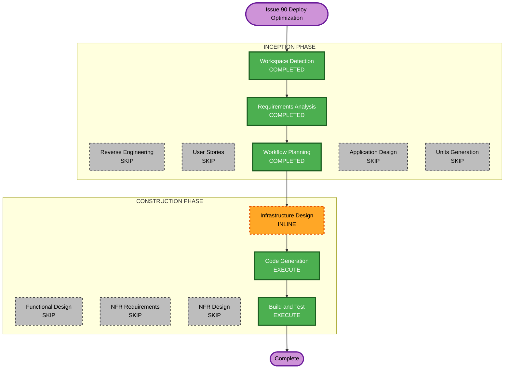

# Execution Plan — Issue #90: Deploy Build Optimization

**GitHub Issue**: [#90](https://github.com/micahwalter/micahwalter-www/issues/90)  
**Branch**: `cursor/deploy-build-optimization-780e`  
**Date**: 2026-07-07  
**Requirements**: `aidlc-docs/inception/requirements/issue-90-requirements.md`

## Detailed Analysis Summary

### Transformation Scope

| Aspect | Assessment |
|--------|------------|
| **Transformation type** | Infrastructure + application — edge redirects replace ~1,150 static redirect pages |
| **Primary changes** | CloudFront Function redirect logic, Next.js route cleanup, GitHub Actions cache + metrics |
| **Related components** | `infra/infra.yml`, `app/[year]/**`, `.github/workflows/deploy.yml` |

### Change Impact Assessment

| Area | Impact |
|------|--------|
| User-facing | Minimal — legacy URLs must still 301 to `/posts/[slug]`; archives unchanged |
| Structural | **Yes** — redirect handling moves from Next.js SSG to CloudFront viewer-request |
| Data model | No |
| API | No |
| NFR | **Yes** — deploy duration target under 2 minutes; build metrics |

### Component Relationships

| Component | Change | Priority |
|-----------|--------|----------|
| `infra/infra.yml` — `StaticHTMLRoutingFunction` | Major — add pattern-based legacy redirect logic before HTML routing | Critical |
| `app/[year]/page.tsx` | Minor — remove slug-as-year from `generateStaticParams` | Critical |
| `app/[year]/[month]/page.tsx` | Minor — remove year×slug combos from `generateStaticParams` | Critical |
| `app/[year]/[month]/[day]/page.tsx` | Remove — redirect-only route | Critical |
| `app/[year]/[month]/[day]/[slug]/page.tsx` | Remove — redirect-only route | Critical |
| `.github/workflows/deploy.yml` | Minor — `.next/cache` + build metrics | Important |
| `lib/content.ts` | Optional cleanup — remove unused helpers if only used by deleted routes | Optional |

### Risk Assessment

| Factor | Level |
|--------|-------|
| **Overall risk** | Medium — redirect pattern matching must not break real archives or photo numeric slugs |
| **Rollback** | Moderate — revert CF function + restore Next.js redirect routes |
| **Testing** | Moderate — local `npm run build` page count; manual redirect spot-checks; CI timing |
| **Infra deploy** | Requires `infra/infra.yml` CloudFormation update (main distribution CF Function) |

### CloudFront Design Note

CloudFront allows **one viewer-request function** per cache behavior. Legacy redirects must be **merged into** the existing `StaticHTMLRoutingFunction` (run redirect checks before HTML extension logic).

Pattern-based matching avoids embedding a slug list (CF Functions 10 KB limit; ~144+ slugs would not fit).

**Redirect rules (viewer-request, in order):**

1. `/YYYY/MM/DD/slug` → 301 `/posts/slug`
2. `/YYYY/MM/slug` where `MM` is 01–12 and third segment is not two digits only → 301 `/posts/slug`
3. `/YYYY/slug` where second segment is not `01`–`12` → 301 `/posts/slug`
4. `/slug` where first segment is not four digits → 301 `/posts/slug`

**Do not redirect:**

- `/YYYY` — year archive
- `/YYYY/MM` — month archive (valid month)

---

## Phase Decisions

| AI-DLC Stage | Decision | Rationale |
|--------------|----------|-----------|
| Workspace Detection | COMPLETED | Brownfield detected |
| Reverse Engineering | SKIP (reused) | Artifacts current |
| Requirements Analysis | COMPLETED | Approved |
| User Stories | SKIP | Internal CI/performance work; no user personas |
| Workflow Planning | COMPLETED | This document |
| Application Design | SKIP | Redirect patterns and components defined in requirements |
| Units Generation | SKIP | Three units with clear sequence below |
| Functional Design | SKIP | Pattern-matching redirects; no complex business logic |
| NFR Requirements | SKIP | Covered in requirements (under 2 min deploy, metrics) |
| NFR Design | SKIP | CI cache is standard GitHub Actions pattern |
| Infrastructure Design | INLINE | CF function changes documented in Unit 1 |
| Code Generation | EXECUTE | All units |
| Build and Test | EXECUTE | `npm run build`, page count verification, redirect spot-check list |

---

## Workflow Visualization



### Text Alternative

```
INCEPTION: Workspace Detection (done) → Requirements (done) → Workflow Planning (done)
           Reverse Engineering, User Stories, Application Design, Units Generation (skipped)
CONSTRUCTION: Infrastructure Design (inline) → Code Generation → Build and Test
```

---

## Construction Units

### Unit 1: CloudFront legacy redirects

- [x] Extend `StaticHTMLRoutingFunction` in `infra/infra.yml` with pattern-based 301 redirects
- [x] Preserve existing trailing-slash, root, and `.html` routing behavior
- [x] Document redirect order and edge cases (numeric photo slugs, year/month archives)

### Unit 2: Next.js route cleanup

- [x] Remove `generateStaticParams` slug/year redirect combos from `app/[year]/page.tsx`
- [x] Remove year×slug combos from `app/[year]/[month]/page.tsx`
- [x] Delete redirect-only routes:
  - `app/[year]/[month]/[day]/page.tsx`
  - `app/[year]/[month]/[day]/[slug]/page.tsx`
- [x] Remove unused `lib/content.ts` helpers if orphaned (`getAllPostDateSlugs`, `getAllPostYearMonthSlugs`, etc.)

### Unit 3: CI cache and metrics

- [x] Add `.next/cache` to GitHub Actions cache in `.github/workflows/deploy.yml`
- [x] Log static page count from build output
- [x] Log build step and S3 sync durations in workflow summary

---

## Change Sequence

```
1. Unit 1 (infra)     — CF function must deploy before or with site; redirects work once live
2. Unit 2 (Next.js)   — reduces build output; safe once CF handles redirects
3. Unit 3 (CI)        — independent; can land with Unit 2
```

**Deploy order for production:**

1. Merge PR with infra + app + CI changes
2. Deploy `infra/infra.yml` stack update (CF function) — via existing infra workflow or manual
3. Site deploy workflow runs on merge (fewer pages, cached build)

---

## Success Criteria

| Criterion | Target |
|-----------|--------|
| Static pages generated | ~1,100+ fewer than baseline (~2,295 → ~1,140) |
| Legacy redirect patterns | All four patterns return 301 → `/posts/[slug]` |
| Year/month archives | `/2024`, `/2024/03` still serve content |
| CI deploy duration | Under 2 minutes consistently (post-merge validation) |
| Build metrics | Page count and timings logged each run |

---

## Out of Scope (Deferred)

- `/micro/[id]` reduction
- `/tags/[tag]` reduction
- S3 single-pass sync
- Content-only deploy pipeline

---

## Quality Gates

- [ ] `npm run build` succeeds with reduced page count
- [ ] Redirect spot-check matrix documented in construction summary
- [ ] No regression on `/`, `/posts/*`, `/2024`, `/2024/03`
- [ ] PR references `Closes #90` or `Fixes #90`
