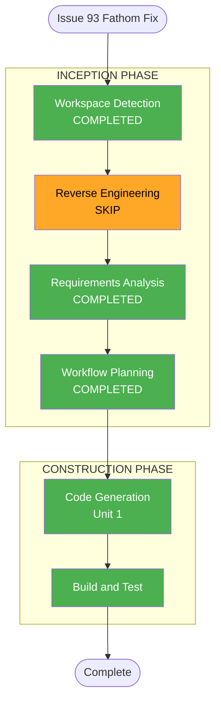

# Execution Plan — Issue #93: Fathom Canonical URL Tracking

**GitHub Issue**: [#93](https://github.com/micahwalter/micahwalter-www/issues/93)  
**Branch**: `cursor/fathom-canonical-urls-000b`  
**Date**: 2026-07-07  
**Requirements**: `aidlc-docs/inception/requirements/issue-93-requirements.md`

## Phase Decisions

| AI-DLC Stage | Decision | Rationale |
|--------------|----------|-----------|
| Workspace Detection | COMPLETED | Brownfield; prior AI-DLC artifacts present |
| Reverse Engineering | SKIP (reused) | Artifacts current from prior engagements |
| Requirements Analysis | COMPLETED | Minimal depth — investigation done in #93 |
| User Stories | SKIP | Internal analytics accuracy; no user personas |
| Workflow Planning | COMPLETED | This document |
| Application Design | SKIP | Single helper + one component change |
| Units Generation | SKIP | Single unit |
| Functional Design | SKIP | Pattern-matching only |
| NFR Requirements | SKIP | Covered in requirements |
| NFR Design | SKIP | Client-side string normalization |
| Infrastructure Design | SKIP | CloudFront redirects already deployed |
| Code Generation | EXECUTE | Unit 1 |
| Build and Test | EXECUTE | `npm run build` |

## Workflow Visualization

## Unit 1: Fathom Canonical URL Normalization

| Step | Task | Files |
|------|------|-------|
| 1 | Add `toFathomPagePath()` mirroring CloudFront legacy redirect rules | `lib/fathom-url.ts` (new) | [x] |
| 2 | Wire Fathom client to use canonical path in `trackPageview()` | `components/Fathom.tsx` | [x] |
| 3 | Run production build | — | [x] |
| 4 | Write construction summary with verification notes | `aidlc-docs/construction/issue-93-construction-summary.md` | [x] |

## Verification Checklist

- [x] Unit tests via manual spot-check of `toFathomPagePath()` cases (no test runner in repo)
- [x] `npm run build` succeeds
- [x] Production CloudFront 301 still verified separately (already confirmed pre-engagement)

## Extension Compliance Summary

All extensions disabled — N/A for this engagement.
