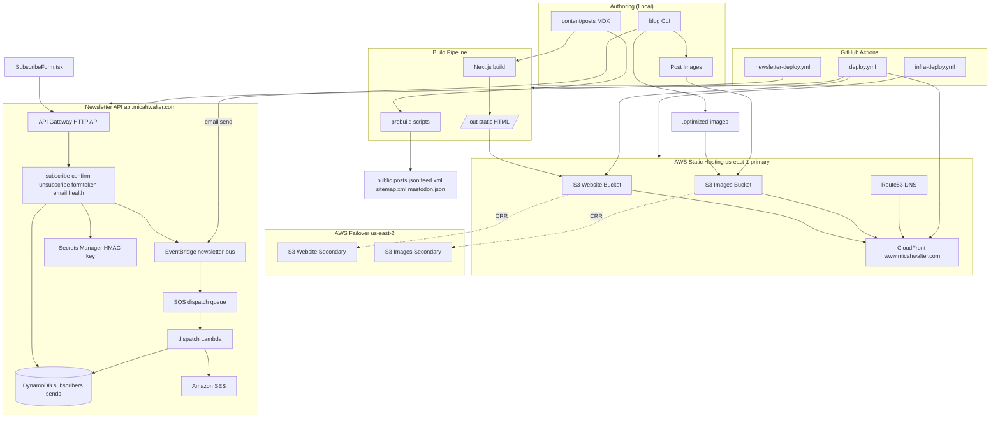
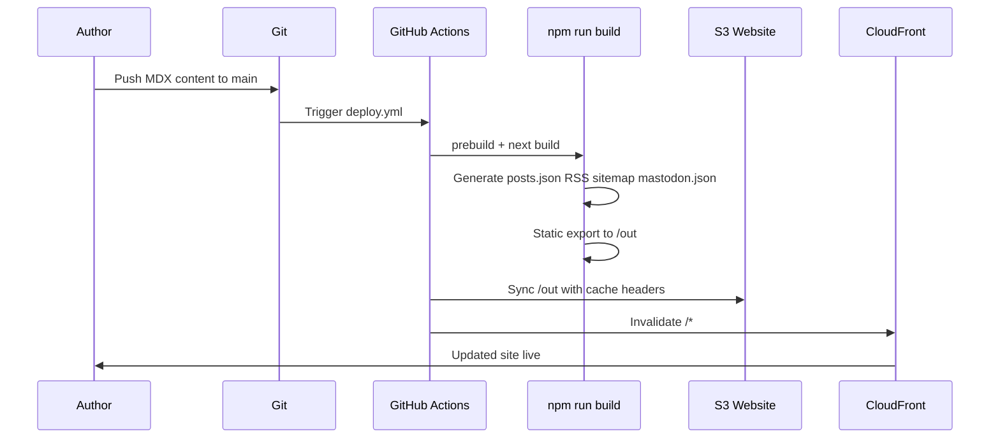
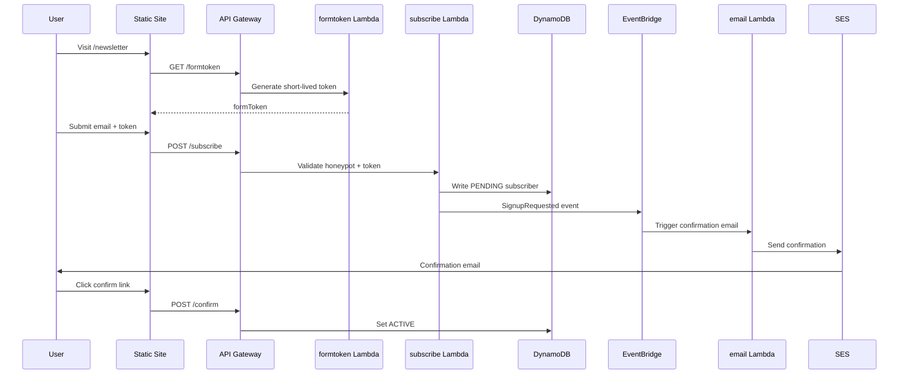
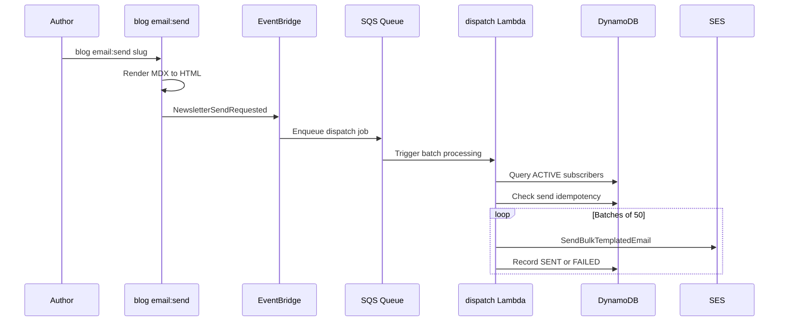

# System Architecture

## System Overview

micahwalter-www is a **static-first personal publishing platform** composed of three major subsystems:

1. **Static Site** — Next.js 15 App Router application exported to HTML at build time, served from S3 via CloudFront
2. **Image CDN** — Dual-storage pipeline (originals + processed variants) on S3, served through CloudFront
3. **Newsletter API** — Event-driven Go Lambda functions behind API Gateway, using DynamoDB, EventBridge, SQS, and SES

There is no server-side runtime for the public site in production. All dynamic behavior (search, newsletter forms) is either client-side or calls external APIs.

## Architecture Diagram

## Component Descriptions

### Next.js Static Site (`app/`, `components/`, `lib/`)
- **Purpose**: Render all public pages from MDX content and build-time data
- **Responsibilities**: Blog/photo/email pages, galleries, sketches, Mastodon archive, newsletter UI, search, pagination, legacy URL redirects
- **Dependencies**: `lib/content.ts`, `lib/galleries.ts`, `lib/sketches.ts`, `lib/mastodon.ts`, prebuild-generated `public/` files
- **Type**: Application

### Blog CLI (`cli/index.js`, `scripts/`)
- **Purpose**: Unified command-line interface for content and image operations
- **Responsibilities**: Post creation, photo import/tagging, image optimize/upload/download/sync, static file generation, newsletter send trigger
- **Dependencies**: Node.js, AWS CLI (for S3), EventBridge (for email send)
- **Type**: Application (developer tooling)

### Newsletter Lambdas (`infra/newsletter-lambdas/`)
- **Purpose**: Serverless API and background processing for newsletter
- **Responsibilities**: HTTP handlers for subscribe/confirm/unsubscribe/formtoken/health; SQS consumer for bulk SES dispatch; transactional email via EventBridge
- **Dependencies**: DynamoDB, EventBridge, SQS, SES, Secrets Manager
- **Type**: Application (serverless)

### CloudFormation Stacks (`infra/*.yml`)
- **Purpose**: Infrastructure as code for AWS resources
- **Responsibilities**: Website hosting, multi-region failover, API domain, newsletter system, GitHub Actions IAM role
- **Dependencies**: AWS account, Route53 hosted zone
- **Type**: Infrastructure

### GitHub Actions (`.github/workflows/`)
- **Purpose**: Continuous integration and deployment
- **Responsibilities**: Build static site, sync to S3, invalidate CloudFront; deploy infra and Lambda changes
- **Dependencies**: GitHub OIDC, AWS IAM role
- **Type**: Infrastructure (CI/CD)

## Data Flow

### Content Publish Flow

### Newsletter Subscribe Flow

### Newsletter Campaign Send Flow

## Integration Points

### External APIs
| Integration | Purpose | Where Used |
|-------------|---------|------------|
| Mastodon API (`micah.social`) | Fetch public toots for `/micro` archive | `scripts/fetch-mastodon.js` (prebuild) |
| Newsletter API (`api.micahwalter.com`) | Subscribe, confirm, unsubscribe, form tokens | `components/SubscribeForm.tsx`, `ConfirmHandler.tsx`, `UnsubscribeForm.tsx` |
| AWS Bedrock | AI photo tagging via Claude Vision | `scripts/tag-photos.js` (authoring only) |
| Fathom Analytics | Privacy-friendly pageview tracking | `components/Fathom.tsx` |

### Databases
| Store | Purpose |
|-------|---------|
| DynamoDB `newsletter_subscribers` | Subscriber records with StatusIndex GSI |
| DynamoDB `newsletter_sends` | Per-subscriber send idempotency tracking |
| File system `content/posts/` | Primary content store (MDX) |

### Third-party Services
| Service | Purpose |
|---------|---------|
| Amazon SES | Transactional and bulk newsletter email |
| Amazon S3 | Static site hosting, image storage |
| Amazon CloudFront | CDN for site and images |
| Route53 | DNS with health-check failover for API |
| Secrets Manager | HMAC signing keys for tokens |

## Infrastructure Components

### CloudFormation Stacks
| Stack | Template | Region | Purpose |
|-------|----------|--------|---------|
| `micahwalter-www` | `infra/infra.yml` | us-east-1 | Primary website + images + CloudFront + DNS |
| `micahwalter-www-secondary` | `infra/infra-secondary.yml` | us-east-2 | Failover S3 buckets |
| `micahwalter-api-domain` | `infra/api-domain.yml` | us-east-1 | Shared API custom domain |
| `micahwalter-api-domain-secondary` | `infra/api-domain-secondary.yml` | us-east-2 | Secondary API domain |
| `micahwalter-newsletter` | `infra/newsletter.yml` | us-east-1 | Full newsletter system |
| `micahwalter-newsletter-secondary` | `infra/newsletter-secondary.yml` | us-east-2 | Secondary API (no dispatch) |
| `micahwalter-www-github-actions` | `infra/github-actions-role.yml` | us-east-1 | OIDC deploy role |

### Deployment Model
- **Site**: GitHub Actions builds `/out`, syncs to S3, invalidates CloudFront (~3-4 min)
- **Images**: Separate manual/CLI workflow via `blog images:sync --profile www` (not in site CI)
- **Newsletter Lambdas**: Auto-deploy on push to main when Go source or templates change; fast path uses `update-function-code`, full path uses CloudFormation deploy
- **Multi-region**: S3 cross-region replication for website and images; Route53 failover routing for API domain

### Networking
- Public CloudFront distributions for `www.micahwalter.com` and apex redirect
- API Gateway HTTP API mapped to `api.micahwalter.com` via shared custom domain
- No VPC; all services are managed AWS serverless/public endpoints
