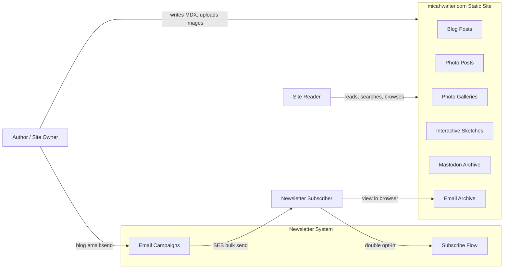

# Business Overview

## Business Context Diagram

## Business Description

**micahwalter-www** is a personal publishing platform for Micah Walter. It combines a statically hosted blog and media site with a newsletter subscription and campaign system. The business purpose is to publish long-form writing, photography, sketches, and microblog content while building and maintaining an email subscriber list for periodic newsletter issues.

The system implements content authoring locally (MDX files, images, CLI tools), build-time generation of static HTML and indexes, deployment to AWS S3/CloudFront, and a separate serverless API for newsletter signup, confirmation, unsubscribe, and bulk email dispatch.

## Business Transactions

| Transaction | Description | Primary Actors |
|-------------|-------------|----------------|
| **Publish blog post** | Author creates MDX post, optimizes/uploads images, pushes to main; CI builds and deploys static HTML | Author, GitHub Actions |
| **Publish photo post** | Author imports photos with EXIF metadata; photo receives numeric ID slug; images synced to CDN | Author, blog CLI |
| **Browse and read content** | Reader navigates posts, photos, galleries, topics, tags, archives, sketches, Mastodon archive | Reader |
| **Search content** | Reader searches titles/excerpts via client-side index (`posts.json`) | Reader |
| **Subscribe to newsletter** | Visitor submits email; system sends confirmation; subscriber confirms to become ACTIVE | Subscriber, Newsletter API |
| **Unsubscribe** | Subscriber uses signed token link to remove subscription | Subscriber, Newsletter API |
| **Send newsletter campaign** | Author runs `blog email:send`; system renders MDX to HTML, dispatches via SES in batches with idempotency | Author, EventBridge, dispatch Lambda |
| **View email in browser** | Subscriber opens archived newsletter issue at `/emails/{slug}` | Subscriber |
| **Sync images across machines** | Author downloads/uploads originals and processed images to S3 for persistence | Author, blog CLI, S3 |

## Business Dictionary

| Term | Meaning |
|------|---------|
| **Post** | Any content item in `content/posts/` — blog, photo, or email type |
| **Slug** | URL identifier; title-based for blog/email, numeric ID for photos |
| **Draft** | Post with `draft: true`; visible in dev, excluded from production builds |
| **Global post ID** | Sequential integer from `content/post-counter` shared across all post types |
| **Email post** | Newsletter issue stored as MDX with `type: email`; primary key for send tracking |
| **Double opt-in** | Subscriber starts PENDING, becomes ACTIVE only after email confirmation |
| **View in browser** | Static archive page for a sent newsletter issue |
| **Originals** | Unprocessed source images stored in S3 under `originals/posts/` |
| **Processed images** | Optimized WebP/JPEG variants at 400/800/1200px widths |
| **Static export** | Production build pre-renders all pages to `/out` with no server runtime |

## Component Level Business Descriptions

### Static Site (Next.js App)
- **Purpose**: Public-facing website for all published content
- **Responsibilities**: Render MDX posts, photo metadata, galleries, sketches, Mastodon archive, newsletter UI pages, search, RSS/sitemap feeds

### Content Layer (`lib/`, `content/`)
- **Purpose**: File-based CMS reading MDX frontmatter at build time
- **Responsibilities**: Parse posts, filter drafts, resolve slugs, category/tag/year filtering, gallery and sketch resolution

### Blog CLI (`cli/`, `scripts/`)
- **Purpose**: Authoring and operations tooling for content and images
- **Responsibilities**: Create posts, import/tag photos, optimize/upload/download images, generate static indexes, trigger newsletter sends

### Newsletter API (Go Lambdas + CloudFormation)
- **Purpose**: Manage subscriber lifecycle and email campaign delivery
- **Responsibilities**: Subscribe/confirm/unsubscribe, form tokens, honeypot bot protection, EventBridge-driven bulk SES dispatch, send idempotency

### AWS Infrastructure (`infra/`)
- **Purpose**: Host static site, images CDN, and newsletter API with multi-region failover
- **Responsibilities**: S3 buckets, CloudFront distributions, Route53 DNS, ACM certificates, DynamoDB, EventBridge, SQS, SES, API Gateway

### CI/CD (GitHub Actions)
- **Purpose**: Automated build and deploy on push to main
- **Responsibilities**: Static site build/deploy, infrastructure stack updates, Lambda code deployment
