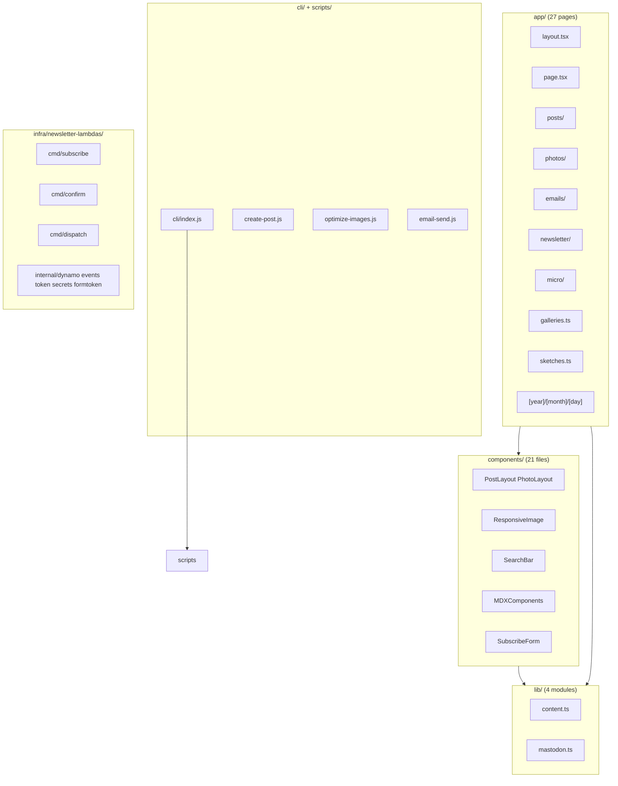

# Code Structure

## Build System

- **Type**: npm / Next.js
- **Configuration**:
  - `package.json` — dependencies, scripts, `bin.blog` CLI entry
  - `next.config.ts` — `output: "export"` in production; `images.unoptimized: true`
  - `tsconfig.json` — strict TypeScript, `@/*` path alias
  - `tailwind.config.ts` — design tokens (cream, charcoal, accent, reading/wide widths)
  - `postcss.config.mjs` — Tailwind pipeline
  - `eslint.config.mjs` — ESLint with `eslint-config-next`

### Build Pipeline Order

```
npm run prebuild
  ├── scripts/fetch-mastodon.js      → public/mastodon.json
  ├── scripts/generate-posts-json.js → public/posts.json
  ├── scripts/generate-rss.js        → public/feed.xml
  └── scripts/generate-sitemap.js    → public/sitemap.xml

npm run build
  └── next build → /out (static HTML export)
```

## Key Modules



## Existing Files Inventory

### App Router Pages (`app/`)

| Path | Purpose |
|------|---------|
| `app/layout.tsx` | Root layout: font, Header, Footer, Fathom analytics |
| `app/page.tsx` | Homepage with hero cover and recent posts |
| `app/posts/page.tsx` | Blog post listing |
| `app/posts/[slug]/page.tsx` | Individual post (blog or photo layout) |
| `app/photos/page.tsx` | Photo post grid |
| `app/emails/page.tsx` | Newsletter archive listing |
| `app/emails/[slug]/page.tsx` | View-in-browser newsletter issue |
| `app/newsletter/page.tsx` | Subscribe form |
| `app/newsletter/confirm/page.tsx` | Confirmation handler |
| `app/newsletter/unsubscribe/page.tsx` | Unsubscribe form |
| `app/newsletter/check-inbox/page.tsx` | Post-subscribe UX |
| `app/newsletter/thank-you/page.tsx` | Confirmation success UX |
| `app/newsletter/goodbye/page.tsx` | Unsubscribe success UX |
| `app/galleries/page.tsx` | Gallery index |
| `app/galleries/[slug]/page.tsx` | Gallery viewer |
| `app/sketches/page.tsx` | Sketches index |
| `app/sketches/[slug]/page.tsx` | Sketch viewer (HTML iframe or image) |
| `app/micro/page.tsx` | Mastodon toot archive |
| `app/micro/[id]/page.tsx` | Individual toot page |
| `app/topics/[category]/page.tsx` | Category filter |
| `app/tags/[tag]/page.tsx` | Tag filter |
| `app/page/[page]/page.tsx` | Paginated all-posts grid |
| `app/[year]/page.tsx` | Year archive |
| `app/[year]/[month]/page.tsx` | Month archive |
| `app/[year]/[month]/[day]/page.tsx` | Day archive |
| `app/[year]/[month]/[day]/[slug]/page.tsx` | Legacy URL redirect to `/posts/{slug}` |
| `app/about/page.tsx` | About page |
| `app/colophon/page.tsx` | Site colophon with Mermaid architecture diagram |
| `app/not-found.tsx` | 404 page |

### Core Libraries (`lib/`)

| Path | Purpose |
|------|---------|
| `lib/content.ts` | Primary CMS: read MDX posts, filter drafts, slug resolution, category/tag/year queries |
| `lib/galleries.ts` | Gallery MDX parsing and photo ID resolution |
| `lib/sketches.ts` | Sketch MDX parsing; HTML/image/p5js type handling |
| `lib/mastodon.ts` | Read cached `public/mastodon.json`; toot types and helpers |

### Components (`components/`)

| Path | Purpose |
|------|---------|
| `components/Header.tsx` | Sticky navigation |
| `components/MobileMenu.tsx` | Mobile drawer navigation |
| `components/SearchBar.tsx` | Client-side search over posts.json |
| `components/Footer.tsx` | Site footer |
| `components/PostLayout.tsx` | Blog post page wrapper |
| `components/PhotoLayout.tsx` | Photo post page wrapper with EXIF |
| `components/PostCard.tsx` / `PhotoCard.tsx` | Grid card components |
| `components/PostGrid.tsx` / `PaginatedPostGrid.tsx` | Listing layouts |
| `components/ResponsiveImage.tsx` | Picture element with WebP/JPEG srcset |
| `components/ZoomableImage.tsx` | Full-screen image zoom |
| `components/MDXComponents.tsx` | Custom MDX element styling and relative image resolution |
| `components/MermaidDiagram.tsx` | Client-side Mermaid rendering |
| `components/GalleryCard.tsx` / `GalleryViewer.tsx` | Gallery UI |
| `components/ExifDisplay.tsx` | Camera/lens/aperture metadata display |
| `components/Pagination.tsx` | Page navigation |
| `components/PaginatedTootList.tsx` | Mastodon feed pagination |
| `components/TopicsDropdown.tsx` | Category filter dropdown |
| `components/Fathom.tsx` | Analytics integration |
| `components/SubscribeForm.tsx` | Newsletter subscribe with form token |
| `components/ConfirmHandler.tsx` | Newsletter confirmation API call |
| `components/UnsubscribeForm.tsx` | Unsubscribe API call |

### CLI and Scripts

| Path | Purpose |
|------|---------|
| `cli/index.js` | Unified `blog` CLI command router |
| `scripts/create-post.js` | New blog post with frontmatter template |
| `scripts/import-photos.js` | Photo import with EXIF extraction |
| `scripts/tag-photos.js` | Bedrock Vision AI tagging |
| `scripts/update-photo-exif.js` | Re-extract EXIF for existing photo |
| `scripts/optimize-images.js` | Sharp multi-size WebP/JPEG generation |
| `scripts/upload-images.js` | S3 upload (originals + processed) |
| `scripts/download-images.js` | S3 download to local |
| `scripts/sync-images.js` | Optimize + upload combined |
| `scripts/copy-images-local.js` | Copy optimized images to public/ for dev |
| `scripts/generate-posts-json.js` | Search index generation |
| `scripts/generate-rss.js` | RSS feed generation |
| `scripts/generate-sitemap.js` | Sitemap generation |
| `scripts/fetch-mastodon.js` | Mastodon API fetch for prebuild |
| `scripts/email-send.js` | Render email MDX and emit EventBridge event |
| `scripts/migrate-wordpress.js` | WordPress to MDX migration (legacy) |

### Newsletter Lambdas (`infra/newsletter-lambdas/`)

| Path | Purpose |
|------|---------|
| `cmd/subscribe/main.go` | POST /subscribe — honeypot, form token, PENDING subscriber |
| `cmd/confirm/main.go` | POST /confirm — activate subscriber |
| `cmd/unsubscribe/main.go` | Token-based unsubscribe |
| `cmd/email/main.go` | Transactional emails (confirmation, admin notification) |
| `cmd/dispatch/main.go` | SQS consumer — bulk SES send with idempotency |
| `cmd/formtoken/main.go` | GET /formtoken — CSRF-like short-lived token |
| `cmd/health/main.go` | Health check endpoint |
| `internal/dynamo/dynamo.go` | DynamoDB client, subscriber queries |
| `internal/events/events.go` | EventBridge event types |
| `internal/token/token.go` | HMAC-signed confirmation/unsubscribe tokens |
| `internal/secrets/secrets.go` | Secrets Manager HMAC key loading |
| `internal/formtoken/formtoken.go` | Form token generation and validation |

### Infrastructure Templates

| Path | Purpose |
|------|---------|
| `infra/infra.yml` | Primary website stack |
| `infra/infra-secondary.yml` | Secondary region failover buckets |
| `infra/api-domain.yml` | Shared API custom domain |
| `infra/api-domain-secondary.yml` | Secondary API domain |
| `infra/newsletter.yml` | Full newsletter stack |
| `infra/newsletter-secondary.yml` | Secondary newsletter (no dispatch) |
| `infra/newsletter-bootstrap.yml` | Lambda artifacts bucket |
| `infra/newsletter-bootstrap-secondary.yml` | Secondary artifacts bucket |
| `infra/github-actions-role.yml` | GitHub OIDC IAM role |

## Design Patterns

### Static Export with Build-Time Data
- **Location**: `next.config.ts`, all `lib/*.ts`, prebuild scripts
- **Purpose**: Eliminate server runtime; all data resolved at build time
- **Implementation**: `output: "export"` in production; filesystem reads in lib modules; prebuild generates JSON/XML indexes

### Unified Post Store with Type Filtering
- **Location**: `lib/content.ts`, `content/posts/`
- **Purpose**: Single content directory for blog, photo, and email types
- **Implementation**: `type` frontmatter field; type-specific getters (`getBlogPosts`, `getPhotos`, `getEmailPosts`); slug rules differ by type

### Dual-Mode Routing (Dev vs Production)
- **Location**: `next.config.ts`, dynamic route pages
- **Purpose**: Dev mode allows accessing any slug; production only pre-renders `generateStaticParams()` routes
- **Implementation**: `output: undefined` in development; `_placeholder` slug pattern to satisfy empty param list constraint

### Event-Driven Newsletter Dispatch
- **Location**: `scripts/email-send.js`, `infra/newsletter-lambdas/cmd/dispatch/`
- **Purpose**: Decouple static site from email sending; enable idempotent bulk dispatch
- **Implementation**: CLI emits EventBridge event → SQS → Lambda → SES bulk templated email

### Image Dual-Storage
- **Location**: `scripts/optimize-images.js`, `scripts/upload-images.js`, `components/ResponsiveImage.tsx`
- **Purpose**: Preserve originals while serving optimized variants via CDN
- **Implementation**: Originals in S3 `originals/posts/`; processed in S3 `images/posts/` and `.optimized-images/` locally

### Client-Side Search Index
- **Location**: `scripts/generate-posts-json.js`, `components/SearchBar.tsx`
- **Purpose**: Enable search without embedding full post bodies in JS bundles
- **Implementation**: Lightweight JSON index at `/posts.json`; client fetches and filters on input

## Critical Dependencies

### Next.js ^15.1.6
- **Usage**: App Router, static export, RSC
- **Purpose**: Core application framework

### next-mdx-remote ^6.0.0
- **Usage**: `app/posts/[slug]/page.tsx`, email rendering
- **Purpose**: Server-side MDX rendering in RSC context

### gray-matter ^4.0.3
- **Usage**: `lib/content.ts`, all content lib modules, scripts
- **Purpose**: Frontmatter parsing for MDX files

### sharp ^0.34.5 (devDependency)
- **Usage**: `scripts/optimize-images.js`
- **Purpose**: Image resizing and WebP/JPEG conversion

### AWS SDK v2 (Go)
- **Usage**: All newsletter Lambda functions
- **Purpose**: DynamoDB, EventBridge, SQS, SES, Secrets Manager integration

### unified/remark/rehype stack
- **Usage**: MDX pipeline, email-send HTML rendering
- **Purpose**: Markdown/MDX processing with GFM and syntax highlighting
