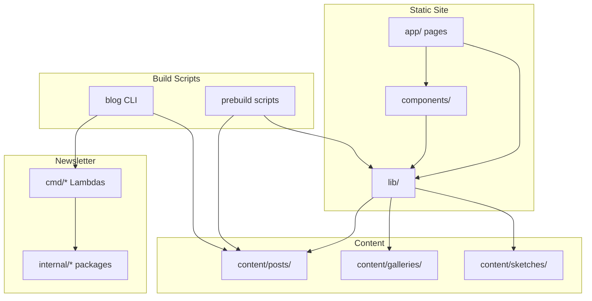

# Dependencies

## Internal Dependencies

### Site depends on lib
- **Type**: Compile-time (TypeScript imports)
- **Reason**: All pages read content through `lib/content.ts`, `lib/galleries.ts`, `lib/sketches.ts`, `lib/mastodon.ts`

### Components depend on lib
- **Type**: Compile-time
- **Reason**: Layout components receive parsed Post objects from lib modules

### Prebuild scripts depend on content
- **Type**: Runtime (filesystem reads)
- **Reason**: Generate posts.json, RSS, sitemap from MDX frontmatter

### Blog CLI depends on scripts
- **Type**: Runtime (execSync)
- **Reason**: CLI routes commands to individual script files in `scripts/`

### email-send script depends on EventBridge
- **Type**: Runtime (AWS SDK)
- **Reason**: Emits NewsletterSendRequested events consumed by dispatch Lambda

### Newsletter Lambdas depend on internal packages
- **Type**: Compile-time (Go modules)
- **Reason**: Shared DynamoDB, events, token, secrets, formtoken logic

### dispatch Lambda depends on subscribe/confirm infrastructure
- **Type**: Runtime (shared DynamoDB tables, SES templates)
- **Reason**: Reads ACTIVE subscribers written by subscribe/confirm flow

## External Dependencies

### Production Runtime (npm)

| Dependency | Version | Purpose | License |
|------------|---------|---------|---------|
| next | ^15.1.6 | Application framework | MIT |
| react / react-dom | ^19.0.0 | UI rendering | MIT |
| next-mdx-remote | ^6.0.0 | MDX rendering | MIT |
| gray-matter | ^4.0.3 | Frontmatter parsing | MIT |
| @headlessui/react | ^2.2.9 | Accessible UI primitives | MIT |
| date-fns | ^4.1.0 | Date formatting | MIT |
| fathom-client | ^3.7.2 | Analytics | MIT |
| mermaid | ^11.13.0 | Diagram rendering | MIT |
| unified | ^11.0.5 | Markdown pipeline | MIT |
| remark-gfm | ^4.0.1 | GFM support | MIT |
| remark-parse | ^11.0.0 | Markdown parsing | MIT |
| remark-rehype | ^11.1.2 | Markdown to HTML | MIT |
| rehype-highlight | ^7.0.2 | Code highlighting | MIT |
| rehype-stringify | ^10.0.1 | HTML serialization | MIT |

### Development / Build (npm)

| Dependency | Version | Purpose | License |
|------------|---------|---------|---------|
| typescript | ^5 | Type checking | Apache-2.0 |
| eslint / eslint-config-next | ^9 / ^15.1.6 | Linting | MIT |
| tailwindcss | ^3.4.1 | CSS framework | MIT |
| sharp | ^0.34.5 | Image processing | Apache-2.0 |
| exifreader | ^4.36.1 | EXIF extraction | MPL-2.0 |
| @aws-sdk/client-bedrock-runtime | ^3.1004.0 | AI photo tagging | Apache-2.0 |
| @aws-sdk/credential-providers | ^3.1004.0 | AWS auth for scripts | Apache-2.0 |
| turndown | ^7.2.2 | HTML to text | MIT |
| turndown-plugin-gfm | ^1.0.2 | GFM turndown rules | MIT |
| cli-progress | ^3.12.0 | CLI progress bars | MIT |
| p-limit | ^4.0.0 | Concurrency control | MIT |

### Go Modules (Newsletter Lambdas)

| Dependency | Purpose |
|------------|---------|
| github.com/aws/aws-lambda-go | Lambda runtime |
| github.com/aws/aws-sdk-go-v2 | AWS service clients |
| github.com/aws/aws-sdk-go-v2/config | AWS configuration |
| github.com/aws/aws-sdk-go-v2/service/dynamodb | DynamoDB operations |
| github.com/aws/aws-sdk-go-v2/service/eventbridge | Event publishing |
| github.com/aws/aws-sdk-go-v2/service/sqs | Queue processing |
| github.com/aws/aws-sdk-go-v2/service/ses | Email sending |
| github.com/aws/aws-sdk-go-v2/service/secretsmanager | HMAC key retrieval |

## Deployment Dependencies

| Dependency | Depends On | Reason |
|------------|-----------|--------|
| Newsletter stack | API domain stack | ApiMapping requires custom domain |
| Newsletter secondary | API domain secondary | Failover API routing |
| Site deploy | GitHub Actions IAM role | OIDC authentication to AWS |
| Newsletter deploy | Bootstrap stacks | Lambda artifact S3 buckets |
| CloudFront | ACM certificates | HTTPS termination |
| SES sending | Domain verification | Email deliverability |

## Dependency Risks

| Risk | Impact | Mitigation |
|------|--------|------------|
| Next.js 15 params-as-Promise API | Breaking change in dynamic routes | All routes use `await params` pattern |
| Static export limitations | No API routes, no SSR | Separate Go Lambda API for newsletter |
| Image pipeline separate from site CI | Images can be out of sync with content | `blog images:sync` workflow documented |
| No automated tests | Regressions undetected | ESLint + manual verification; AI-DLC extensions available |
| Multi-region complexity | Partial failover scenarios | Primary runs dispatch; secondary excludes dispatch Lambda |
