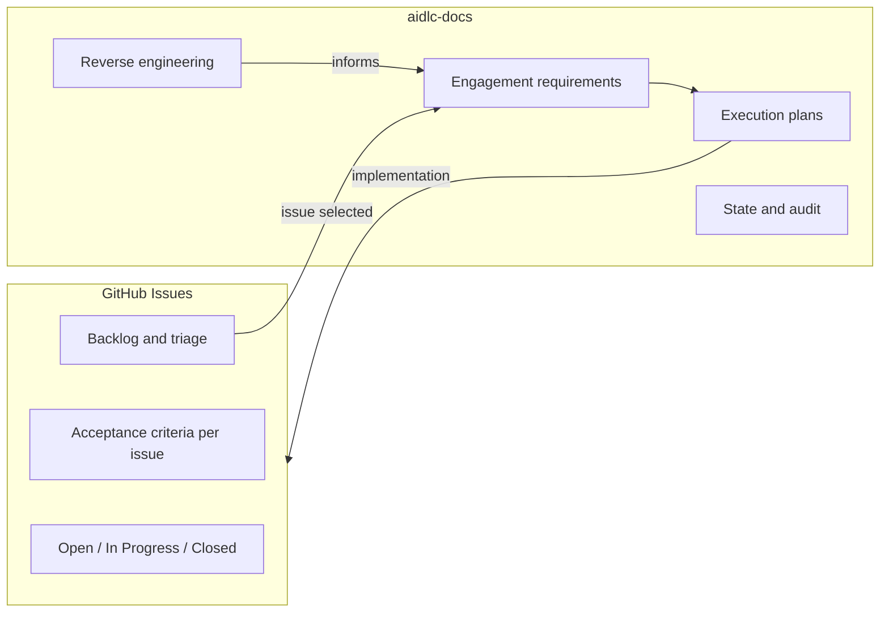

# Project Workflow Conventions

This document defines how AI-DLC integrates with project-specific tooling for **micahwalter-www**. It supplements the generic AI-DLC rules in `.aidlc-rule-details/` and `.cursor/rules/ai-dlc-workflow.mdc`.

## Backlog and Work Tracking

### GitHub Issues — Source of Truth

**GitHub Issues is the authoritative backlog** for improvements, bugs, features, and triage items. Do not duplicate issue lists in `aidlc-docs/`.

| Concern | Where It Lives |
|---------|----------------|
| Running list of improvements, bugs, ideas | [GitHub Issues](https://github.com/micahwalter/micahwalter-www/issues) |
| Architecture, reverse engineering, system understanding | `aidlc-docs/inception/reverse-engineering/` |
| Requirements for a specific engagement | `aidlc-docs/inception/requirements/requirements.md` |
| Execution plans | `aidlc-docs/inception/plans/` |
| Workflow state and audit trail | `aidlc-docs/aidlc-state.md`, `aidlc-docs/audit.md` |

### Rules for AI-DLC Agents

1. **Do not copy open issue lists into aidlc-docs.** Reference GitHub Issues by URL or issue number when linking work to a backlog item.
2. **When scoping implementation work**, read relevant issues from GitHub (e.g., `gh issue view <number>`) rather than maintaining a parallel list in markdown.
3. **When completing work**, close or update the corresponding GitHub issue — not a duplicate entry in aidlc-docs.
4. **Requirements documents** may reference a specific issue being addressed (e.g., "Implementing #68") but shall not enumerate all open issues.
5. **Workflow Planning** shall pull backlog context from GitHub at planning time; stale snapshots in docs are avoided by design.

### Starting Implementation from an Issue

When the user selects work from GitHub Issues:

```
User: "Let's work on #68"
  → Agent reads issue via GitHub
  → Requirements Analysis (standard depth) for that issue
  → Workflow Planning scoped to issue acceptance criteria
  → Construction phases as needed
  → PR references "Closes #68" (or similar)
  → GitHub issue updated/closed on merge
```

### Blog / email post `id` allocation (#121)

Agents writing blog or email posts under `content/posts/` do **not** need `TICKETS_PASSCODE` in the environment. Add the post file without an `id` (or leave it blank); open a PR. The `allocate-post-ids.yml` workflow calls IAM-authenticated `POST /tickets/allocate` and commits `id: N` onto the PR branch. Photos continue to allocate inside `photo-upload-process`. To backfill a live post that is missing an id, run that workflow with `workflow_dispatch`.

Local `blog post:new` may still use passcode auth + `/tickets/next` when you are at a configured desk.

### aidlc-docs vs GitHub — Division of Labor



## Future Focus Areas (Themes, Not Issues)

These are high-level improvement themes identified during Requirements Analysis. Specific work items belong in GitHub Issues, not here.

- CLI improvements (`blog` CLI developer experience)
- Deployment automation (GitHub Actions, preview environments)
- GitHub issue triage and resolution (process, not a duplicate issue list)

## Conventions Maintenance

Update this file when project workflow preferences change. Log significant convention changes in `audit.md`.
