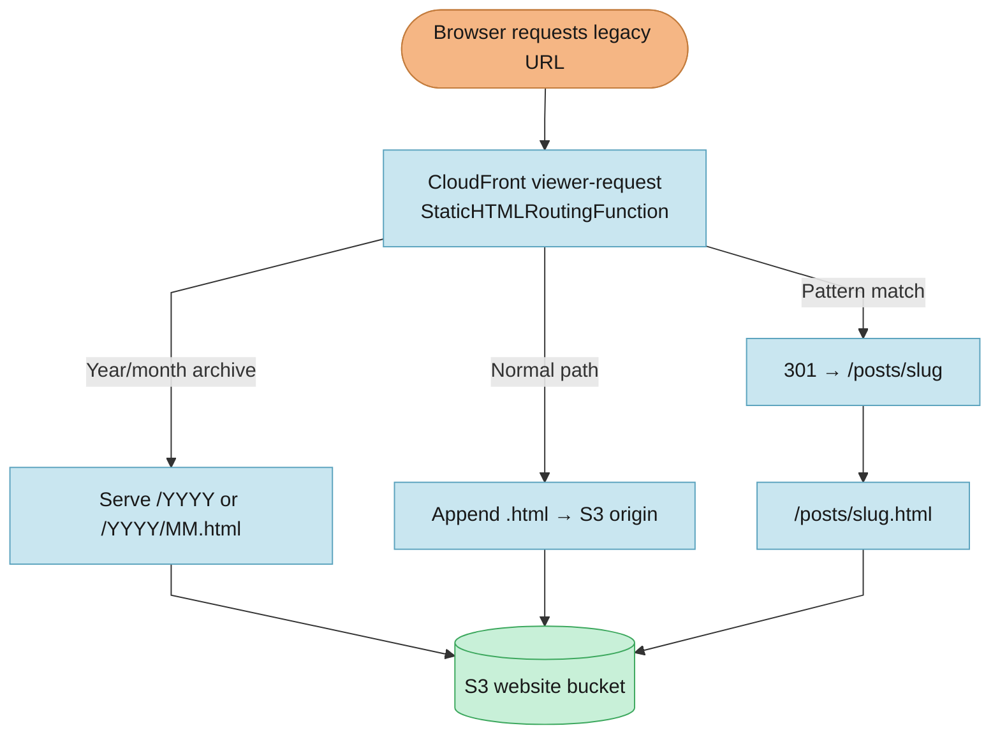

Every push to `main` on this blog triggers a GitHub Actions workflow that builds the entire Next.js site as static HTML, syncs it to S3, and invalidates CloudFront. For a while that has been taking three to five minutes. Not catastrophic, but noticeable every time I publish a photo from my phone or merge a small fix. I opened [GitHub issue #90](https://github.com/micahwalter/micahwalter-www/issues/90) to find out why and whether I could make it better without abandoning static export.

The short answer turned out to be embarrassing in hindsight. The site was generating **2,295 static pages** on every deploy. Only about a thousand of those were real content. The rest were HTML files that existed only to redirect, because Next.js static export has no incremental build mode and no middleware at the edge.

## What I did not want to break

This site uses `output: "export"`. There is no server at request time. Every URL in `generateStaticParams` must be pre-rendered at build time. That model has served me well. Cheap hosting on S3, fast pages on CloudFront, and no runtime to patch.

I also had years of legacy URL shapes that need to keep working with **301 redirects** to `/posts/[slug]`.

- `/2024/my-post-slug`
- `/my-post-slug` (slug used where a year would go)
- `/2021/03/my-post-slug`
- `/2021/03/05/my-post-slug`

Those patterns were implemented as real Next.js routes that called `redirect()`. That worked, but it meant every deploy regenerated hundreds of redirect pages that never served content. Photo uploads from [/upload](/upload) were already fast enough on the publish path, and I did not want to make that worse. I just wanted the full rebuild to stop doing pointless work.

## What the investigation found

Cursor sampled recent workflow runs and ran a local production build. A typical deploy broke down roughly like this.

| Step | Time |
|------|------|
| `npm ci` | ~14s |
| Next.js build | ~58 to 62s |
| S3 sync | ~50 to 85s |

Inside the build, static page generation dominated. The route inventory explained why.

| Route | Pages | Notes |
|-------|------:|-------|
| `/micro/[id]` | 427 | One page per Mastodon toot |
| `/[year]/[month]` | ~895 | **864 were year×slug redirect combos** |
| `/tags/[tag]` | 335 | Tag archive pages |
| `/posts/[slug]` | ~144 | Actual posts |
| Date and slug redirect trees | ~288 | More pages that only called `redirect()` |

The biggest offender was `app/[year]/[month]/page.tsx`, which crossed every year with every slug so `/2024/my-post` would work in static export.

```typescript
const yearSlugs = years.flatMap((year) => slugs.map((slug) => ({ year, month: slug })));
return [...yearMonths, ...yearSlugs];
```

With six years and 144 posts that alone was **864 pages** that only existed to call `redirect()`.

We also looked at whether Next.js could build incrementally on content only changes. It cannot in export mode. Once the workflow runs, it renders everything in `generateStaticParams`. S3 sync was already incremental, but the expensive part was generating HTML, not uploading it.

## The shape of the solution (phase 1)

[PR #91](https://github.com/micahwalter/micahwalter-www/pull/91) implemented phase 1 from the issue.

1. **Move legacy redirects to CloudFront.** Extend the existing `StaticHTMLRoutingFunction` with pattern based 301s before the static HTML routing logic runs.
2. **Remove redirect only Next.js routes.** Trim `generateStaticParams` in the year/month archive pages and delete the `[day]` redirect route trees.
3. **Cache `.next/cache` in CI** and **log deploy metrics** (page count, build time, S3 sync time) in the Actions summary.

I deferred reducing `/micro/[id]` and `/tags/[tag]` pages, S3 single pass sync, and a custom content only deploy path for later.

The redirect flow at the edge now looks like this.



CloudFront allows only **one** viewer request function per cache behavior, so the redirect logic had to merge into the function that already handled clean URLs and trailing slash canonicalization.

## Using AI-DLC and Cursor to plan and ship it

Same pattern as the [photo upload post](/posts/uploading-photos-from-my-phone) and the [newsletter confirmation post](/posts/newsletter-confirmation-emails). GitHub issue #90 held the investigation and candidate optimizations. I started a branch, ran the AI-DLC workflow in the repo, answered a few scope questions in `aidlc-docs/inception/requirements/issue-90-requirement-verification-questions.md`, and approved a three unit execution plan covering CloudFront redirects, Next.js route cleanup, and CI cache and metrics.

The construction summary is in [aidlc-docs/construction/issue-90-construction-summary.md](https://github.com/micahwalter/micahwalter-www/blob/main/aidlc-docs/construction/issue-90-construction-summary.md). Requirements and the execution plan live under `aidlc-docs/inception/` if I need to remember why micro and tag pages were deferred.

## What broke during deploy (and what we fixed)

The site deploy from #91 succeeded in **1m59s** with **1,007 static pages** (down from ~2,295). The workflow summary logged 53s for the build and 28s for S3 sync.

The **infra deploy workflow failed**. The GitHub Actions role could deploy newsletter, photo upload, and ticket stacks, but not `micahwalter-www`. [PR #92](https://github.com/micahwalter/micahwalter-www/pull/92) added a `GitHubActionsDeployWebsiteInfra` managed policy. That still required a one time manual deploy of the IAM stack from a machine with the `www` SSO profile, because CI cannot grant itself new permissions. After that, deploying `infra/infra.yml` published the updated CloudFront function.

Redirects verified cleanly.

- `/2024/sometimes-i-forget-i-have-a-blog` → 301 `/posts/sometimes-i-forget-i-have-a-blog`
- `/sometimes-i-forget-i-have-a-blog` → 301 `/posts/sometimes-i-forget-i-have-a-blog`
- `/2024` and `/about` → 200 (no redirect)

## Results

| Metric | Before | After |
|--------|-------:|------:|
| Static pages | ~2,295 | ~1,007 |
| CI deploy (total) | ~2 to 3 min | **~1m59s** |
| Local build | ~85s | ~31s |

Phase 1 hit the "under two minutes consistently" target on the first production run after merge. There is still headroom. `/micro/[id]` alone is 427 pages and will keep growing as I post more Mastodon toots.

## Same workflow, different bottleneck

This was the second time in a few weeks that the interesting work was not inventing a new architecture but tracing a bottleneck from complaint to fix. The photo upload issue closed the loop between my phone and the existing publish pipeline. Issue #90 did the same for deploy time. I started with a vague "why is CI slow?" and ended with a page count, a before and after table, and a target I could actually hit.

The workflow looked familiar. GitHub issue #90 accumulated the investigation and candidate fixes. I ran AI-DLC on a branch to lock scope. I deferred micro and tag page cuts, moved redirects to CloudFront, and added CI cache and metrics, then left the reasoning in `aidlc-docs/` for the next session. The implementation landed in PRs #91 and #92. The deploy workflow now writes page count and timings to the Actions summary on every run, which means I will notice if that 1,007 drifts upward again without having to dig through build logs.

Issue #90 is closed, legacy URLs still redirect correctly, and deploys are back under two minutes. The lesson I care about most is simpler than any of the timing tables. Before I add another `generateStaticParams` route that crosses every year with every slug, I will ask whether CloudFront can handle the redirect first.
