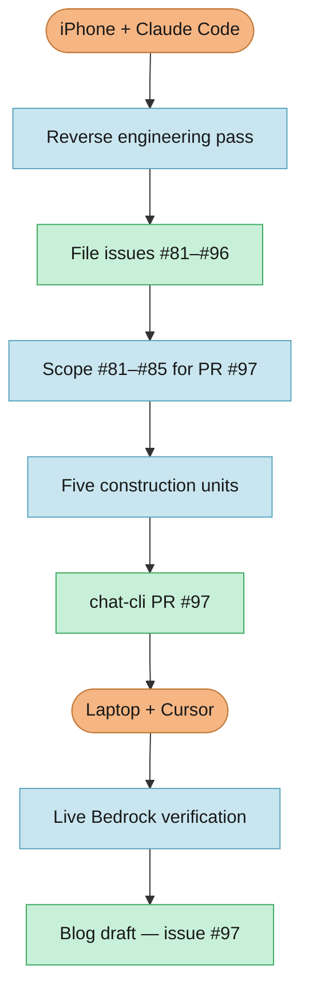

[chat-cli](https://github.com/chat-cli/chat-cli) is the kind of project I keep in a drawer and forget about for a while. I started it in 2023 as a way to learn Go and kick the tires on [Amazon Bedrock](https://aws.amazon.com/bedrock/). I [wrote about that here](/posts/building-a-generative-ai-cli-with-amazon-bedrock-and-go). A year later AWS shipped the [Converse API](/posts/rewriting-chat-cli-again) and I rewrote the whole thing again to stop maintaining per-model payload types. Then life happened. The repo kept working. Homebrew installs still landed. I just stopped opening it.

Last week I pulled it back out. Not because something was broken in production — there is no production, it is a CLI — but because Bedrock had quietly accumulated a pile of Converse features that my code never learned to speak. System prompts. Tool use. Prompt caching. Native document blocks. Extended thinking. The API had grown up. chat-cli had not.

I did almost all of the catch-up work from my iPhone using [Claude Code](https://claude.com/claude-code). I am doing the final testing now on my laptop with Cursor. That split turned out to be a useful constraint. The phone sessions were good for reading the brownfield codebase, running the AI-DLC workflow, filing issues, and landing implementation commits. The laptop session is where I want real AWS credentials, integration tests against live models, and the calm to read a failing type assertion without squinting.

I opened [GitHub issue #97](https://github.com/micahwalter/micahwalter-www/issues/97) on this blog to track the write-up. The code lives in [chat-cli PR #97](https://github.com/chat-cli/chat-cli/pull/97), which closes [#81](https://github.com/chat-cli/chat-cli/issues/81) through [#85](https://github.com/chat-cli/chat-cli/issues/85) on the chat-cli repo.

## What I did not want to break

chat-cli is a small Go CLI. Two commands matter most: `chat` for an interactive session and `prompt` for a one-shot question. Both route through Bedrock's Converse and ConverseStream APIs. Users pick a model by ID or family name, pipe in documents on stdin, attach images, and switch models mid-session. SQLite stores chat history locally. None of that needed to change.

The catch-up work had to stay additive. New flags and config keys, off by default or auto-degrading when a model does not support them. Existing scripts and muscle memory should keep working. I also did not want to turn this into a Claude Code clone. Tool use ships opt-in with one built-in `read_file` handler. MCP support and a full agent toolbelt are filed as follow-ups ([#86](https://github.com/chat-cli/chat-cli/issues/86)–[#87](https://github.com/chat-cli/chat-cli/issues/87)).

## Waking the repo up with reverse engineering

The first real step was not coding. It was an AI-DLC reverse-engineering pass over the existing tree. Claude Code read every package, compared what chat-cli actually sent to Bedrock against what Converse supports today, and wrote the usual brownfield artifacts under `aidlc-docs/inception/reverse-engineering/`.

That pass produced a gap list. Five features mapped cleanly to new GitHub issues:

| Issue | Feature | Why it was missing |
|-------|---------|-------------------|
| [#81](https://github.com/chat-cli/chat-cli/issues/81) | System prompts | `SystemContentBlocks` was never set on requests |
| [#82](https://github.com/chat-cli/chat-cli/issues/82) | Tool use | No `ToolConfig`, no tool loop in `chat` |
| [#83](https://github.com/chat-cli/chat-cli/issues/83) | Prompt caching | Documents were merged into one string on every `prompt` call |
| [#84](https://github.com/chat-cli/chat-cli/issues/84) | Native documents | Only images and stdin `<document>` wrapping, not `DocumentBlock` |
| [#85](https://github.com/chat-cli/chat-cli/issues/85) | Extended thinking | No `AdditionalModelRequestFields` for reasoning mode |

The same session filed eleven more ideas ([#86](https://github.com/chat-cli/chat-cli/issues/86)–[#96](https://github.com/chat-cli/chat-cli/issues/96)): built-in agent tools, MCP client support, a `CHATCLI.md` convention, markdown rendering, slash commands, deduplicating model-validation logic, CI, dependency cleanup. Good backlog. Not in scope for this PR.

From there the workflow ran the way it has on this blog before — requirements, user stories, workflow planning, application design, five units of work, then construction one unit at a time. The full audit trail is in chat-cli's `aidlc-docs/audit.md` if you want the play-by-play.

## The five features (summary)

**System prompts ([#81](https://github.com/chat-cli/chat-cli/issues/81)).** `--system` on `chat` and `prompt`, plus `chat-cli config set system-prompt` for persistence. Follows the same precedence pattern as `model-id` and `custom-arn`.

**Tool use ([#82](https://github.com/chat-cli/chat-cli/issues/82)).** `--tools` enables a tool loop in `chat`. Bedrock exposes no "this model supports tools" capability bit, so the flag stays opt-in. One built-in tool: `read_file`, with path validation shared via `utils.ValidateLocalPath`.

**Prompt caching ([#83](https://github.com/chat-cli/chat-cli/issues/83)).** No new flag. When a system prompt or piped document is present, the request splits into separate content blocks with a cache point between the stable prefix and the changing question. Automatic cost/latency win for repeated `prompt` invocations over the same document.

**Native document input ([#84](https://github.com/chat-cli/chat-cli/issues/84)).** `--document` / `-d` sends PDF, CSV, DOC, DOCX, XLS, XLSX, HTML, TXT, and MD through Converse `DocumentBlock` instead of stuffing bytes into the prompt string.

**Extended thinking ([#85](https://github.com/chat-cli/chat-cli/issues/85)).** `--thinking` and `--thinking-budget` enable reasoning mode where the model supports it. Reasoning content prints distinctly (prefixed `[thinking]`) across streaming and non-streaming paths.

Along the way the pinned AWS SDK jumped from `bedrockruntime` v1.23.0 to v1.55.0. The old pin predated prompt-caching and reasoning-content types entirely. Test coverage moved from 52.6% to 66.3%.

## Implementation notes worth keeping

A few decisions only make sense with the brownfield context:

- **Tool use is opt-in** because enabling `ToolConfig` unconditionally might break models that reject the field. There is no Bedrock capability check to lean on.
- **Caching required splitting `prompt`'s merged document+question string** into two blocks. Otherwise there was nothing stable to cache separately from the question that changes every invocation.
- **Extended thinking's request shape is a best-effort assumption** (`reasoning_config` / `budget_tokens` via `AdditionalModelRequestFields`). That field is untyped and provider-specific. Unit tests and composition smokes pass; a live model round-trip is still the real proof.
- **A latent streaming bug surfaced while adding reasoning output**: an unchecked type assertion in `prompt`'s streaming path would have panicked on any non-text delta. Fixed before it met a real reasoning response.

## Claude Code on the phone, Cursor on the desk

This is the part I expect to refine as I finish testing.

On the phone, Claude Code had the repo, the AI-DLC rules, and long uninterrupted sessions. I could approve a unit plan, watch tests go green, and push commits without pretending a terminal on iOS is a development environment. It was closer to being a patient senior engineer on a very long voice call than to "coding on mobile."

On the laptop, Cursor is handling what the phone should not have to: `go test -tags=integration` with real AWS credentials, spot-checking whether `--thinking`'s request JSON is actually accepted, and writing this post. Same pattern as the [photo upload](/posts/uploading-photos-from-my-phone) and [faster deploys](/posts/faster-deploys-moving-redirects-to-cloudfront) write-ups — implementation in one context, verification and narrative in another.

## What is still open

[chat-cli PR #97](https://github.com/chat-cli/chat-cli/pull/97) is open. Local unit and integration tests pass in CI-shaped environments without credentials. The build-and-test summary in chat-cli's `aidlc-docs/construction/build-and-test/build-and-test-summary.md` lists live Bedrock verification as the remaining gate, with extended thinking's request shape ranked highest risk.

The backlog issues ([#86](https://github.com/chat-cli/chat-cli/issues/86)–[#96](https://github.com/chat-cli/chat-cli/issues/96)) are intentionally untouched. MCP, markdown rendering, slash commands, and CI enforcement are the next time I open the drawer.

## Same workflow, different repo

Resurrecting a side project feels different from shipping a feature on this blog. Nobody was waiting for chat-cli v0.6. The win is personal: the CLI matches what Bedrock offers today, the decisions are written down, and I proved I can move a non-trivial Go change forward without sitting at my desk for every hour of it.

GitHub Issues hold the intent ([#81](https://github.com/chat-cli/chat-cli/issues/81)–[#85](https://github.com/chat-cli/chat-cli/issues/85)). The PR holds the code ([#97](https://github.com/chat-cli/chat-cli/pull/97)). AI-DLC artifacts hold the reasoning so the next session does not start cold. This blog issue ([#97](https://github.com/micahwalter/micahwalter-www/issues/97)) holds the story. I will update this draft once live testing settles what the PR description already flags as uncertain.
