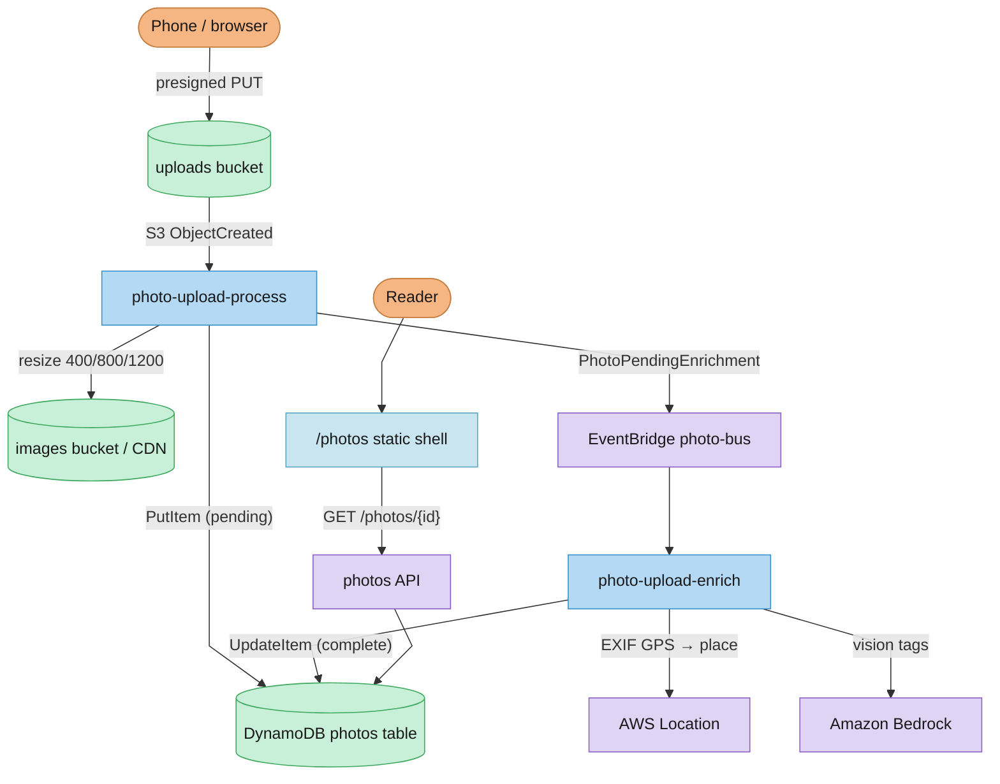

A couple of weeks ago I wrote about [uploading photos to this blog from my phone](/posts/uploading-photos-from-my-phone). That project gave me a passcode gated form at `/upload` and a small serverless pipeline that could take a photo from my camera roll to the site without opening my laptop, and I have been using it constantly ever since. But every upload still ended the same way, with the processing function committing a markdown file to git so GitHub Actions could rebuild about a thousand static pages, sync them to S3, and invalidate CloudFront. The images themselves were on the CDN within seconds of the upload finishing. Everything after that, usually another three or four minutes, was the site rebuilding itself so it could publish about twenty lines of YAML.

Once I noticed how much of the wait was ceremony I could not stop thinking about it, and I started sketching out what publishing a photo would look like without the rebuild. The idea I kept circling back to was to leave the blog exactly as it is, static markdown in git, and quietly pull photos out into a database with a small public API in front of it, so a new photo could appear on the site the moment its record was written. That is more or less where things ended up, though the road there wound through automatic AI tags, maps, a full data migration, and an afternoon where a photo of Glen Cove, New York insisted it had been taken in Kyrgyzstan.

## The mismatch

The static export model has been great for this site, and blog posts are the reason why. A post is a piece of writing that rarely changes once it ships, benefits from having its history in git, and serves beautifully as pre rendered HTML on S3, which is about the cheapest and fastest way to run a website that I know of. None of that was ever in question, and none of it changed.

Photos, though, had drifted into that model without ever really belonging there. By the time I opened [issue #103](https://github.com/micahwalter/micahwalter-www/issues/103), photo folders made up about a quarter of `content/posts/`, and each one held a single `index.md` whose frontmatter read like a database record that had wandered into the wrong file format. A numeric id, a title, a date, a featured flag, camera settings pulled from EXIF. The image binaries were gitignored and already living in S3, so the markdown file existed only to feed the static build, and for photos the static build existed mostly to render that one record into HTML.

Once I saw it that way I could not unsee it. Structured data produced by a serverless pipeline was passing through git and a full site rebuild just to reach a browser. Issue #103 wrote the split down properly, with blog and email posts staying on markdown forever and photos becoming a dynamic content type backed by DynamoDB and a public read API. And since I was already rethinking the whole path, [issue #104](https://github.com/micahwalter/micahwalter-www/issues/104) gathered up the wishlist that had been quietly accumulating alongside it. Uploading more than one photo at a time, real captions instead of auto generated excerpts, a map when a photo knows where it was taken, and AI tagging that happens on its own instead of waiting for me to remember a CLI command.

## Running the loop

This turned into the biggest AI-DLC engagement I have run on this repo so far. The [inception pass](/posts/notes-on-exploring-ai-dlc) took the two issues and turned them into requirements, user stories, and an application design that broke the work into seven units. A data plane, enrichment, the upload UI, browse and detail pages, an edit UI, galleries, and the cutover itself. Each unit went through functional design, NFR review where it mattered, and a code generation plan before any code landed, and the whole trail lives under `aidlc-docs/` in the repo. Construction played out across a handful of PRs over about three days.

[PR #106](https://github.com/micahwalter/micahwalter-www/pull/106) landed the data plane first. A DynamoDB table keyed by the same numeric ids the ticket server was already handing out, a secondary index for chronological listing, and public routes on the existing API domain, with `GET /photos`, `GET /photos/featured`, `GET /photos/{id}`, and an authenticated `PATCH` for edits. The processing function stopped committing markdown, and instead writes a `pending` record to the table, emits a `PhotoPendingEnrichment` event to an EventBridge bus, and gets out of the way.

[PR #110](https://github.com/micahwalter/micahwalter-www/pull/110) carried enrichment and the new upload experience, and by the end of that branch the remaining units had followed it in, with browse and detail pages, galleries served from the API, an edit hub behind the same passcode, a migrator, and a small feed publisher. [PR #113](https://github.com/micahwalter/micahwalter-www/pull/113) was the one I had been waiting for. With the migration verified, it deleted 44 photo folders and 2 gallery folders from the content tree, leaving `content/posts/` with nothing but writing in it, which is what it probably should have been all along.

## The shape of the thing

Here is the path a photo takes now, from my phone to the site.

The site itself is still a static export, since that constraint was never up for negotiation, and the way around it turned out to be a thin shell. Photo URLs moved from `/posts/{id}` to `/photos/{id}`, and the CloudFront function that already handles clean URLs now issues permanent redirects for the old numeric paths and serves a single pre rendered shell page for any `/photos/{id}` request. The shell fetches the metadata from the API in the browser and renders the photo, the EXIF panel, the tags, and the map, while blog posts never touch any of this and remain plain HTML files on S3, exactly as before.

Feeds were the one place the shell trick could not reach, because RSS readers and crawlers do not run JavaScript. A small feed publisher function runs hourly and writes `photos-feed.xml` and a photo sitemap straight to the website bucket, so photos stay visible to readers and search engines without a build. And because the photos API is now load bearing for the site, a second copy of it runs in us-east-2 behind the same custom domain, with the secrets replicated over.

## Enrichment

The part of [issue #104](https://github.com/micahwalter/micahwalter-www/issues/104) I was most excited about was making photos smarter without making uploads slower, so everything expensive happens after the upload responds, in an enrichment function triggered by the EventBridge event.

When a photo has GPS in its EXIF, the enricher reverse geocodes it against an AWS Location place index and stores a city and country. The precise coordinates never reach the public API, and instead the record carries fuzzed public coordinates, rounded enough to place the photo in a neighborhood rather than at a doorstep, which drive a small OpenStreetMap embed on the detail page. When there is no GPS there is no map, and no empty chrome pretending otherwise.

Every upload also gets a vision pass through Claude on Amazon Bedrock, the same flow the `blog photos:tag` CLI command used, now automatic. The model suggests a handful of lowercase tags covering subject, setting, and mood, and they merge into the record. On the browse grid the tags are now links, so clicking `harbor` on one photo filters the grid down to every photo the model saw a harbor in, which for a personal archive is quietly wonderful. Nobody was ever going to go back and hand tag a decade of photos, and now nobody has to.

## What broke once it was live

Two of the bugs that turned up after cutover are worth telling in full.

The first showed up minutes after the switch, when the `/upload` page refused to log me in even with the right passcode, despite the API working fine from curl. The culprit was a `$default` route that had crept into the API Gateway HTTP API definition. On this API, behind a custom domain path mapping, `$default` intercepted the browser's `OPTIONS` preflight request and returned a 500 before CORS headers ever entered the picture, so the browser never sent the real `POST`. [PR #114](https://github.com/micahwalter/micahwalter-www/pull/114) removed the route from both regions and left a comment explaining why it must never come back. The reminder I took away is that curl can only ever tell you the API works, and it takes a real browser to tell you CORS does.

The second bug was more fun. I uploaded a photo from the north shore of Long Island, opened the detail page, and the map confidently showed Osh Region, Kyrgyzstan, roughly six thousand miles from where I was standing ([issue #117](https://github.com/micahwalter/micahwalter-www/issues/117)). The cause was buried in how Apple writes location data into XMP, where the longitude arrived as the string `73.655W`, with the hemisphere baked into a suffix instead of a separate reference tag. The parser read the number, never saw a west reference, and kept the value positive. Longitude 73.655 east of Greenwich lands you in Kyrgyzstan, while 73.655 west is Glen Cove, New York, so one dropped letter moved the photo half a world away. [PR #118](https://github.com/micahwalter/micahwalter-www/pull/118) taught the parser to prefer the EXIF reader's expanded GPS output, to check for hemisphere suffixes embedded in the coordinate itself, and to allow a forced re enrichment so bad place tags could be replaced rather than merged into, and photo 172 now lives where it was actually taken.

There was also a round of polish once real use exposed the rough edges. [PR #115](https://github.com/micahwalter/micahwalter-www/pull/115) replaced a dead static map provider with the OpenStreetMap embed, wired up the tag filtering, swapped a "Loading photos" message on the homepage for a proper skeleton, and fixed gallery layout. Small things, but they are the difference between a system that works and a site I enjoy.

## What is nicer now

The change I notice every day is publish latency. A photo used to take three or four minutes to appear, all of it deploy, and it now shows up in the time it takes the processing function to resize the image and write a row, with tags and geo arriving a few moments later. The homepage hero, the `/photos` grid, the detail pages, and the galleries all read from the API, so none of them wait on a build.

The upload form grew up too, accepting multiple photos in one session with per file progress, letting each photo carry a real caption instead of an auto generated excerpt, and opening into an edit hub behind the same passcode where I can fix a title, rewrite a caption, adjust tags, or assemble a gallery from my phone. The CLI still works and writes to the same table, so nothing about my desk workflow broke.

And the content tree finally matches how I think about the content, with writing living in git where version history matters and photos living in a database where structured records belong. The build got smaller, the repo got cleaner, and deploys of actual writing are no longer held up by pictures.

## Closing the loop

This is the fourth or fifth project in a row on this site that followed the same loop, where the intent starts life as a GitHub issue, AI-DLC turns it into requirements and units, Cursor does the construction on branches, the code lands in PRs, and the decisions settle into `aidlc-docs/` so the next session starts warm instead of cold. What made this one different was the scale, with seven units, two regions, a data migration, and a cutover with a runbook, and the loop held up fine under all of it. The agent did the tactical work while my job was mostly judgment, approving plans, catching the things that looked wrong, and clicking upload with real photos until the seams showed.

There is more on the backlog. Browsing photos by color has been an open idea since [issue #52](https://github.com/micahwalter/micahwalter-www/issues/52), and now that every photo is a row in a table with an enrichment pipeline attached, a color analysis pass is a small step instead of a rebuild of everything. That might be the real payoff of this whole project. The photos stopped being frozen pages and became data, and data is something you can keep asking new questions of.
